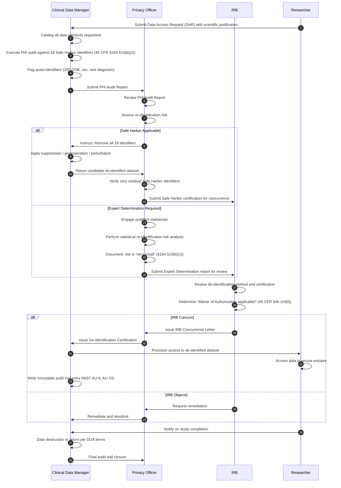
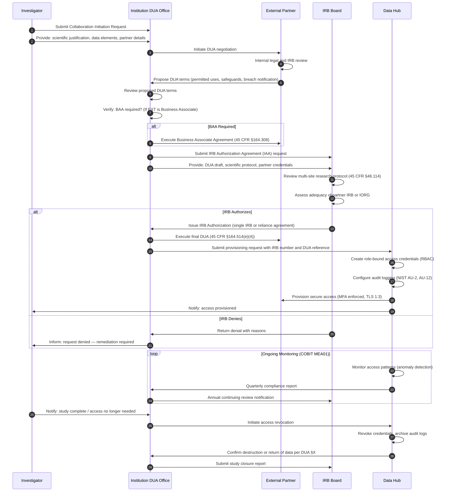
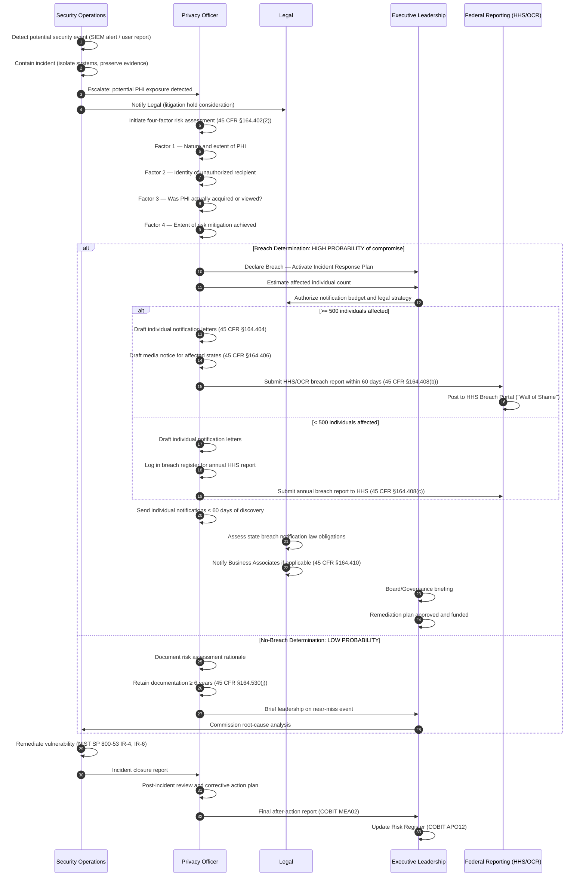

# Data Pipeline Swimlane Diagrams

> **Document Control**
> Version: 1.0.0 | Classification: Internal — Restricted | Owner: Research Informatics & Compliance  
> Last Reviewed: 2026-05-26 | Review Cycle: Annual | Framework References: HIPAA 45 CFR §164, NIST SP 800-53 Rev. 5, COBIT 2019

---

## Overview

This document presents four authoritative swimlane diagrams governing the end-to-end lifecycle of health data within the Lapaki Health Data Architecture Framework. Swimlane (also called cross-functional) diagrams are the preferred visualization for multi-stakeholder processes because they make ownership boundaries explicit and accountability unambiguous — a requirement of COBIT 2019 Domain EDM01 (Ensured Governance Framework Setting and Maintenance) and NIST SP 800-53 Rev. 5 Control Family PM (Program Management).

Each diagram is preceded by explanatory prose that contextualizes the workflow within applicable regulatory obligations. Together, the four diagrams span: (1) the full end-to-end data ingestion pipeline, (2) the de-identification workflow subject to HIPAA Safe Harbor and Expert Determination standards, (3) the external collaboration request process governed by Data Use Agreements and IRB authorization, and (4) the incident response workflow mandated by the HIPAA Breach Notification Rule (45 CFR §164.400–414) and HITECH Act §13402.

All Mermaid diagrams in this document use the `sequenceDiagram` directive with actor-based lane separation, which provides the clearest representation of multi-party workflows in a GitHub-rendered markdown environment. Where decision logic is required, `flowchart` subgraph notation is used as a supplementary representation.

---

## Diagram 1 — End-to-End Data Ingestion Swimlane

### Explanatory Notes

The end-to-end data ingestion pipeline represents the most complex multi-stakeholder workflow in the framework, spanning five organizational functions: Source Systems (EHR vendors and operational databases), Data Engineering (ETL/ELT pipeline engineering), Data Quality (clinical data managers and quality analysts), Research Informatics (the team responsible for Common Data Model population and federated query readiness), and Security & Compliance (HIPAA privacy and security officers, COBIT APO13 Managed Security).

The pipeline originates at the point-of-care electronic health record, which produces HL7 v2.x ADT/ORU/ORM messages, HL7 FHIR R4 RESTful resources, and C-CDA documents. These streams are ingested into the Operational Data Warehouse (ODW) via certified integration engines (e.g., Rhapsody, Mirth Connect, Azure Health Data Services). The ODW serves as the transactional layer; it is not a research environment.

A critical governance gate exists at the transition from the ODW to the Integrated Research Warehouse (IRW): the IRB Required? decision diamond. Per 45 CFR §46.102(l), any systematic investigation designed to develop generalizable knowledge involving human subjects requires IRB review. This gate prevents research use of identifiable data prior to appropriate authorization. A second gate — PHI Present? — triggers the de-identification workflow (Safe Harbor per 45 CFR §164.514(b)(1) or Expert Determination per 45 CFR §164.514(b)(2)) before data may be exposed to the research layer or external partners.

The pipeline terminates at the External Collaboration Hub, which is the governance-controlled egress point for data shared with academic consortia, industry partners, and multi-site federated query platforms. COBIT objective DSS05 (Managed Security Services) governs the security controls applied at each hop.

```mermaid
sequenceDiagram
    autonumber
    participant SS as Source Systems
    participant DE as Data Engineering
    participant DQ as Data Quality
    participant RI as Research Informatics
    participant SC as Security & Compliance

    SS->>DE: HL7 v2 ADT/ORU messages (real-time)
    SS->>DE: HL7 FHIR R4 RESTful resources
    SS->>DE: C-CDA Continuity of Care Documents
    DE->>DE: Parse & validate message structure
    DE->>DQ: Load to Operational Data Warehouse (ODW)
    DQ->>DQ: Execute data quality rules (completeness, conformance, plausibility)
    DQ->>SC: Trigger PHI audit log (NIST AC-2, AU-2)

    alt IRB Required?
        SC->>RI: IRB protocol number verified → Proceed to IRW
    else No IRB
        SC-->>DE: BLOCK — Halt pipeline; notify Privacy Officer
    end

    RI->>RI: Ingest to Integrated Research Warehouse (IRW)
    RI->>RI: Master Patient Index (MPI) linkage
    RI->>RI: Terminology normalization (SNOMED CT, LOINC, RxNorm)
    RI->>DQ: CDM mapping validation (OMOP v5.4 / PCORNet v6.1)
    DQ->>RI: Quality check passed → Populate CDM

    alt PHI Present?
        RI->>SC: Route to De-Identification workflow
        SC->>SC: Apply Safe Harbor (45 CFR §164.514(b)(1)) OR Expert Determination
        SC->>RI: Return certified de-identified dataset
    else No PHI
        RI->>RI: Data already de-identified — proceed
    end

    RI->>RI: Priority Cohort extraction
    RI->>SC: DUA review and execution
    SC->>SC: Audit log sealed (NIST AU-9, AU-10)
    RI-->>DE: Publish to External Collaboration Hub
    DE->>SS: Acknowledgement / reconciliation report
```

---

## Diagram 2 — De-Identification Workflow Swimlane

### Explanatory Notes

The de-identification workflow is the single most audited process in any health data architecture. Under HIPAA, the Privacy Rule (45 CFR §164.514(b)) establishes two legally recognized methods for de-identification: the Safe Harbor method, which requires the removal of 18 specific categories of identifiers enumerated at §164.514(b)(2)(i), and the Expert Determination method, which requires a qualified statistician to certify that the risk of re-identification is "very small" using accepted analytical techniques (§164.514(b)(1)).

This swimlane involves four roles. The **Clinical Data Manager** initiates the data request and performs the initial PHI audit, cataloguing every data element against the 18 Safe Harbor identifiers and any quasi-identifiers that could enable re-identification through linkage attacks (as described in the Latanya Sweeney ZIP+DOB+Sex = 87% unique population research). The **Privacy Officer** (required under 45 CFR §164.530(a)) reviews the audit, selects the de-identification method, and issues or withholds certification. The **IRB** reviews the de-identification certification as part of the waiver of authorization determination under 45 CFR §46.116(f) and issues its concurrence. The **Researcher** receives access only after all upstream gates are cleared, and all researcher access events are written to an immutable audit trail per NIST SP 800-53 Rev. 5 AU-9 (Protection of Audit Information).

The audit trail itself must satisfy COBIT objective MEA02 (Managed System of Internal Control), providing evidence of process integrity that can be produced during OCR desk audit or litigation.



---

## Diagram 3 — External Collaboration Request Swimlane

### Explanatory Notes

External data sharing — whether with academic partners, industry sponsors, or federal consortia such as NIH N3C or PCORNet — requires a rigorous multi-party authorization workflow. This swimlane spans five roles: the **Investigator** (the requesting researcher at the originating institution), the **Institution DUA Office** (responsible for negotiating and executing Data Use Agreements per 45 CFR §164.514(e) for Limited Datasets or 45 CFR §164.508 for full authorization), the **External Partner** (the receiving institution or organization), the **IRB Board** (which must authorize data sharing in multi-site research per 21 CFR Part 56 and 45 CFR Part 46), and the **Data Hub** (the technical platform that provisions, monitors, and revokes access).

A Data Use Agreement is a binding legal instrument required under 45 CFR §164.514(e)(4) whenever a Limited Dataset (one that retains dates and geographic data but suppresses direct identifiers) is shared externally. The DUA must specify: permitted uses and disclosures, prohibition on re-identification, prohibition on onward sharing without authorization, required security safeguards, and procedures for breach reporting. DUAs with industry partners additionally require a Business Associate Agreement (BAA) under 45 CFR §164.308 et seq. when the partner is a Business Associate.

The monitoring phase is non-negotiable: COBIT objective MEA01 (Managed Performance and Conformance Monitoring) requires continuous surveillance of data access patterns, with anomaly alerts routed back to the Privacy Officer and IRB as appropriate. Access must be revoked immediately upon study completion, personnel departure, or breach event.



---

## Diagram 4 — Incident Response Swimlane

### Explanatory Notes

The HIPAA Breach Notification Rule (45 CFR §164.400–414), as strengthened by HITECH Act §13402, mandates specific notification timelines that make the incident response workflow one of the most time-critical processes in health data governance. A "breach" under HIPAA is defined as the acquisition, access, use, or disclosure of PHI in a manner not permitted under the Privacy Rule that compromises the security or privacy of the PHI — unless the covered entity demonstrates that there is a low probability that PHI has been compromised based on a four-factor risk assessment (45 CFR §164.402(2)).

The four-factor risk assessment must evaluate: (1) the nature and extent of the PHI involved, including the types of identifiers and the likelihood of re-identification; (2) the unauthorized person who used the PHI or to whom the disclosure was made; (3) whether the PHI was actually acquired or viewed; and (4) the extent to which the risk to the PHI has been mitigated. This assessment is the pivot point of the swimlane — the **breach/no-breach determination** gate.

Notification timelines are non-negotiable: affected individuals must be notified without unreasonable delay and within 60 calendar days of discovery (45 CFR §164.404(b)). If a breach affects 500 or more individuals in a state, prominent media outlets in that state must also be notified (45 CFR §164.406). The Secretary of HHS must be notified via the OCR web portal within 60 days for large breaches, or annually for breaches affecting fewer than 500 individuals (45 CFR §164.408). Business Associates must notify Covered Entities without unreasonable delay and within 60 days of discovery (45 CFR §164.410). COBIT objective DSS02 (Managed Service Requests and Incidents) and DSS04 (Managed Continuity) govern the organizational response capability.



---

## Appendix: Swimlane Role Definitions

| Role Abbreviation | Full Title | Regulatory Anchor |
|---|---|---|
| SS | Source Systems (EHR, ADT, ancillary) | 45 CFR §164.304 (Covered Entity) |
| DE | Data Engineering | COBIT APO04, BAI03 |
| DQ | Data Quality | COBIT APO11, BAI07 |
| RI | Research Informatics | COBIT APO01, BAI09 |
| SC | Security & Compliance | 45 CFR §164.308, NIST SP 800-53 |
| CDM | Clinical Data Manager | ICH E6(R3), CDISC CDMIG |
| PO | Privacy Officer | 45 CFR §164.530(a) |
| IRB | Institutional Review Board | 45 CFR Part 46, 21 CFR Part 56 |
| RES | Researcher | NIH GPS, COBIT APO02 |
| INV | Investigator | 45 CFR §46.102(e) |
| DUA | DUA Office / Legal | 45 CFR §164.514(e)(4) |
| EXT | External Partner / Institution | 45 CFR §164.308(b) (BAA) |
| HUB | Data Hub Operations | NIST SP 800-53 AC-3, AU-2 |
| SOC | Security Operations Center | NIST SP 800-53 IR-4, SI-4 |
| LGL | Legal / General Counsel | HITECH §13402 |
| EX | Executive Leadership | COBIT EDM01, EDM02 |
| FED | HHS Office for Civil Rights | 45 CFR §164.408 |

---

*Document end — Lapaki Health Data Architecture Framework v1.0.0*
