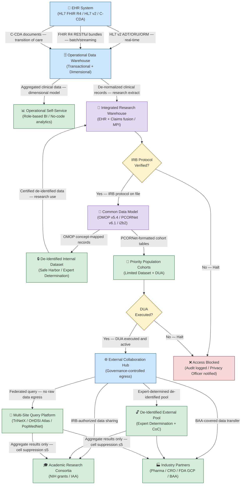
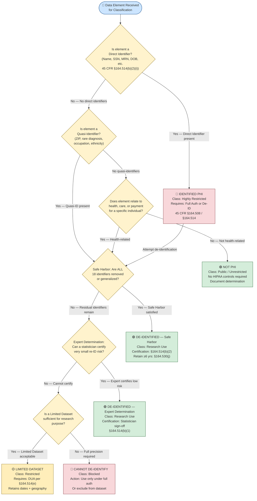
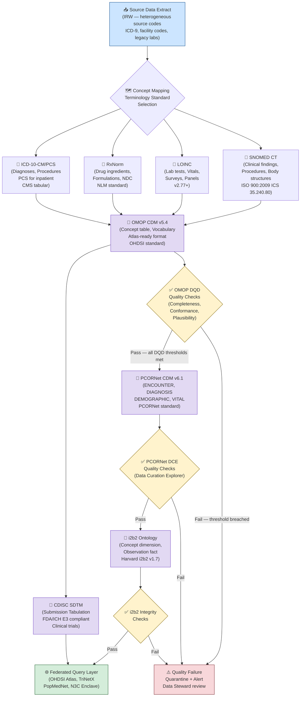

# Data Flow & Process Flowcharts

> **Document Control**
> Version: 1.0.0 | Classification: Internal — Restricted | Owner: Research Informatics  
> Last Reviewed: 2026-05-26 | Review Cycle: Annual | Framework References: HIPAA 45 CFR §164, NIST SP 800-53 Rev. 5, OMOP CDM v5.4, COBIT 2019

---

## Overview

This document presents five authoritative process flowcharts covering the core decision logic and data movement patterns of the Lapaki Health Data Architecture Framework. Unlike swimlane diagrams (which emphasize role ownership), flowcharts emphasize the logical sequence of operations, conditional branching, and system-to-system data flows. Together, these five diagrams constitute the technical process specification required for COBIT 2019 Domain BAI (Build, Acquire, and Implement) process documentation, HIPAA Security Rule risk analysis (45 CFR §164.308(a)(1)), and audit readiness under NIST SP 800-53 Rev. 5 CA-7 (Continuous Monitoring).

The diagrams are organized from the broadest (the complete 14-node data pipeline) to the most specific (the research request lifecycle). Each diagram is preceded by explanatory prose that contextualizes the chart within its regulatory and technical environment. All flowcharts use standard Mermaid `flowchart` syntax with directional specifications (TD = top-down, LR = left-right) chosen to maximize the clarity of the logical flow.

Color coding conventions: green fill (`#d4edda`) for successful terminal states, red fill (`#f8d7da`) for blocked or denied terminal states, yellow fill (`#fff3cd`) for decision points requiring human review, and blue fill (`#cce5ff`) for external system interfaces.

---

## Chart 1 — Complete Data Pipeline (14-Node Architecture)

### Explanatory Notes

The complete data pipeline flowchart depicts all fourteen logical nodes in the Lapaki Health Data Architecture Framework, from point-of-care data capture through federated multi-site research. This flowchart serves as the master reference for understanding how data traverses organizational and legal boundaries, and it is the primary artifact for the framework's data flow documentation requirement under HIPAA Security Rule §164.308(a)(1)(ii)(A) (Risk Analysis) and NIST SP 800-53 Rev. 5 PL-8 (Information Security Architecture).

The pipeline bifurcates at the de-identification gateway: one branch serves internal research consumers (the Integrated Research Warehouse, CDM, and de-identified internal datasets), while the other serves external collaborative research ecosystems. Arrow labels carry data type annotations that reflect the physical formats in transit at each hop — a requirement of COBIT BAI09 (Managed Assets) and ISO/IEC 27001:2022 Annex A 8.12 (Data Leakage Prevention).

The twelve operational nodes and two supporting infrastructure nodes (Multi-Site Query Platform and Operational Self-Service) together represent the full governance scope. Each node must have a designated Data Steward, an assigned sensitivity classification, documented retention schedules per 45 CFR §164.530(j) (six-year minimum), and a current privacy impact assessment (PIA). The OMOP CDM v5.4 and PCORNet CDM v6.1 nodes are the interoperability pivot points that enable federated analytics without raw data egress — a principle endorsed by the PCORNet Data Model and the OHDSI collaborative.

The Operational Self-Service node represents the business intelligence layer available to non-research clinical and administrative users. It is deliberately isolated from the research pipeline by RBAC controls; users with Operational Self-Service access cannot access the Integrated Research Warehouse without an IRB-backed data access request.

---

## Chart 2 — PHI Classification Decision Tree

### Explanatory Notes

The PHI Classification Decision Tree operationalizes the HIPAA Privacy Rule's definition of Protected Health Information (45 CFR §160.103) and the two de-identification standards at §164.514(b). Every data element entering the research pipeline must traverse this decision tree before it is classified and routed appropriately. This flowchart is the reference artifact for the organization's PHI inventory and classification standard, a control required by NIST SP 800-53 Rev. 5 RA-2 (Security Categorization) and COBIT APO12 (Managed Risk).

A data element is PHI if it: (a) relates to the past, present, or future physical or mental health condition of an individual; (b) relates to the provision of health care to an individual; or (c) relates to the past, present, or future payment for health care; AND can be used to identify the individual. The identification test is bifurcated: **direct identifiers** are the 18 categories enumerated at §164.514(b)(2)(i) (names, geographic subdivisions smaller than a state, dates except year for persons >89, telephone numbers, fax numbers, email addresses, Social Security numbers, medical record numbers, health plan beneficiary numbers, account numbers, certificate/license numbers, VINs/serial numbers, device identifiers, URLs, IP addresses, biometric identifiers, full-face photographs, and any other unique identifying number or code). **Quasi-identifiers** are data elements that, in combination, can re-identify individuals — notably the Sweeney (2000) finding that ZIP code, date of birth, and sex uniquely identify 87% of the U.S. population.

The Expert Determination path requires engagement of a qualified statistician who must apply generally accepted principles to analyze re-identification risk. The statistician's written certification must be retained (45 CFR §164.514(b)(1)(ii)). The Limited Dataset option at §164.514(e) permits retention of certain dates and geographic data under a DUA, and is the appropriate classification for longitudinal research cohorts where temporal precision is scientifically necessary.

---

## Chart 3 — Access Control Authorization Flow

### Explanatory Notes

The access control authorization flow implements the Principle of Least Privilege (NIST SP 800-53 Rev. 5 AC-6) and Need-to-Know (AC-3) for the Lapaki research data environment. Every access request — whether from a researcher, data analyst, external collaborator, or automated service account — must traverse this nine-stage authorization flow before credentials are provisioned. This flow implements a defense-in-depth architecture consistent with NIST Zero Trust Architecture principles (NIST SP 800-207) and COBIT DSS05 (Managed Security Services).

The flow begins at the request reception point, where the identity of the requestor is established against the organizational directory (Active Directory or LDAP). Role lookup maps the requestor to one of the defined RBAC roles: Clinical Administrator, Research Analyst, Research Investigator, Data Engineer, External Collaborator, or System Service Account. The data sensitivity level check evaluates the requested data against the four-tier classification scheme: Tier 1 (Identified PHI — most restrictive), Tier 2 (Limited Dataset), Tier 3 (De-Identified Research), Tier 4 (Public/Aggregate).

The IRB status check is applied to Tier 1 and Tier 2 requests: a valid, current IRB approval (not expired, not suspended) is required. The DUA check is applied to all external collaborator requests and any request for Limited Dataset data, regardless of internal/external status. MFA verification (NIST SP 800-63B AAL2 — two authentication factors) is required for all research data access without exception. All access grants and denials are written to an immutable audit log (NIST AU-2, AU-3, AU-12), which is reviewed by the Security Operations Center weekly and by the Privacy Officer monthly.

```mermaid
flowchart LR
    REQ(["📨 Access Request\nReceived"])
    ID["🪪 Identity Verification\n(LDAP / Active Directory\nSSO / Federated IdP)"]
    ROLE{"🎭 Role Lookup\n(RBAC role assignment\nverification)"}
    SENS{"📊 Data Sensitivity\nLevel Check\nTier 1-4 Classification"}
    IRB{"📋 IRB Status Check\n(Active, non-expired\nprotocol required\nfor Tier 1-2)"}
    DUA{"📄 DUA Check\n(Active DUA required\nfor external or\nLimited Dataset)"}
    MFA{"🔐 MFA Verification\n(NIST SP 800-63B\nAAL2 Required)"}
    AUDIT["📝 Audit Log Entry\n(NIST AU-2, AU-3, AU-12\nImmutable write)"]
    GRANT["✅ Access Granted\nCredentials Provisioned\nSession TTL enforced\nMonitored"]
    DENY["❌ Access Denied\nReason logged\nRequestor notified\nEscalation path provided"]
    REVOKE["⛔ Privilege Revocation\nOn expiry / departure /\nbreach event"]

    REQ --> ID
    ID --> ROLE
    ROLE -->|"Valid role found"| SENS
    ROLE -->|"No valid role"| DENY
    SENS -->|"Tier 3-4: De-identified\nor Public"| MFA
    SENS -->|"Tier 1-2: PHI or\nLimited Dataset"| IRB
    IRB -->|"Valid IRB on file"| DUA
    IRB -->|"No IRB / expired"| DENY
    DUA -->|"DUA active and covers\nrequested data"| MFA
    DUA -->|"No DUA / DUA expired"| DENY
    MFA -->|"MFA passed"| AUDIT
    MFA -->|"MFA failed"| DENY
    AUDIT --> GRANT
    GRANT -->|"Session expires / role changes"| REVOKE
    DENY --> AUDIT

    style REQ fill:#cce5ff,stroke:#004085
    style GRANT fill:#d4edda,stroke:#155724
    style DENY fill:#f8d7da,stroke:#721c24
    style REVOKE fill:#f8d7da,stroke:#721c24
    style IRB fill:#fff3cd,stroke:#856404
    style DUA fill:#fff3cd,stroke:#856404
    style MFA fill:#fff3cd,stroke:#856404
    style SENS fill:#fff3cd,stroke:#856404
    style ROLE fill:#fff3cd,stroke:#856404
```

---

## Chart 4 — Common Data Model Mapping Process

### Explanatory Notes

The Common Data Model (CDM) mapping process is the cornerstone of the framework's interoperability strategy. By harmonizing source data from heterogeneous EHR systems, claims databases, and research data capture tools into standardized CDMs — specifically OMOP CDM v5.4, PCORNet CDM v6.1, and i2b2 — the organization enables participation in federated research networks without exposing raw patient data to external parties. This process is mandated by NIH's data sharing policies and is essential for participation in PCORNet, OHDSI, NIH N3C, and similar distributed research networks.

The mapping process begins with source data extraction from the Integrated Research Warehouse. Source codes (facility-specific internal codes, legacy ICD-9, non-standard lab codes) are mapped to standard clinical terminologies: SNOMED CT (clinical findings, procedures, body structures), LOINC (laboratory tests, clinical observations, surveys), RxNorm (medications and drug ingredients), and ICD-10-CM/ICD-10-PCS (diagnosis and procedure codes for claims-based data). The OMOP Standardized Vocabularies (published at athena.ohdsi.org) provide the concept-level mapping tables that translate source codes to OMOP concept IDs with defined relationship types (Maps to, Is a, Subsumes).

After OMOP mapping, secondary mappings to PCORNet and i2b2 are derived from the OMOP layer rather than re-mapping from source, reducing mapping maintenance burden. Quality checks at each CDM layer execute the OHDSI DQD (Data Quality Dashboard) checks (Completeness, Conformance, Plausibility) and PCORNet Data Curation Explorer rules. Only data passing all quality gates is published to the federated query layer. COBIT BAI07 (Managed IT Change Acceptance and Transitioning) governs the release of new CDM versions and mapping updates.

---

## Chart 5 — Research Request Lifecycle

### Explanatory Notes

The research request lifecycle flowchart maps the end-to-end journey of a research data request from the initial scientific question through publication and data disposition. This lifecycle is the operational manifestation of the organization's Research Data Governance Policy and the NIH Data Management and Sharing Policy (effective January 25, 2023), which requires that investigators plan for data sharing at the time of application, not as an afterthought.

The lifecycle begins with the articulation of the research question, which drives a **feasibility query** — typically a count-only query against the CDM to determine whether sufficient eligible patients exist to answer the question with adequate statistical power. Feasibility queries are subject to cell suppression (counts of ≤5 are suppressed per PCORNet and OHDSI policy) to prevent small-cell re-identification. The feasibility stage is a critical cost-saving gate: if fewer than the minimum required patients are available, the investigator is advised before IRB submission, saving significant regulatory overhead.

The IRB determination stage applies a three-way branch: full board review (for greater than minimal risk research), expedited review (Category 4, 5, 6, or 7 under 45 CFR §46.110), or exemption determination (Categories 1–8 under 45 CFR §46.104). The data destruction/return phase at the end of the lifecycle is mandated by DUA terms, NIST SP 800-53 Rev. 5 MP-6 (Media Sanitization), and NIH data retention requirements. The publication phase triggers the NIH Data Management and Sharing Plan compliance check and, for clinical trial data, FDA and ICMJE requirements for data availability statements.

```mermaid
flowchart LR
    RQ(["💡 Research Question\nFormulated"])
    FQ["🔍 Feasibility Query\n(Count-only against CDM\nCell suppression ≤5\nNo PHI exposure)"]
    FEA{"Sufficient cohort\nsize for study?"}
    IRB["📋 IRB Submission\n(Protocol, consent waiver,\nde-id plan, DMP)"]
    IRBD{"IRB\nDetermination"}
    DUA["📄 DUA Execution\n(If external partner\nor Limited Dataset\n45 CFR §164.514(e))"]
    PROV["🖥️ Data Provisioning\n(Secure enclave access\nRBAC + MFA + audit log\nSFTP / API / Enclave)"]
    ANAL["📊 Analysis\n(Approved tools only\nNo egress of record-level data\nCode review if applicable)"]
    PUB{"Publication\nReady?"}
    SHARE["📢 Publication &\nData Sharing\n(DMP compliance\nOpenICPSR / dbGaP\nNIH DMS Policy)"]
    DEST["🗑️ Data Destruction\n/ Return\n(NIST MP-6 sanitization\nDUA closeout\n≥6yr records retained)"]
    INSUF["📉 Insufficient Cohort\nNotify investigator\nSuggest alternatives\nor multi-site query"]
    EXEMPT["✅ Exempt / Expedited\nReview Category\n45 CFR §46.104 / §46.110"]
    FULL["📋 Full Board Review\n(Convened IRB meeting\nquorum required)"]

    RQ --> FQ
    FQ --> FEA
    FEA -->|"Yes — n > minimum threshold"| IRB
    FEA -->|"No — underpowered"| INSUF
    INSUF -->|"Multi-site query option"| FQ
    IRB --> IRBD
    IRBD -->|"Exempt (§46.104)"| EXEMPT
    IRBD -->|"Expedited (§46.110)"| EXEMPT
    IRBD -->|"Full board (>minimal risk)"| FULL
    EXEMPT --> DUA
    FULL -->|"Approved by convened IRB"| DUA
    FULL -->|"Disapproved"| RQ
    DUA --> PROV
    PROV --> ANAL
    ANAL --> PUB
    PUB -->|"Yes — manuscript accepted"| SHARE
    PUB -->|"No — continuing research"| ANAL
    SHARE --> DEST

    style RQ fill:#cce5ff,stroke:#004085
    style FEA fill:#fff3cd,stroke:#856404
    style IRBD fill:#fff3cd,stroke:#856404
    style PUB fill:#fff3cd,stroke:#856404
    style SHARE fill:#d4edda,stroke:#155724
    style DEST fill:#d4edda,stroke:#155724
    style INSUF fill:#ffeeba,stroke:#856404
    style EXEMPT fill:#d4edda,stroke:#155724
    style FULL fill:#ffeeba,stroke:#856404
```

---

## Appendix: Flowchart Symbol Legend

| Symbol | Mermaid Shape | Meaning |
|---|---|---|
| Rounded rectangle | `(["..."])` | Terminal / start / end state |
| Rectangle | `["..."]` | Process / action step |
| Diamond | `{"..."}` | Decision point / conditional gate |
| Parallelogram | `[/"..."/]` | Input / output data |
| Arrow with label | `-->|"label"|` | Data flow with payload type |

## Appendix: Data Classification Reference

| Tier | Classification | Examples | HIPAA Category | Access Controls |
|---|---|---|---|---|
| 1 | Identified PHI | Name+DOB+Diagnosis | Protected — Full auth required | IRB + DUA + MFA + Audit |
| 2 | Limited Dataset | Dates + ZIP + Diagnosis | Protected — DUA required | IRB + DUA + MFA + Audit |
| 3 | De-Identified Research | OMOP concepts, no 18 identifiers | Not PHI (Safe Harbor) | IRB + MFA + Audit |
| 4 | Public / Aggregate | Count tables, cell-suppressed | Not PHI | MFA + Audit |

---

*Document end — Lapaki Health Data Architecture Framework v1.0.0*
