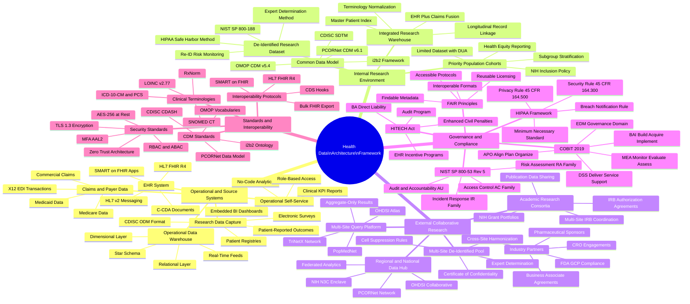

# Health Data Architecture Framework — Mind Map

> **Document Control**
> Version: 1.0.0 | Classification: Internal — Restricted | Owner: Research Informatics  
> Last Reviewed: 2026-05-26 | Review Cycle: Annual | Framework References: HIPAA 45 CFR §164, HITECH Act, NIST SP 800-53 Rev. 5, COBIT 2019, FAIR Principles

---

## Overview

This document presents the complete Health Data Architecture Framework as a hierarchical mind map. The mind map serves as a navigational reference for the entire framework — encompassing all operational source systems, internal research infrastructure, external collaborative research pathways, governance and compliance obligations, and standards & interoperability requirements.

The mind map is the highest-level artifact in the framework documentation suite. It is the entry point for new stakeholders (including auditors, IRB administrators, new investigators, and executive leadership) seeking to understand how all components of the architecture relate to one another. Every leaf node in the mind map corresponds to a more detailed specification in the framework's supporting documentation.

The architecture is organized into five major branches, each representing a functional domain:

1. **Operational & Source Systems** — The data-producing layer: EHR, operational data warehouse, research data capture tools, claims data, and business intelligence self-service.
2. **Internal Research Environment** — The governed research data infrastructure: integrated research warehouse, common data models, de-identified datasets, and priority population cohorts.
3. **External Collaborative Research** — The federated and collaborative data sharing ecosystem: regional/national data hubs, multi-site de-identified pools, academic consortia, industry partners, and multi-site query platforms.
4. **Governance & Compliance** — The regulatory and policy framework: HIPAA, HITECH, NIST SP 800-53, COBIT 2019, and the FAIR Principles.
5. **Standards & Interoperability** — The technical standards enabling semantic and structural interoperability: clinical terminologies, CDM standards, FHIR-based interoperability, and security standards.

Each branch is expanded to its full leaf-node depth in the mind map below. For compliance mapping, annotation, and audit evidence requirements for each node, refer to `04-mindmap-notes.md`.

---

## Full Architecture Mind Map

---

## Branch Summaries

### Branch 1: Operational & Source Systems

The operational and source systems branch encompasses all data-producing systems that feed the research pipeline. The EHR System is the primary source, generating real-time HL7 v2 ADT (Admit/Discharge/Transfer), ORU (Observation Result), and ORM (Order) messages, as well as HL7 FHIR R4 RESTful API resources and C-CDA documents for transitions of care. The Operational Data Warehouse (ODW) is the first aggregation point, implementing a star schema dimensional model suitable for operational reporting. The Research Data Capture node encompasses REDCap surveys, disease registries, patient-reported outcomes (PROs), and CDISC ODM (Operational Data Model) XML for clinical trial data. Claims and Payer Data covers commercial insurer, Medicare, and Medicaid claims in X12 EDI 837 (professional and institutional) and 835 (remittance) formats. The Operational Self-Service node provides governed business intelligence access for clinical and administrative users who are not research investigators.

### Branch 2: Internal Research Environment

The internal research environment is the governed space where identified and de-identified patient data are stored, harmonized, and prepared for research use. The Integrated Research Warehouse (IRW) fuses EHR and claims data, implements the Master Patient Index (MPI) for longitudinal patient matching across encounters and data sources, and normalizes terminology from source codes to standard clinical vocabularies. The Common Data Model layer transforms IRW data into the OMOP CDM v5.4 and PCORNet CDM v6.1 formats required for federated network participation, as well as i2b2 and CDISC SDTM for clinical trials. The De-Identified Research Dataset node represents data certified as de-identified per 45 CFR §164.514(b) — either by Safe Harbor or Expert Determination — with ongoing re-identification risk monitoring per NIST SP 800-188. Priority Population Cohorts are extracts governed by Limited Dataset DUAs, supporting NIH Inclusion Policy compliance for women, minorities, and underrepresented populations.

### Branch 3: External Collaborative Research

The external collaborative research branch governs all data flows beyond the institutional boundary. The Regional/National Data Hub is the governance-controlled egress point for data contributed to PCORNet, OHDSI, and NIH N3C. The Multi-Site De-Identified Pool contains data certified for cross-institutional sharing under Expert Determination with Certificate of Confidentiality protection (42 U.S.C. §241(d)). Academic Research Consortia are governed by NIH grant terms, IRB Authorization Agreements, and the NIH Data Management and Sharing Policy (NOT-OD-21-013). Industry Partners require Business Associate Agreements, FDA GCP compliance documentation, and adherence to ICH E6(R3) Good Clinical Practice. Multi-Site Query Platforms (TriNetX, OHDSI Atlas, PopMedNet) enable federated query — researchers submit a query that runs locally at each site; only aggregate results with cell suppression (≤5) are returned.

### Branch 4: Governance & Compliance

The governance and compliance branch is the normative foundation of the entire architecture. HIPAA's three rules — Privacy (45 CFR §164.500–534), Security (45 CFR §164.300–318), and Breach Notification (45 CFR §164.400–414) — establish the baseline compliance requirements. HITECH Act provisions (Pub. L. 111-5, §§13400–13411) enhanced civil monetary penalties (now up to $1.9M per violation category per year under the HHS 2023 inflation adjustment), extended direct liability to Business Associates, and mandated the HHS audit program. NIST SP 800-53 Rev. 5 provides the security control catalog organized into 20 control families. COBIT 2019 provides the IT governance framework organized into five domains (EDM, APO, BAI, DSS, MEA) with 40 governance and management objectives. The FAIR Principles (Findable, Accessible, Interoperable, Reusable) — published in Scientific Data (Wilkinson et al., 2016) — guide the framework's data sharing and metadata standards strategy.

### Branch 5: Standards & Interoperability

The standards and interoperability branch defines the technical languages in which the architecture speaks. Clinical Terminologies (SNOMED CT, LOINC, RxNorm, ICD-10-CM/PCS) provide semantic standardization — the ability to mean the same thing across different systems and institutions. CDM Standards (OMOP, PCORNet, i2b2, CDISC CDASH) provide structural standardization — the ability to represent data in the same table structure across sites. Interoperability Protocols (HL7 FHIR R4, SMART on FHIR, CDS Hooks, Bulk FHIR Export) govern real-time and batch data exchange. Security Standards (TLS 1.3, AES-256, RBAC/ABAC, MFA at NIST AAL2, Zero Trust Architecture per NIST SP 800-207) govern the confidentiality, integrity, and availability of data in transit and at rest.

---

*Document end — Lapaki Health Data Architecture Framework v1.0.0*
