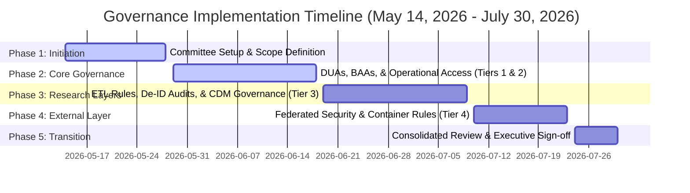

# 05-governance-timeline.md: Governance Framework & Timeline Simulation

> **Authority:** Data Governance Committee, reporting to Executive Leadership  
> **COBIT alignment:** EDM01 (Ensured Governance Framework Setting), APO01 (Managed IT Management Framework), APO05 (Managed Portfolio), BAI11 (Managed Projects)  
> **Standard basis:** HIPAA Security Rule 45 CFR Part 164 Subpart C, HIPAA Privacy Rule 45 CFR Part 164 Subpart E  
> **Review cycle:** Project Phase Gate Transition points

---

## 1. Executive Summary

This document establishes the project planning timeline and governance implementation framework for the **Generalized Healthcare Enterprise Data Architecture** from **May 14, 2026, to July 30, 2026**. 

The goal of this initiative is to define and enforce policy gates, legal agreements, and security constraints to support operational analytics, internal research, and external multi-institutional collaboration while strictly protecting patient privacy and institutional confidentiality.

---

## 2. The Caveat Statement

For all presentations, steering committee updates, and external documentation concerning this project, the following disclaimer must be utilized:

> *"The following framework represents a generalized, vendor-agnostic data architecture. It illustrates best practices for how modern healthcare systems route data from primary sources into tiered environments to support operational analytics, internal research, and external multi-institutional collaboration."*

---

## 3. Four-Tier Architecture Governance Mapping

```
[ Tier 1: Ingestion ] ──> [ Tier 2: Operational Integration ] ──> [ Tier 3: Internal Research ] ──> [ Tier 4: External Collaboration ]
```

### Tier 1: Data Ingestion & Source Systems (Far Left)
* **Scope:** Primary Electronic Health Record (EHR) Databases, Payer Claims Feeds, and Ancillary/Enterprise Systems (ERP, HR).
* **Governance Mandate:** Source system validation, ingestion pipeline logging, and secure transport (TLS 1.3).

### Tier 2: Operational Integration & Analytics Layer (Center-Left)
* **Scope:** Enterprise Data Warehouse (EDW), Self-Service Operational Tools, and Secondary Data Capture.
* **Governance Mandate:** Role-Based Access Control (RBAC) constraints (T1-Self-Service Analysts), query auditing, and separation of operational tools from clinical source systems.

### Tier 3: Internal Research & Standardization Layer (Center)
* **Scope:** Institutional Common Data Model (CDM) (e.g., standard schemas like OMOP/PCORnet), De-Identified Research Extract, and Priority Cohort Datasets.
* **Governance Mandate:** Formal de-identification audits (Safe Harbor vs. Expert Determination), IRB check points, and standard vocabulary mapping rules (Athena).

### Tier 4: External Collaborative Research Layer (Right)
* **Scope:** Federated Self-Service Networks, Multi-Institutional Data Warehouses, and Public Health Datasets.
* **Governance Mandate:** Data Use Agreements (DUAs), Business Associate Agreements (BAAs), minimum query size suppression (preventing small-cell count re-identification), and Differential Privacy (DP) limits on external federated analytical containers.

---

## 4. Project Timeline and Governance Milestones

The 11-week planning and governance implementation lifecycle is divided into five phases, starting from May 14, 2026, to July 30, 2026.



### Phase 1: Project Initiation & Scope Alignment (Weeks 1-2)
**Dates:** May 14, 2026 – May 28, 2026  
**Status:** **[COMPLETED]**
* **Action Items:**
  1. Convene the Data Governance Committee (DGC), selecting leads for Clinical Operations, Research, Security, and Privacy.
  2. Approve the project charter and map existing physical database servers to the 4-tier logical model.
  3. Engage the Institutional Review Board (IRB) to establish expedited review paths for research using the Tier 3 De-Identified Research Extract.

### Phase 2: Core Governance, Legal, & Access Policies (Weeks 3-5)
**Dates:** May 29, 2026 – June 18, 2026  
**Status:** **[IN PROGRESS]**
* **Action Items:**
  1. **Draft Data Use Agreements (DUAs)**: Create generic DUA templates governing data access rights, publish permissions, and liability for all external research partners.
  2. **Establish Business Associate Agreements (BAAs)**: Finalize vendor BAA templates for any third-party analytics engines connected to Tier 2 (EDW).
  3. **Access Controls (Tiers 1 & 2)**: Finalize the Role-Based Access Control (RBAC) mapping for operational data access, enforcing the "Minimum Necessary" standard.

### Phase 3: Research Standardization & Privacy Frameworks (Weeks 6-8)
**Dates:** June 19, 2026 – July 9, 2026  
**Status:** **[PLANNED]**
* **Action Items:**
  1. **ETL Code Review Policy**: Implement version-control requirements and sign-off gates for all transformation code moving data from Tier 2 (EDW) to Tier 3 (Institutional CDM).
  2. **De-Identification Validation Protocol**: Document the mathematical and policy steps to strip PHI from Tier 3 extracts, utilizing Safe Harbor rules or Expert Determination assessments.
  3. **Priority Cohort Criteria**: Draft standard operating procedures for researchers requesting customized clinical cohort subsets.

### Phase 4: Collaborative Networks & Edge Security (Weeks 9-10)
**Dates:** July 10, 2026 – July 23, 2026  
**Status:** **[PLANNED]**
* **Action Items:**
  1. **Federated Query Constraints**: Define count suppression thresholds (e.g., cell sizes < 11 must be masked) to prevent re-identification via federated queries in Tier 4.
  2. **Model Aggregation & Secure Compute Audit**:
     - Define parameters for edge-node model training (e.g., Differential Privacy epsilon budget limits).
     - Standardize security review guidelines for containers deployed on the local compute edge.
  3. **Public Health Reporting Gates**: Configure approval gates for automated epidemiological extractions.

### Phase 5: Consolidated Review & Go-Live Gate (Week 11)
**Dates:** July 24, 2026 – July 30, 2026  
**Status:** **[PLANNED]**
* **Action Items:**
  1. **Governance Playbook Synthesis**: Compile all policies, DUA templates, and security rules into a single *Generalized Healthcare Enterprise Data Governance Playbook*.
  2. **CISO & Privacy Officer Audit**: Conduct a final security audit of the proposed network segmentation and encryption profiles.
  3. **Go/No-Go Approval**: Vote on organizational readiness to transition from governance planning to live technical execution.

---

## 5. Risk and Mitigation Framework

| Risk Event | Target Tier | Mitigation Strategy |
| :--- | :--- | :--- |
| **Ingestion Pipeline Failures / Schema Drift** | Tier 1 ➔ Tier 2 | Implement daily source-schema validation checks. Automatically pause pipelines if unexpected fields are encountered. |
| **Exposure of PHI to Operational Users** | Tier 2 | Restrict direct SQL queries. Require the use of audited self-service dashboard tools with strict RBAC profiles. |
| **Re-Identification in Research Extracts** | Tier 3 | Enforce HIPAA Safe Harbor limits on dates and geographic elements, shifting clinical event dates per institutional policy. |
| **Unauthorized Aggregator Access** | Tier 4 | Require mutually authenticated TLS (mTLS) with strict certificate pinning between local edge clients and external hubs. |
| **Re-Identification via Federated Analysis** | Tier 4 | Require all federated queries to run through privacy-preserving algorithms with local noise addition (Differential Privacy). |
