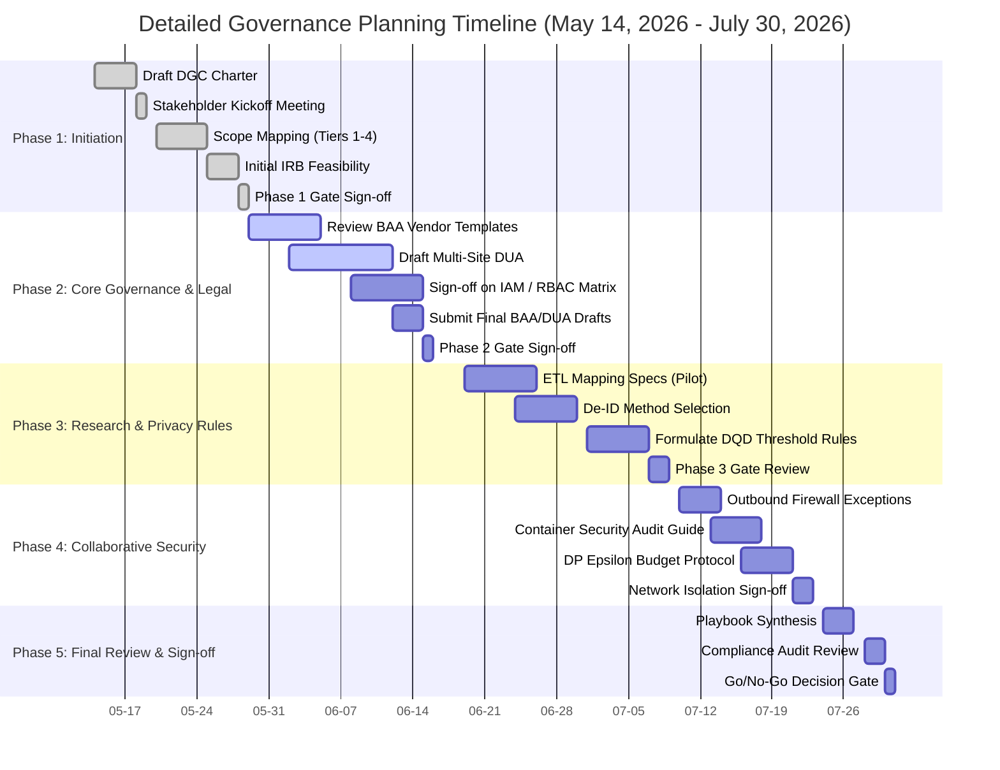

# 06-detailed-gantt.md: Detailed Planning & Governance Gantt Chart

> **Authority:** Data Governance Committee, reporting to Executive Leadership  
> **COBIT alignment:** EDM01 (Ensured Governance Framework Setting), APO01 (Managed IT Management Framework), APO05 (Managed Portfolio), BAI11 (Managed Projects)  
> **Standard basis:** HIPAA Security Rule 45 CFR Part 164 Subpart C, HIPAA Privacy Rule 45 CFR Part 164 Subpart E  
> **Review cycle:** Project Phase Gate Transition points

---

## 1. Overview

This document provides a highly detailed task breakdown and visual Gantt chart for the planning and governance implementation phase (spanning **May 14, 2026, to July 30, 2026**). It maps dependencies, task sequences, and key policy gates. 

---

## 2. Visual Gantt Chart (Mermaid)

---

## 3. Work Breakdown Structure (WBS) & Task Descriptions

### Phase 1: Project Setup & Feasibility (Weeks 1-2)
* **t1_1: Draft DGC Charter** (May 14 - May 18)
  - Define roles and responsibilities for the Data Governance Committee.
  - Establish decision-making authority and meeting cadence.
* **t1_2: Stakeholder Kickoff Meeting** (May 19)
  - Align Clinical Leads, Research PIs, IT Security, and Legal on project goals.
* **t1_3: Scope Mapping (Tiers 1-4)** (May 20 - May 25)
  - Document all current clinical and claims data stores.
  - Define the boundaries between Operational and Research zones.
* **t1_4: Initial IRB Feasibility Assessment** (May 26 - May 28)
  - Engage the Institutional Review Board for a pre-review determination of the federated framework model.

---

### Phase 2: Legal & IAM Governance (Weeks 3-5)
* **t2_1: Review BAA Vendor Templates** (May 29 - June 5)
  - Audit existing Business Associate Agreements to verify suitability for edge-compute and cloud-hosted analytics nodes.
* **t2_2: Draft Multi-Site DUA** (June 2 - June 12)
  - Formulate data sharing boundaries with partner research networks.
  - Define ownership of aggregate global model weights.
* **t2_3: Sign-off on IAM / RBAC Matrix** (June 8 - June 15)
  - Authorize the data access permissions defined in `governance/access-control-matrix.md`.
* **t2_4: Submit Final BAA/DUA Drafts to Legal** (June 16 - June 18)
  - Hand off finalized templates for formal institutional contract reviews.

---

### Phase 3: Research Standardization & Privacy Auditing (Weeks 6-8)
* **t3_1: ETL Mapping Specs (Pilot)** (June 19 - June 26)
  - Document field-level source-to-target mapping between the Enterprise Data Warehouse (Tier 2) and the Common Data Model (Tier 3).
* **t3_2: De-Identification Method Selection** (June 24 - June 30)
  - Formally choose between HIPAA Safe Harbor (structural stripping) and Expert Determination (statistical analysis of risk).
* **t3_3: Formulate DQD Threshold Rules** (July 1 - July 7)
  - Define minimum data-quality validation scores for clinical tables (e.g., condition, drug, measurement).

---

### Phase 4: Collaborative Security & Compute Policies (Weeks 9-10)
* **t4_1: Outbound Firewall Exception Draft** (July 10 - July 14)
  - Define strict routing rules for local federated learning clients to connect to the external central aggregator.
* **t4_2: Container Security Audit Guide** (July 13 - July 17)
  - Establish a standard procedure for vulnerability-scanning external software container images prior to deployment.
* **t4_3: Differential Privacy Epsilon Budget Protocol** (July 16 - July 21)
  - Define the maximum privacy loss parameter ($\epsilon$) permitted per study execution to mitigate model inversion risks.

---

### Phase 5: Final Review & Release Gate (Week 11)
* **t5_1: Playbook Synthesis** (July 24 - July 27)
  - Compile the charters, DUAs, security policies, and technical guidelines into a single, cohesive *Data Governance Playbook*.
* **t5_2: Compliance Audit Review** (July 28 - July 29)
  - Conduct a mock compliance audit using the checklists defined in the compliance documentation folder.
* **t5_3: Go/No-Go Decision Gate** (July 30)
  - The steering committee convenes to review readiness and vote on proceeding to the active technical deployment phase.
