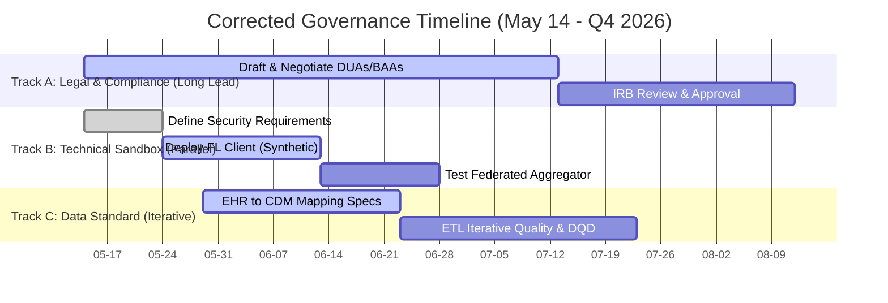

# 07-gantt-critique.md: Brutal Critique of the Planning Gantt Chart

> **Authority:** Data Governance Committee, reporting to Executive Leadership  
> **COBIT alignment:** EDM01 (Ensured Governance Framework Setting), APO12 (Managed Risk), BAI11 (Managed Projects)  
> **Standard basis:** Project Management Body of Knowledge (PMBOK), HIPAA Administrative Safeguards  
> **Review cycle:** Project Phase Gate Transition points

---

## 1. Executive Grading

| Dimension | Score (1-10) | Verdict |
| :--- | :---: | :--- |
| **Visual/Structural Clarity** | **8/10** | Clear phases, neat Mermaid rendering, and defined task durations. |
| **Sequence Logic & Dependency Realism** | **3/10** | **Critical Sequence Flaws.** Assumes a linear progression for highly iterative processes (like legal reviews and data cleaning). |
| **Resource & Operational Realism** | **2/10** | **Over-optimistic.** Task durations assume a high-priority, zero-friction environment with instant corporate response. |
| **Overall Execution Viability** | **3/10** | **High Failure Risk.** The schedule will likely collapse by Week 4 due to legal delays or mapping bottlenecks. |

---

## 2. Deep-Dive Critical Critique of Gantt Tasks

### Critique 1: The "One-Day Legal Approval" Fallacy (Phase 2 Gate)
* **Specific Task:** `Submit Final BAA/DUA Drafts (t2_4)` ends on June 18; `Phase 2 Gate Sign-off (t2_gate)` occurs on June 19.
* **The Loophole:** This schedule assumes that once the DUA and BAA drafts are submitted to institutional legal counsel, they will be reviewed, negotiated with partner sites, signed, and approved in **24 hours**. 
* **The Reality:** In a real health system, a multi-institutional DUA undergoes multiple rounds of markups between legal teams. 
* **Audit Grade: 1/10** (Catastrophic scheduling error. Legal review is the longest critical path item and should be scheduled for a minimum of 6 weeks, running in parallel with technical work).

### Critique 2: Underestimating Data Mapping & ETL Complexity (Phase 3)
* **Specific Tasks:** `ETL Mapping Specs (t3_1)` (7 days) and `Formulate DQD Threshold Rules (t3_3)` (6 days).
* **The Loophole:** Standardizing raw EHR database schemas into a unified CDM (like OMOP) is represented as a quick, linear process. 
* **The Reality:** 
  - Standardizing local concepts (e.g., mapping custom lab batteries to LOINC, local pharmacy formularies to RxNorm) requires manual, clinical terminology validation.
  - The Data Quality Dashboard (DQD) is not a "run once and check the box" task. It is a loop: *Run DQD ➔ Identify mapping error ➔ Rewrite ETL ➔ Re-run DQD*. 
* **Audit Grade: 3/10** (Needs an explicit recursive loop notation and at least 3-4 weeks of buffer time).

### Critique 3: Late-Stage Security Guidelines (Phase 4)
* **Specific Tasks:** `Container Security Audit Guide (t4_2)` (5 days) starts on July 13.
* **The Loophole:** Writing the security audit guidelines for the federated learning container in Phase 4 is too late.
* **The Reality:** Security requirements (such as which container base images are trusted, which libraries are banned, and what port permissions are allowed) must be defined in **Phase 1**. If developers build or download an FL client in Phase 2/3 and find out in Phase 4 that it fails CISO standards, weeks of engineering work must be discarded.
* **Audit Grade: 2/10** (Bad architectural sequence. Policies must precede build).

### Critique 4: Lack of Float and Contingency Buffer
* **Specific Structure:** Tasks are chained back-to-back with zero buffer days.
* **The Loophole:** If any task slips by even 1 day, the entire July 30 go-live date is missed.
* **The Reality:** Clinical data projects have high risk profiles due to operational emergency diversions (e.g., IT staff dealing with an EHR system patch or network outage).
* **Audit Grade: 2/10** (Unrealistic project management practice. A high-risk project requires at least 20-30% "float" time).

---

## 3. Corrective Plan: Shifting the Gantt to a 9/10

To make this plan realistically executable, the Gantt chart must be redesigned. The following changes are mandatory:

### Key Redesign Features:
1. **Multi-Track Parallelization:** Legal (Track A), Security Architecture (Track B), and Data Engineering (Track C) run concurrently from Day 1 rather than sequentially.
2. **Early Security Boundary Definition:** Security requirements are drafted in Week 1, allowing the technical team to build the container testing environment safely.
3. **Synthetic Data Sandbox:** The FL pipeline is tested on synthetic/dummy data first, allowing technical issues to be ironed out *while* legal teams negotiate the real DUA.
