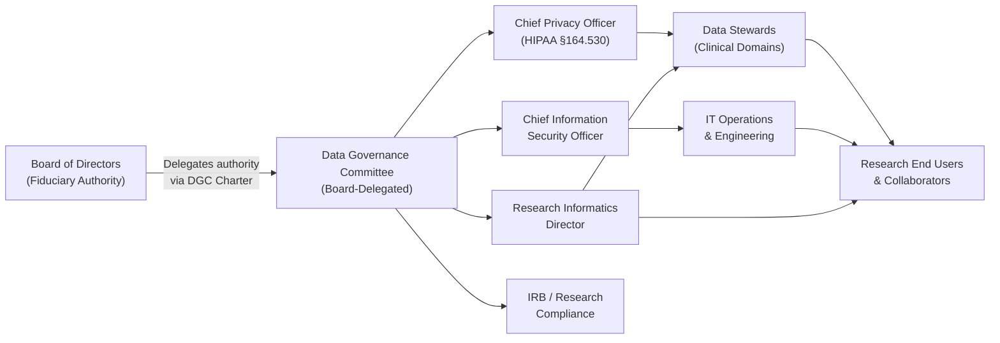
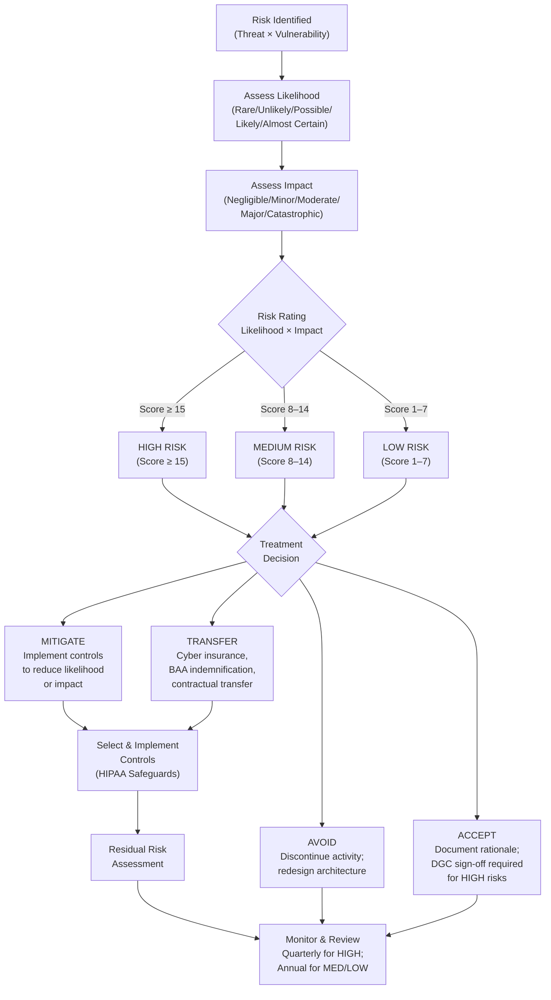

# Governance System — EDM Domain

> **Classification:** Internal Governance Documentation — Lapaki Health Data Architecture Project  
> **COBIT 2019 Domain:** EDM — Evaluate, Direct, and Monitor  
> **Version:** 1.0  
> **Effective Date:** 2026-05-26  
> **Review Cycle:** Annual  
> **Owner:** Data Governance Committee / Board of Directors Delegated Authority  

---

## Overview

The **EDM domain** represents the apex of the COBIT 2019 governance architecture. Whereas the four management domains (APO, BAI, DSS, MEA) address *how* information technology is planned, built, operated, and measured, the EDM domain addresses *why* — establishing the authority structures, strategic intent, risk tolerances, and stakeholder expectations that give management its direction.

In healthcare data governance, the EDM domain is uniquely critical because PHI stewardship carries **personal, institutional, and legal accountability** that cannot be delegated entirely to IT management. A health system's governing board bears non-delegable fiduciary responsibility for patient data, including obligations under HIPAA's administrative simplification provisions, OCR enforcement actions, and state breach notification laws. COBIT's EDM domain formalizes this accountability into six discrete, measurable objectives.

The Lapaki Health Data Architecture governance system is designed to demonstrate **EDM Level 3 (Established)** capability across all six EDM objectives, with documented progression plans toward Level 4 (Predictable) in EDM01, EDM03, and EDM05 within 24 months.

---

## EDM01 — Ensured Governance Framework Setting and Maintenance

### Purpose Statement

Establish and maintain an effective, evidence-based governance framework for the Lapaki Health Data Architecture that ensures board-level accountability for PHI stewardship, supports federated research objectives, and creates the structural foundation upon which all management objectives operate.

### Healthcare Context

In a healthcare data architecture context, EDM01 is the objective that establishes the **institutional legitimacy** of the entire governance system. Without a formally adopted governance framework — ratified by the governing board or its delegated committee — no downstream policy, standard, procedure, or control carries the authority necessary to compel compliance across clinical, research, IT, and administrative stakeholders.

For the Lapaki project, this means the Data Governance Committee (DGC) must operate under a board-approved charter that explicitly assigns accountability for OMOP CDM integrity, de-identification quality oversight, federated query authorization, and AI/ML pipeline governance. The charter must identify named roles (Data Governance Officer, Chief Privacy Officer, Chief Information Security Officer, Research Informatics Director), their authority boundaries, and their escalation paths to the board.

Healthcare governance frameworks must also navigate the **dual accountability** inherent in academic medical centers: the board's fiduciary duty to patients and the institution's research mission. COBIT EDM01 resolves this tension by requiring that the governance framework explicitly address all stakeholder classes and their competing interests, rather than optimizing for any single class.

### Key Activities

1. **Define and ratify the Data Governance Charter**: A board-approved document that establishes the Lapaki Data Governance Committee's mandate, authority, composition, meeting cadence, reporting obligations, and decision-making authority for data-related matters including CDM schema approvals, de-identification protocol changes, and federated network participation agreements.

2. **Establish a Data Stewardship Program**: Assign formal Data Steward roles to clinical domain experts (pharmacy, laboratory, encounters, diagnoses) who bear accountability for CDM domain accuracy and completeness. Stewards participate in the DGC and are the primary point of escalation for data quality disputes.

3. **Set PHI Protection Governance Policies**: Adopt foundational policies for PHI classification, minimum necessary access, de-identification method selection, and data sharing agreement governance. These policies must be HIPAA Privacy Rule compliant (§164.530 administrative requirements) and reviewed on a defined cycle.

4. **Define governance review and update mechanisms**: Establish a formal process for reviewing the governance framework annually and on any material change (new regulatory requirement, new data source, new use case). Changes must be documented and approved by the DGC.

5. **Communicate governance structure to all stakeholders**: Ensure that researchers, clinical staff, IT personnel, legal counsel, IRB members, and external collaborators understand the governance framework and their roles within it.

6. **Integrate with institutional governance**: Align the Lapaki governance framework with the host institution's broader IT governance, research compliance, and privacy governance structures to avoid conflicting authorities.

### Healthcare-Specific Metrics

| Metric | Target | Measurement Frequency |
|--------|--------|-----------------------|
| DGC meeting frequency | Minimum 6 meetings/year | Quarterly tracking |
| Policy review completion rate | 100% of policies reviewed on cycle | Annual audit |
| Governance charter ratification status | Board-approved; current version in effect | Continuous |
| Incident escalation to DGC: time to first review | ≤ 5 business days from identification | Per incident |
| Stakeholder governance training completion | ≥ 95% of data-handling personnel | Semi-annual |
| Open governance action items > 90 days | Zero | Monthly |

### HIPAA Alignment

- **Privacy Rule §164.530(a)**: Requires covered entities to designate a privacy official responsible for developing and implementing privacy policies and procedures. The EDM01 governance framework operationalizes this requirement by embedding the Privacy Officer into the DGC structure.
- **Privacy Rule §164.530(b)**: Requires workforce training on privacy policies and procedures; EDM01 establishes the governance structure that mandates and tracks this training.
- **Privacy Rule §164.530(i)**: Requires documentation of policies and procedures in written form (paper or electronic) and retention for 6 years. The DGC charter, policies, and meeting minutes are subject to this retention requirement.

### Governance Hierarchy Diagram

---

## EDM02 — Ensured Benefits Delivery

### Purpose Statement

Secure optimal value from data infrastructure investments by establishing governance mechanisms that track, validate, and report on the benefits delivered by the Lapaki Health Data Architecture to clinical care, research, and operational stakeholders.

### Healthcare Context

Healthcare IT investments are perennially under scrutiny because they draw from constrained capital budgets that compete with direct clinical care needs. A federated research data architecture like Lapaki must continuously demonstrate that its costs — infrastructure, personnel, licensing, compliance overhead — are justified by quantifiable research and clinical outcomes. COBIT EDM02 provides the governance mechanism to make this case systematically and defensibly.

Benefits delivery in health data architecture takes multiple forms: research publications enabled by standardized CDM data, cohort query capabilities that reduce time-to-science, de-identification throughput that enables compliant data sharing, and federated query infrastructure that allows multi-site analyses without transferring PHI. Each of these represents a dimension of benefit that must be tracked, reported to the DGC, and tied to investment decisions.

The PMC13000207 (2026) trustworthy AI pipeline study demonstrates that governance frameworks that explicitly track benefits delivery are significantly more likely to sustain funding for data infrastructure over time, because they provide the evidence base for demonstrating return on investment to institutional leadership and grant-funding agencies.

COBIT EDM02 also requires that benefits realization be planned *before* investment — not discovered retrospectively. For Lapaki, this means every major infrastructure decision (CDM version upgrade, new data source integration, federated network expansion) must include a documented benefits case with measurable outcomes.

### Key Activities

1. **Develop Benefits Realization Framework**: Define the benefit dimensions for the Lapaki architecture (research enablement, clinical quality improvement, operational efficiency, regulatory compliance) and establish baseline measurements for each.

2. **Track CDM adoption and quality metrics**: Monitor completeness, conformance, and quality of OMOP CDM data across all contributing sites and report to the DGC quarterly.

3. **Measure federated query capability**: Track query turnaround time, query success rate, and number of multi-site analyses completed; compare against stated targets.

4. **Monitor de-identification throughput**: Measure the volume of records de-identified per reporting period, error rates, and turnaround time for de-identification service requests from researchers.

5. **Report research output attribution**: Maintain a registry of publications, grants, and research products enabled by the Lapaki data architecture; report to the DGC and institutional leadership annually.

6. **Conduct benefits reviews on completed initiatives**: After major CDM upgrades or new data source integrations, formally assess whether the projected benefits were realized and document lessons learned.

### Healthcare-Specific Metrics

| Metric | Target | Measurement Frequency |
|--------|--------|-----------------------|
| Research publications attributing Lapaki data | ≥ 5/year | Annual |
| Cohort query turnaround time (standard) | ≤ 3 business days | Monthly |
| CDM conformance rate (OMOP Achilles) | ≥ 95% | Quarterly |
| De-identification throughput | ≥ 50,000 records/month | Monthly |
| Data reuse rate (datasets requested >1x) | ≥ 30% | Annual |
| Benefits realization reviews completed on schedule | 100% | Per initiative |
| New data source integrations with documented benefits case | 100% | Per integration |

### FAIR Principles Alignment

The FAIR data principles (Findable, Accessible, Interoperable, Reusable) are directly supported by EDM02's benefits delivery mandate:
- **Findable**: Maintaining a searchable data catalog with persistent identifiers
- **Accessible**: Implementing controlled-access data sharing workflows
- **Interoperable**: OMOP CDM adoption ensures cross-site query compatibility
- **Reusable**: De-identification and data sharing agreements enable secondary use

---

## EDM03 — Ensured Risk Optimization

### Purpose Statement

Ensure that the risk profile of the Lapaki Health Data Architecture is aligned with the institution's documented risk appetite, with explicit governance mechanisms for identifying, assessing, and treating PHI breach risk, re-identification risk, federated data exposure risk, and AI/ML pipeline risk.

### Healthcare Context

Risk management in healthcare data architecture is not discretionary — it is a legal obligation. HIPAA Security Rule §164.308(a)(1) mandates a formal risk analysis that identifies potential vulnerabilities to PHI, assesses the likelihood and impact of threats exploiting those vulnerabilities, and documents the resulting risk decisions. COBIT EDM03 provides the *governance* wrapper for this regulatory obligation, ensuring that risk decisions are made at the appropriate level of authority, documented with appropriate evidence, and monitored continuously.

For the Lapaki architecture, the risk landscape includes:

**PHI Breach Risk**: Unauthorized access to identifiable patient data through infrastructure vulnerabilities, misconfigured access controls, or insider threat. The potential regulatory consequence includes OCR fines of up to $1.9 million per violation category per year.

**Re-Identification Risk**: Even properly de-identified data (Safe Harbor or Expert Determination pathway) carries residual re-identification risk, particularly in small-cell demographics or rare disease populations. Governance of acceptable re-identification risk thresholds must be documented and board-endorsed.

**Federated Data Exposure Risk**: In the pSCANNER-style multi-site architecture (Ohno-Machado et al., 2014), aggregate query results from distributed sites can, under certain attack models, reveal information about individual records. Differential privacy controls and query result suppression rules require governance oversight to ensure consistent application across sites.

**AI/ML Pipeline Risk**: Chawla et al. (2024) identifies AI training data bias, model drift, and algorithmic fairness as governance-level risks requiring explicit board-level risk appetite definition, not merely technical controls. An AI model trained on historically biased CDM data may perpetuate care disparities at scale — a harm that is both clinical and legal.

### Key Activities

1. **Define and document institutional risk appetite**: The DGC must formally adopt a risk appetite statement that specifies acceptable risk thresholds for each major risk category (PHI breach probability, re-identification risk score, model fairness metrics).

2. **Conduct and maintain HIPAA Security Rule risk analysis**: Perform the §164.308(a)(1)(ii)(A) risk analysis on an annual basis and on any material change to the environment; document identified risks, likelihood, impact, and risk rating.

3. **Establish residual risk acceptance thresholds**: Define the conditions under which residual risk after control implementation is formally accepted by the DGC (not delegated to management).

4. **Maintain the risk register**: Document all identified risks, their current status, assigned owners, treatment plans, and control effectiveness evidence.

5. **Govern risk treatment decisions**: Ensure that High risks require DGC approval for acceptance; Medium risks may be accepted by the Data Governance Officer with DGC notification; Low risks may be accepted by management.

6. **Monitor emerging risks**: Establish mechanisms for identifying new threats (e.g., new attack techniques, regulatory changes, new AI capabilities) and escalating them to the DGC on a defined cadence.

### HIPAA Alignment

- **Security Rule §164.308(a)(1)(i)**: Security Management Process — requires risk analysis, risk management, sanction policy, and information system activity review.
- **Security Rule §164.308(a)(1)(ii)(A)**: Risk Analysis — conduct accurate and thorough assessment of potential risks and vulnerabilities.
- **Security Rule §164.308(a)(1)(ii)(B)**: Risk Management — implement security measures sufficient to reduce risks to a reasonable and appropriate level.

### Risk Treatment Decision Matrix

---

## EDM04 — Ensured Resource Optimization

### Purpose Statement

Ensure that the human, technical, financial, and informational resources required to operate the Lapaki Health Data Architecture are acquired, maintained, and deployed optimally — balancing cost, risk, and capability — to sustain a high-quality, compliant federated research data platform.

### Healthcare Context

Healthcare research data infrastructure is resource-intensive and resource-constrained simultaneously. The Lapaki architecture requires specialized expertise in clinical informatics, OMOP CDM implementation, de-identification science, federated query engineering, and healthcare data security — a talent profile that is scarce, expensive, and subject to significant turnover in the academic healthcare labor market.

COBIT EDM04 requires that the DGC provide governance-level oversight of resource planning — not merely delegate this entirely to operational management. In practice, this means the DGC must approve the staffing model for the Research Informatics team, authorize major infrastructure investments (cloud compute, CDM tooling licenses, de-identification platforms), and ensure that resource allocation reflects the organization's stated priorities (patient safety data integrity above all others).

Resource optimization for healthcare data architecture encompasses multiple dimensions:

**Human Capital**: Clinical informatics specialists, data engineers, privacy engineers, and governance staff. The DGC must ensure succession planning exists for key-person dependencies (single expert on OMOP CDM mapping, sole de-identification specialist).

**Compute Infrastructure**: CDM processing pipelines require significant compute capacity for ETL jobs, Achilles quality characterization, and federated query execution. Capacity planning must anticipate data volume growth from new EHR integrations and longitudinal data accumulation.

**Licensing and Vendor Management**: CDM tooling (OHDSI Atlas, ATLAS, Achilles, DataQualityDashboard), de-identification platforms, and EHR integration middleware all carry licensing obligations that must be managed within the governance framework.

**Information Resources**: The OMOP CDM vocabulary (SNOMED CT, LOINC, RxNorm, ICD-10-CM) requires annual licensing renewals and update management. These are foundational information resources without which the CDM loses its semantic interoperability.

### Key Activities

1. **Develop and maintain a workforce plan**: Document required competencies for each role in the Research Informatics team; identify gaps; authorize recruitment or training to close gaps.

2. **Implement capacity planning for data infrastructure**: Conduct semi-annual reviews of compute, storage, and network capacity against projected data volume growth.

3. **Manage CDM tooling vendor relationships**: Maintain current contracts, evaluate vendor performance against SLAs, and govern tool upgrades within the change management process.

4. **Govern EHR integration licensing**: Ensure HL7 FHIR interface agreements and EHR vendor contracts are current and align with the data sharing requirements of the federated architecture.

5. **Authorize budget for governance overhead**: The DGC must recognize governance activities (policy development, training, audit preparation) as resource investments, not overhead to be minimized.

6. **Plan for succession and knowledge transfer**: Maintain documented runbooks, CDM mapping decisions, and de-identification configuration artifacts so that knowledge is institutionalized rather than resident in individuals.

### Key Metrics

| Metric | Target | Measurement Frequency |
|--------|--------|-----------------------|
| Key-person dependency on critical functions | Zero single points of failure | Semi-annual |
| CDM tooling license renewal on-time rate | 100% | Annual |
| Infrastructure capacity headroom | ≥ 25% compute/storage buffer | Quarterly |
| Workforce plan currency | Updated ≤ 12 months | Annual |
| Vendor SLA compliance rate | ≥ 98% | Quarterly |
| Research Informatics FTE vacancy rate | ≤ 10% | Quarterly |

---

## EDM05 — Ensured Stakeholder Engagement

### Purpose Statement

Ensure that the information needs, interests, and concerns of all stakeholders in the Lapaki Health Data Architecture ecosystem — including patients, clinical researchers, IRBs, data stewards, IT staff, legal counsel, privacy officers, payer partners, and external collaborators — are identified, documented, prioritized, and addressed through formal governance mechanisms.

### Healthcare Context

The healthcare data ecosystem is defined by an unusually diverse and often conflicting set of stakeholder interests. Patients expect their data to be used for their care benefit and protected from unauthorized use. Clinical researchers require broad data access to enable discovery. Legal and compliance staff apply a precautionary principle to data sharing. Payer partners require access to outcomes data under value-based care contracts. IRBs must balance research benefit against subject protection. External collaborators in federated networks (e.g., the PCORnet or CTSA network model underlying pSCANNER) bring their own institutional requirements.

COBIT EDM05 requires the DGC to govern stakeholder engagement — not merely manage it operationally. This means the DGC defines which stakeholders have formal governance participation rights (voting membership on the DGC, representation in policy review), which have consultation rights (required notification before policy changes), and which have information rights (periodic reporting).

The PMC13000207 (2026) trustworthy AI pipeline governance study specifically identifies patient advisory board engagement and community representative participation in AI governance as a distinguishing characteristic of trustworthy AI systems — a finding that directly informs the EDM05 design for the Lapaki architecture.

### Stakeholder Register

| Stakeholder Class | Governance Role | Engagement Mechanism | Frequency |
|-------------------|----------------|---------------------|-----------|
| Board of Directors | Ultimate authority; DGC charter ratification | Annual governance report; ad hoc for major incidents | Annual + as needed |
| Data Governance Committee | Policy approval; risk acceptance; resource authorization | DGC meetings; between-meeting approval process | ≥ 6×/year |
| Chief Privacy Officer | PHI governance oversight; HIPAA compliance | DGC membership; incident escalation | Continuous |
| IRB / Research Compliance | Research protocol oversight; data use validation | DGC liaison; protocol review process | Per protocol |
| Clinical Researchers | Data access requests; research design input | Researcher portal; DGC advisory role | Per request |
| Data Stewards (Clinical) | CDM domain accuracy; data quality accountability | Data Steward Council; DGC reporting | Monthly |
| IT Operations | Infrastructure management; security operations | DGC reporting; change advisory board | Per change |
| Legal Counsel | BAA review; data sharing agreement review; breach response | DGC consultation | As needed |
| Payer Partners | Value-based care data access; claims linkage | DGC-approved data sharing agreements | Per agreement |
| External Federated Sites | Multi-site query participation; CDM harmonization | Federated governance committee; bilateral agreements | Quarterly |
| Patient Advisory Board | Patient perspective on data use; consent model input | Annual forum; DGC reporting | Annual |

### Key Activities

1. **Develop and maintain the Stakeholder Register**: Document all stakeholder classes, their interests, governance roles, and engagement mechanisms; review annually and on any major change.

2. **Implement structured researcher communication**: Establish regular communication to the research community regarding data availability, new CDM data sources, policy changes, and access procedures.

3. **Manage federated network governance**: Participate in cross-institutional governance structures for the federated query network, representing the Lapaki institution's policies and interests.

4. **Operate the Patient Advisory Board**: Convene an annual patient advisory forum to inform governance decisions on consent models, data use transparency, and patient-facing data access mechanisms.

5. **Maintain the DGC reporting calendar**: Ensure that all DGC stakeholders receive timely, relevant, accurate governance reporting on the schedule defined in the charter.

6. **Manage external collaborator onboarding**: Establish a formal governance process for onboarding new federated sites or external research collaborators, including data sharing agreement execution, privacy training verification, and CDM harmonization review.

### FAIR Principles Alignment

EDM05 directly supports the **Accessible** (A) and **Reusable** (R) dimensions of FAIR data principles:
- Governance of data access workflows ensures researchers can navigate the access process without barriers
- Stakeholder engagement in governance builds the trust that enables broader data reuse

---

## EDM06 — Ensured Transparency

### Purpose Statement

Ensure that the Lapaki Health Data Architecture operates with demonstrable transparency — in its governance processes, data provenance, audit trails, methodology documentation, and regulatory reporting — such that all stakeholders can trust the integrity of the data, the fairness of its governance, and the institution's good-faith compliance with applicable law.

### Healthcare Context

Transparency in healthcare data governance operates on multiple levels simultaneously:

**Regulatory Transparency**: HIPAA requires covered entities to maintain documentation of policies, procedures, and compliance activities for six years. OCR investigation and corrective action plan compliance requires demonstrated openness with federal regulators.

**Research Transparency**: The scientific community's reproducibility standards require that research conducted on CDM data be accompanied by documented methodology, data provenance information, and — where permissible — replication datasets. Ohno-Machado et al. (2014) built the pSCANNER architecture explicitly to enable multi-site reproducibility by standardizing data models across participating sites.

**Algorithmic Transparency**: AI/ML models trained on CDM data must be accompanied by documentation of training data characteristics, model architecture, validation methodology, and known limitations. Chawla et al. (2024) identifies algorithmic transparency as a prerequisite for trustworthy AI in healthcare, noting that opaque model development processes are the leading driver of AI-related compliance failures.

**Data Provenance**: Every dataset derived from the Lapaki CDM must carry provenance metadata sufficient to answer: what source systems contributed, which ETL version was used, which vocabulary version was applied, which de-identification method was applied, and what the data extraction date was.

### Key Activities

1. **Maintain the enterprise data catalog**: Implement and maintain a searchable catalog of all CDM datasets, de-identified research files, and derived analytical datasets, with provenance metadata for each.

2. **Implement and maintain audit logging**: Ensure that all data access, query execution, de-identification operations, and administrative actions on the Lapaki platform generate tamper-evident audit log entries, retained in accordance with HIPAA and institutional policy.

3. **Document and publish CDM lineage**: Maintain version-controlled documentation of all ETL transformation logic, vocabulary mappings, and CDM configuration decisions, accessible to authorized researchers.

4. **Produce and distribute governance transparency reports**: Publish annual reports to the DGC and institutional leadership summarizing governance activity, audit findings, policy changes, and compliance status.

5. **Maintain HHS reporting compliance**: Ensure timely filing of required HHS reports (including breach notifications under §164.410) and maintain documentation of all regulatory correspondence.

6. **Support external audit and assurance**: Maintain organized, accessible documentation of all governance evidence (policies, meeting minutes, training records, audit logs, risk assessments) to support internal audit, HITRUST assessment, and regulatory examination.

### Key Metrics

| Metric | Target | Measurement Frequency |
|--------|--------|-----------------------|
| Data catalog coverage (% of datasets cataloged) | ≥ 99% | Quarterly |
| Audit log completeness (% of operations logged) | 100% | Continuous / monthly review |
| CDM lineage documentation currency | Updated within 30 days of any ETL change | Per change |
| Governance transparency report publication on schedule | 100% | Annual |
| Audit evidence package readiness time | ≤ 10 business days from request | Per audit |
| HHS breach notifications filed on time | 100% (within 60 days of discovery) | Per incident |
| Open audit findings > 90 days | Zero | Monthly |

### HIPAA Alignment

- **Privacy Rule §164.530(j)**: Documentation requirements — all privacy policies and procedures must be documented in written form and retained for 6 years from date of creation or last effective date, whichever is later.
- **Security Rule §164.310(d)(2)(iii)**: Audit controls — implement hardware, software, and procedural mechanisms that record and examine activity in information systems containing PHI.
- **Breach Notification Rule §164.410**: Notification to HHS — all breaches affecting 500 or more individuals must be reported to HHS within 60 days of discovery; breaches affecting fewer than 500 individuals must be logged and reported annually.

---

## EDM Domain Summary: Current State and Target State

| Objective | Current Capability Level | Target Level (24 Months) | Primary Gap |
|-----------|--------------------------|--------------------------|-------------|
| EDM01 — Governance Framework | Level 2 (Managed) | Level 3 (Established) | Charter not yet board-ratified |
| EDM02 — Benefits Delivery | Level 2 (Managed) | Level 3 (Established) | Benefits realization framework not formalized |
| EDM03 — Risk Optimization | Level 3 (Established) | Level 4 (Predictable) | Risk register lacks quantitative likelihood metrics |
| EDM04 — Resource Optimization | Level 2 (Managed) | Level 3 (Established) | Workforce plan not current; succession gaps |
| EDM05 — Stakeholder Engagement | Level 2 (Managed) | Level 3 (Established) | Patient advisory board not yet convened |
| EDM06 — Transparency | Level 2 (Managed) | Level 3 (Established) | Data catalog coverage below target |

---

## References

1. **Ohno-Machado, L., et al. (2014).** pSCANNER: Patient-centered scalable national network for effectiveness research. *JAMIA*, **21**(4), 621–626. [https://doi.org/10.1136/amiajnl-2014-002751](https://doi.org/10.1136/amiajnl-2014-002751)

2. **[Toward Integrated Sleep Health] (2026).** Trustworthy AI pipeline governance in multi-site health research networks. PMC13000207. *PubMed Central.*

3. **Chawla, A., et al. (2024).** Trustworthy AI Systems: Governance, Compliance, and Accountability Frameworks. *IJETCSIT*, **5**(3).

4. **ISACA. (2018).** COBIT 2019 Framework: Governance and Management Objectives. ISACA.

5. **U.S. Department of Health and Human Services.** HIPAA Administrative Simplification Regulations. 45 CFR Parts 160 and 164.

---

*This document is controlled by the Lapaki Data Governance Committee. All modifications require DGC approval per EDM01 governance charter provisions.*
