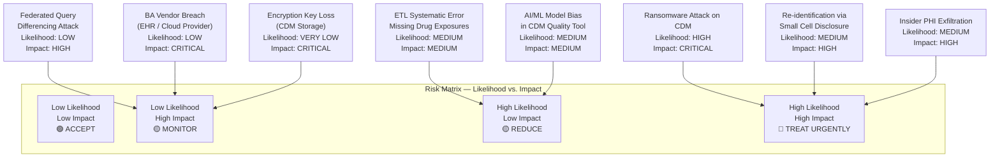
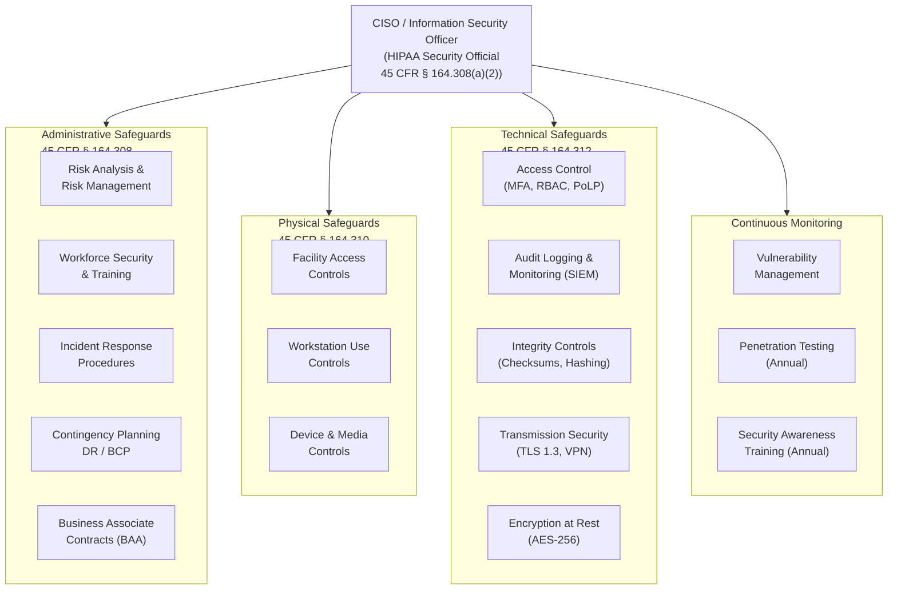

# Align, Plan & Organize (APO) Domain — APO01–APO14

> **COBIT 2019 Reference:** Align, Plan & Organize (APO) is one of the five governance and management objective domains defined in COBIT 2019 (ISACA, 2018). APO objectives address the overarching organization, strategy, and planning needed to direct and coordinate technology resources in support of enterprise goals. In a healthcare research data environment, APO objectives govern how the health data pipeline, CDM infrastructure, and clinical data management programs are structured, governed, and aligned with the organization's research mission, HIPAA obligations, and regulatory requirements.

---

## Table of Contents

- [APO01 — Managed IT Management Framework](#apo01--managed-it-management-framework)
- [APO02 — Managed Strategy](#apo02--managed-strategy)
- [APO03 — Managed Enterprise Architecture](#apo03--managed-enterprise-architecture)
- [APO04 — Managed Innovation](#apo04--managed-innovation)
- [APO05 — Managed Portfolio](#apo05--managed-portfolio)
- [APO06 — Managed Budget and Costs](#apo06--managed-budget-and-costs)
- [APO07 — Managed Human Resources](#apo07--managed-human-resources)
- [APO08 — Managed Relationships](#apo08--managed-relationships)
- [APO09 — Managed Service Agreements](#apo09--managed-service-agreements)
- [APO10 — Managed Vendors](#apo10--managed-vendors)
- [APO11 — Managed Quality](#apo11--managed-quality)
- [APO12 — Managed Risk](#apo12--managed-risk)
- [APO13 — Managed Security](#apo13--managed-security)
- [APO14 — Managed Data](#apo14--managed-data)
- [Capability Summary Table](#capability-summary-table)

---

## APO01 — Managed IT Management Framework

### Healthcare Context

APO01 requires the organization to establish, maintain, and communicate an IT management framework that defines the principles, policies, and structures under which technology is governed. In a healthcare research data environment, this translates directly into the **Data Governance Charter** for the health data pipeline. The charter must delineate accountability lines between the Principal Investigator (PI), the Data Governance Committee, the Institutional Review Board (IRB), the Information Security Officer (ISO), and the data engineering team. For organizations operating a Common Data Model (CDM) such as OMOP CDW, PCORNet, or i2b2, the governance framework must establish who owns data quality obligations, who approves schema changes, who authorizes data access for new research projects, and how exceptions are escalated.

The IT management framework in healthcare cannot be siloed. It must integrate with the HIPAA Privacy Officer's responsibilities (45 CFR § 164.530(a)), the organization's existing Notice of Privacy Practices (NPP), and the federal research data sharing requirements under 45 CFR Part 46 (Common Rule). The framework must also define how COBIT 2019 governance objectives align with existing ISO 27001 information security management activities and NIST SP 800-53 Rev. 5 control catalog activities. Critically, this framework must be reviewed at least annually and whenever significant structural changes occur — such as the addition of a new EHR system, federated network participation (PCORNet, TriNetX), or a major CDM version upgrade.

The governance charter should be publicly accessible to all internal stakeholders, version-controlled in the organization's document management system, and approved at the executive level (e.g., CISO, CIO, or Institutional Official).

### Key Activities

- **Establish the Data Governance Charter:** Draft, approve, and publish a formal governance charter identifying roles (Data Owner, Data Steward, Data Custodian, Researcher, IRB Liaison), responsibilities, decision rights (RACI matrix), and escalation pathways for the health data pipeline.
- **Define and Publish IT Management Policies:** Develop and maintain a policy library covering acceptable use, data access control, de-identification standards (Safe Harbor / Expert Determination per 45 CFR § 164.514), incident response, and CDM change management; ensure policies are version-controlled and reviewed annually.
- **Implement a Governance Operating Model:** Establish a Data Governance Committee (DGC) with at least quarterly cadence, documented agendas and minutes, and formal voting thresholds for policy changes, data access approvals, and schema amendments.
- **Align with Regulatory Requirements:** Map each governance policy to its controlling regulatory citation (HIPAA Privacy Rule 45 CFR Part 164 Subpart E, Security Rule 45 CFR Part 164 Subpart C, HITECH Act, Common Rule 45 CFR Part 46) and track compliance obligations in a regulatory matrix.
- **Communicate Framework to All Stakeholders:** Conduct mandatory annual HIPAA and data governance training for all staff with access to PHI or CDM data; track completion rates; issue governance updates via structured communications when policies change.

### Metrics

| Metric | Target | Measurement Frequency |
|---|---|---|
| Governance Policy Review Compliance Rate | 100% of policies reviewed annually | Annual |
| Data Governance Committee Meeting Attendance Rate | ≥ 85% quorum achieved per meeting | Quarterly |
| HIPAA Workforce Training Completion Rate | 100% within 30 days of hire; 100% annual refresh | Annual / Onboarding |

### HIPAA / NIST Alignment

| Standard | Citation | Alignment |
|---|---|---|
| HIPAA Privacy Rule | 45 CFR § 164.530(a) | Designation of a Privacy Official with responsibility for framework implementation |
| HIPAA Security Rule | 45 CFR § 164.308(a)(1) | Security Management Process — risk analysis, risk management, sanction policy, information system activity review |
| NIST SP 800-53 Rev. 5 | PL-1 (Policy and Procedures) | Policy and procedure documentation requirements |
| NIST SP 800-53 Rev. 5 | PM-1 (Information Security Program Plan) | Enterprise-level program plan requirement |

---

## APO02 — Managed Strategy

### Healthcare Context

APO02 governs the development and maintenance of an IT/data strategy that is explicitly aligned with the enterprise's business strategy. In an academic medical center or health system operating a clinical data research program, this means the **data strategy must be derived from and traceable to the research mission, clinical quality priorities, and funding portfolio**. The data strategy must answer: What data assets does the organization need to fulfill its research aims? How will CDM infrastructure evolve over the next three to five years to support anticipated grant portfolio growth? How will the organization remain competitive in PCORNet participation, CTSA data sharing obligations, and NIH data sharing mandates (per the 2023 NIH Data Management and Sharing Policy)?

The strategy must address the **trajectory of EHR data complexity**, including the transition from HL7 v2.x interfaces to FHIR R4 APIs, the growing volume of wearable and remote patient monitoring data, genomic data integration, and the need for federated query capability across multiple clinical sites. The strategy must explicitly identify which CDM standards will be maintained (OMOP CDW, PCORNet CDM, i2b2), what version lifecycle commitments the organization will make, and how conflicts between CDM standards will be reconciled.

Critically, the data strategy must be **formally adopted by institutional leadership** — not just the IT department — because data strategy in healthcare has direct implications for regulatory exposure (HIPAA), research compliance (Common Rule), and fiduciary obligations (grant stewardship). The strategy should be reviewed annually and updated within 90 days of material changes to the regulatory, competitive, or technology landscape.

### Key Activities

- **Conduct Strategic Needs Assessment:** Perform an annual environmental scan covering the research portfolio pipeline, funding agency data sharing requirements, clinical informatics technology trends, and competitive positioning within research networks (PCORNet, ENACT, TriNetX).
- **Develop a 3-to-5-Year Data Strategy Roadmap:** Define strategic objectives, technology investments, CDM version lifecycle commitments, workforce capacity plans, and budget projections; align with institutional strategic plan.
- **Map Data Strategy to Research Mission:** Trace each strategic data initiative to one or more funded research programs, clinical quality goals, or regulatory compliance mandates; document traceability in a strategy-to-objective matrix.
- **Establish Strategy Governance Process:** Require formal institutional approval of the data strategy by the Chief Research Officer, CIO, and Data Governance Committee; schedule biannual progress reviews against strategic KPIs.
- **Communicate Strategy to All Stakeholders:** Publish the strategy roadmap (appropriately redacted for sensitive investment details) to all data stakeholders; provide quarterly strategy briefings to department leadership.

### Metrics

| Metric | Target | Measurement Frequency |
|---|---|---|
| Strategic Objective Completion Rate | ≥ 80% of annual strategic milestones achieved | Annual |
| Strategy-to-Research Portfolio Alignment Score | ≥ 90% of active CDM initiatives traceable to funded research aims | Annual |
| Strategy Review Cycle Adherence | Strategy reviewed within 60 days of annual review date | Annual |

### HIPAA / NIST Alignment

| Standard | Citation | Alignment |
|---|---|---|
| HIPAA Security Rule | 45 CFR § 164.308(a)(1)(ii)(A) | Risk Analysis — informs strategic investment priorities |
| NIST SP 800-53 Rev. 5 | PM-3 (Information Security and Privacy Resources) | Budget and resource planning tied to security strategy |
| NIH Data Management & Sharing Policy | NOT-OD-21-013 | Long-term data sharing strategy requirement for NIH-funded research |

---

## APO03 — Managed Enterprise Architecture

### Healthcare Context

APO03 requires the organization to define and maintain an enterprise architecture (EA) that reflects the current and target state of technology, data, applications, and infrastructure. In a healthcare research data environment, the **CDM is the de facto enterprise architecture standard for clinical data**. The organization must maintain a living architecture model that documents how source EHR systems (Epic, Cerner, Meditech) connect to the CDM layer (OMOP CDW v5.4, PCORNet CDM v6.1), what transformation rules govern the ETL pipelines, how FHIR R4 APIs expose CDM data to downstream consumers, and how the architecture complies with HIPAA's technical safeguard requirements.

The enterprise architecture must explicitly document the **data flow from clinical encounter to research-ready CDM record**, including all intermediate processing steps: HL7 interface extraction, staging database ingestion, de-identification or Limited Dataset creation, CDM transformation, data quality validation, and researcher access provisioning. This end-to-end documentation is essential not only for governance purposes but also for HIPAA breach response — the organization must be able to trace exactly where PHI resides at each architectural layer.

Architecture documentation must conform to a recognized framework such as TOGAF (The Open Group Architecture Framework) or FEAF (Federal Enterprise Architecture Framework), and must be updated whenever a significant technology change occurs. The architecture must also address **interoperability standards**: FHIR R4 (HL7 FHIR Release 4), SNOMED CT, LOINC, RxNorm, ICD-10-CM/PCS, and CPT-4 as mandatory terminology standards within the CDM.

### Key Activities

- **Maintain Current-State Architecture Model:** Document all EHR source systems, interface engines, staging environments, CDM instances (OMOP, PCORNet), FHIR servers, and data access portals in a formal EA repository (e.g., Archi, LeanIX, or Sparx EA); update within 30 days of any architectural change.
- **Define Target-State Architecture:** Develop and maintain a target architecture reflecting the 3-to-5-year technology roadmap, including FHIR R4 full adoption, cloud CDM migration, and federated query capability; document gap analysis between current and target states.
- **Enforce CDM Conformance Standards:** Establish mandatory conformance rules for OMOP CDW, PCORNet CDM, and FHIR R4 API compliance; conduct quarterly conformance testing using automated validation tools (ACHILLES, DQD, Argonaut FHIR validators).
- **Document PHI Data Flows:** Maintain a comprehensive PHI data flow inventory per HIPAA Security Rule 45 CFR § 164.308(a)(1)(ii)(A); update within 30 days of any new data source integration or architectural change.
- **Review Architecture Against Regulatory Requirements:** Conduct annual architecture review against HIPAA technical safeguard requirements (45 CFR § 164.312), NIST SP 800-53 SC family controls, and applicable state privacy laws.

### Metrics

| Metric | Target | Measurement Frequency |
|---|---|---|
| Architecture Documentation Currency | 100% of architectural components documented and updated within 30 days of changes | Continuous |
| CDM Conformance Test Pass Rate | ≥ 95% of ACHILLES/DQD checks passing | Quarterly |
| PHI Data Flow Inventory Completeness | 100% of known PHI data flows documented in inventory | Annual / Post-change |

### HIPAA / NIST Alignment

| Standard | Citation | Alignment |
|---|---|---|
| HIPAA Security Rule | 45 CFR § 164.312(a)(1) | Access control technical safeguards — architecting role-based access |
| HIPAA Security Rule | 45 CFR § 164.308(a)(1)(ii)(A) | Risk analysis requires documented understanding of PHI locations |
| NIST SP 800-53 Rev. 5 | SA-17 (Developer Architecture and Design) | Architecture documentation requirements |
| HL7 FHIR | R4 Specification (4.0.1) | Interoperability architecture standard |

---

## APO04 — Managed Innovation

### Healthcare Context

APO04 requires the organization to maintain awareness of technology and process innovations that could advance its goals, and to manage the evaluation and adoption of promising innovations in a structured, risk-aware manner. In a healthcare research data environment, innovation management is particularly complex because the cost of uncontrolled innovation is extremely high — introducing an unvalidated AI/ML model into a clinical data pipeline can produce systematically biased research outputs or, worse, expose PHI through model inversion attacks.

The primary innovation domains in healthcare research data management include: **(1) AI/ML for CDM data quality**, including automated detection of implausible values, missing data imputation, and anomaly detection in clinical code distributions; **(2) NLP for unstructured EHR data**, enabling the extraction of structured phenotype information from clinical notes, pathology reports, and radiology impressions; **(3) real-world evidence (RWE) generation** using CDM-standardized data for regulatory submissions to the FDA under the Framework for FDA's Real-World Evidence Program (2018); and **(4) federated learning**, enabling multi-site model training without centralizing PHI.

Each innovation must pass through a formal **Innovation Evaluation Gate** before being piloted in any environment containing PHI. The gate must assess: technical readiness (TRL), regulatory risk (FDA SaMD classification, HIPAA applicability), privacy risk (re-identification, model inversion), bias and fairness (especially for protected class attributes), and institutional appetite for the associated risks.

### Key Activities

- **Establish an Innovation Scanning Program:** Designate a clinical informatics innovation team responsible for monitoring emerging technologies (NLP, federated learning, synthetic data generation, AI/ML), academic literature, and regulatory guidance; publish quarterly innovation briefings to the Data Governance Committee.
- **Implement an Innovation Evaluation Gate:** Require all proposed innovations involving PHI or CDM data to pass a formal gate review covering regulatory risk, privacy impact, bias assessment, and pilot plan; document gate decisions with rationale.
- **Pilot AI/ML Data Quality Tools:** Evaluate and pilot AI/ML-based CDM data quality tools (e.g., automated plausibility checking, ML-driven ETL anomaly detection) in a sandboxed non-PHI environment before production deployment; document pilot results.
- **Govern NLP and Unstructured Data Processing:** Establish specific governance requirements for NLP tools processing clinical notes, including de-identification validation (using i2b2 de-identification benchmarks), IRB review requirements, and audit logging of NLP model versions and outputs.
- **Track RWE Innovation Maturity:** Monitor FDA guidance on RWE and assess the organization's CDM data quality maturity against FDA's Data Standards Catalog requirements for RWE submissions; develop a roadmap to FDA-grade RWE readiness.

### Metrics

| Metric | Target | Measurement Frequency |
|---|---|---|
| Innovation Pipeline Review Cycle | Quarterly innovation briefing delivered to DGC | Quarterly |
| Innovation Gate Pass Rate (Appropriate Approvals) | 100% of PHI-touching innovations reviewed before pilot | Per innovation event |
| NLP De-identification Validation F1 Score | ≥ 0.95 on PHI entity recognition benchmark | Per NLP model deployment |

### HIPAA / NIST Alignment

| Standard | Citation | Alignment |
|---|---|---|
| HIPAA Privacy Rule | 45 CFR § 164.514(b) | De-identification of PHI in NLP training data |
| FDA RWE Framework | December 2018 Framework | RWE program innovation governance |
| NIST AI RMF | NIST AI 100-1 (2023) | AI risk management for healthcare AI innovation |
| NIST SP 800-53 Rev. 5 | SA-11 (Developer Testing and Evaluation) | Security testing of innovative software |

---

## APO05 — Managed Portfolio

### Healthcare Context

APO05 requires the organization to manage its portfolio of IT-enabled investments and projects in a coordinated, prioritized, and transparent manner. In a healthcare data environment, the portfolio encompasses all initiatives that touch the clinical data pipeline: CDM migrations and version upgrades, EHR interface re-engineering, de-identification platform replacements, FHIR API implementations, federated network integrations, security tool deployments, and research data infrastructure expansions.

Portfolio management in healthcare is complicated by the **dual governance structure** inherent in academic medical centers: IT investments must satisfy both the research administration (grants, IRB, protocol management) and the clinical operations governance structures. A CDM migration project, for example, requires coordinated investment decisions from the research office, IT, clinical informatics, compliance, and privacy. Without formal portfolio governance, these projects tend to be driven by individual grant demands with no coordination, resulting in duplicated infrastructure, inconsistent data quality standards, and security gaps.

The portfolio must be managed against a defined **benefit realization framework** that tracks not just project completion but whether the intended data quality, access, and compliance benefits were actually achieved post-implementation. For NIH-funded research infrastructure, this includes demonstrating return on investment through publication output, grant renewal, and PCORNet contribution metrics.

### Key Activities

- **Establish a Data Infrastructure Portfolio Registry:** Maintain a centralized registry of all active and planned data infrastructure initiatives, including project owner, funding source, timeline, regulatory dependencies (IRB protocol, grant requirements), and CDM version dependencies.
- **Implement Portfolio Prioritization Criteria:** Define and apply consistent prioritization criteria for competing data infrastructure initiatives: strategic alignment score, regulatory urgency, research impact, cost-benefit ratio, risk profile, and dependency on other portfolio items.
- **Conduct Quarterly Portfolio Reviews:** Review the active project portfolio at least quarterly in the Data Governance Committee; assess progress against milestones, re-prioritize as needed, and escalate stalled or at-risk projects.
- **Track Benefit Realization Post-Implementation:** Define measurable benefit indicators for each portfolio initiative before project approval; conduct formal benefit realization assessments at 6 and 12 months post-implementation.
- **Manage Portfolio-Level Risk Consolidation:** Aggregate risk registers from all active portfolio projects into a consolidated portfolio risk view; identify correlated risks (e.g., multiple projects depending on the same EHR vendor API) and escalate to risk management.

### Metrics

| Metric | Target | Measurement Frequency |
|---|---|---|
| Portfolio Registry Completeness | 100% of active data infrastructure initiatives registered | Continuous |
| On-Time Portfolio Milestone Achievement Rate | ≥ 75% of portfolio milestones achieved within ± 10% of planned date | Quarterly |
| Benefit Realization Assessment Completion Rate | 100% of completed projects assessed at 6 and 12 months | Semi-annual |

### HIPAA / NIST Alignment

| Standard | Citation | Alignment |
|---|---|---|
| HIPAA Security Rule | 45 CFR § 164.308(a)(1) | Security management process — risk management investment portfolio |
| NIST SP 800-53 Rev. 5 | PM-11 (Mission and Business Process Definition) | Portfolio alignment with mission |
| NIH Grants Policy | 2 CFR Part 200 | Allowable cost and reporting requirements for federally funded data infrastructure |

---

## APO06 — Managed Budget and Costs

### Healthcare Context

APO06 requires the organization to manage IT budgeting, cost accounting, and financial reporting in a manner that is transparent, accurate, and aligned with organizational goals. In healthcare research data management, financial governance is particularly complex because data infrastructure costs often span multiple funding sources: federal grants (NIH, CDC, AHRQ, CMS), institutional subsidy, clinical operations cost centers, and consortium fee-based models (PCORNet network fees, TriNetX subscription costs).

The budget for a health data pipeline must account for: **(1) Data warehouse hosting costs**, whether on-premises (server hardware, storage, colocation) or cloud-based (AWS, Azure, GCP — with appropriate HIPAA-compliant BAAs in place); **(2) CDM tool licensing**, including OMOP community tooling (open-source but infrastructure-dependent) and commercial CDM platforms; **(3) Security tool costs**, including SIEM, DLP, MFA, vulnerability scanning, and encrypted backup services; **(4) Personnel costs**, including data engineers, clinical informaticists, biostatisticians, and compliance staff; and **(5) Regulatory compliance costs**, including HIPAA training, penetration testing, legal counsel for BAA negotiation, and external audit fees.

Cost allocation to individual research grants must comply with 2 CFR Part 200 (Uniform Guidance), which requires that direct costs be reasonable, allocable, and consistently applied. Improper cost allocation to federal grants carries significant legal risk, including potential False Claims Act liability.

### Key Activities

- **Develop an Annual Data Infrastructure Budget:** Prepare a detailed annual budget covering all direct and indirect costs of the health data pipeline; submit for institutional approval; align with grant portfolio projections for anticipated resource demands.
- **Implement Cost Allocation Methodology:** Develop and document a defensible, consistent methodology for allocating data infrastructure costs across research grants, clinical operations, and institutional overhead; obtain review from sponsored programs/grants accounting.
- **Track Actual vs. Budget Performance Monthly:** Implement monthly budget-to-actual variance reporting for all data infrastructure cost categories; investigate and document variances exceeding ± 10% of budget.
- **Conduct Annual Cost Benchmarking:** Benchmark data infrastructure costs against peer academic medical centers using sources such as AAMC cost surveys, HIMSS benchmarking reports, and PCORNet network cost-sharing data; identify cost optimization opportunities.
- **Manage Cloud Cost Governance:** Implement cloud cost management controls (budget alerts, resource tagging, reserved instance planning, rightsizing reviews) for all HIPAA-compliant cloud deployments; ensure cloud costs are included in grant budget justifications.

### Metrics

| Metric | Target | Measurement Frequency |
|---|---|---|
| Budget-to-Actual Variance Rate | ≤ ± 10% variance for all major cost categories | Monthly |
| Cost Allocation Audit Findings | Zero material findings in cost allocation audit | Annual |
| Cloud Cost Optimization Savings (YoY) | ≥ 10% reduction in unit cost per CDM record processed | Annual |

### HIPAA / NIST Alignment

| Standard | Citation | Alignment |
|---|---|---|
| 2 CFR Part 200 | Uniform Guidance §§ 200.405–200.406 | Cost allocability and consistency for federally funded activities |
| HIPAA Security Rule | 45 CFR § 164.308(a)(1)(ii)(B) | Risk management — budget for security controls |
| NIST SP 800-53 Rev. 5 | PM-3 (Information Security and Privacy Resources) | Budgeting for security program |

---

## APO07 — Managed Human Resources

### Healthcare Context

APO07 requires the organization to manage its IT human resources — recruitment, competency development, performance management, and succession planning — in alignment with IT strategy and business needs. In a healthcare research data environment, human resource management is a critical risk control because **personnel with access to PHI represent both the organization's greatest asset and its most significant insider threat vector**. The HIPAA Security Rule explicitly requires workforce management controls at 45 CFR § 164.308(a)(3).

The workforce for a clinical data research program is highly specialized and difficult to recruit and retain. The organization needs: **data engineers** capable of building and maintaining OMOP ETL pipelines; **clinical informaticists** who understand both clinical workflows and data standards (SNOMED CT, LOINC, ICD-10); **biostatisticians and epidemiologists** who can work with CDM data for research analysis; **de-identification specialists** with expertise in Safe Harbor and Expert Determination methods; and **compliance and privacy staff** with deep HIPAA knowledge. Each of these roles requires not only technical competency but also explicit HIPAA training and, for roles with direct PHI access, background screening.

Workforce management must also address the **contingent and contractor workforce** — a significant source of HIPAA risk, as contractors with PHI access must be covered under Business Associate Agreements (BAAs) or, where applicable, workforce member designations, and must complete the same security and privacy training as employees.

### Key Activities

- **Maintain a CDM Workforce Competency Matrix:** Define required competencies (technical, clinical informatics, privacy/compliance) for each role in the data pipeline; conduct annual competency assessments for all CDM-touching roles; identify and address competency gaps.
- **Implement HIPAA Workforce Clearance and Training:** Conduct background screening for all roles with PHI access; deliver role-specific HIPAA training at onboarding and annually thereafter; track and document completion in the LMS; enforce sanctions for non-compliance per 45 CFR § 164.308(a)(3).
- **Manage Contractor and Vendor Workforce:** Maintain a register of all contractors and vendor personnel with PHI or CDM access; ensure BAAs are executed before access is granted; enforce the same training and access provisioning requirements as for employees.
- **Develop Succession Plans for Key Roles:** Identify single points of failure in the data engineering and CDM administration team; develop documented succession and knowledge transfer plans for each critical role; cross-train at least one backup for every business-critical function.
- **Conduct Annual Workforce Capacity Planning:** Assess current workforce capacity against projected research portfolio demands; identify hiring needs, training investments, and potential outsourcing for the coming year; incorporate into the annual budget.

### Metrics

| Metric | Target | Measurement Frequency |
|---|---|---|
| HIPAA Workforce Training Completion Rate (PHI-Access Roles) | 100% within 30 days of hire; 100% annual refresh | Annual / Onboarding |
| CDM Role Competency Assessment Pass Rate | ≥ 90% of staff in CDM-critical roles rated "proficient" or above | Annual |
| Contractor PHI Access BAA Execution Rate | 100% of contractors with PHI access covered under executed BAA before access granted | Continuous |

### HIPAA / NIST Alignment

| Standard | Citation | Alignment |
|---|---|---|
| HIPAA Security Rule | 45 CFR § 164.308(a)(3) | Workforce security — authorization, clearance, termination procedures |
| HIPAA Security Rule | 45 CFR § 164.308(a)(5) | Security awareness and training |
| NIST SP 800-53 Rev. 5 | AT-2 (Literacy Training and Awareness) | Mandatory literacy training for all system users |
| NIST SP 800-53 Rev. 5 | PS-3 (Personnel Screening) | Background screening requirements |

---

## APO08 — Managed Relationships

### Healthcare Context

APO08 requires the organization to manage its relationships with key stakeholders — internal and external — in a structured manner that ensures mutual understanding, trust, and aligned expectations regarding IT services and data. In a healthcare research data environment, **relationship management encompasses a wide and complex stakeholder ecosystem** that directly affects data governance, access, and compliance.

Internal stakeholders include: the IRB (which approves PHI use for research and sets data access parameters), clinical department leadership (who are the data producers and have governance rights over their patients' data), the Privacy Officer and Legal Counsel (who interpret HIPAA and negotiate agreements), and the sponsored programs office (which manages grant compliance). External stakeholders include: federal agencies (NIH as a funder and data-sharing mandate enforcer; CDC as a grantee and data recipient; CMS as a payer data source through data use agreements); academic consortia (PCORNet, ACT Network, ENACT, TriNetX); payer partners (commercial insurers with whom the organization may have data sharing arrangements under limited data set agreements); and EHR vendors (whose data architecture decisions determine what is extractable for CDM transformation).

Relationship failures in this ecosystem have concrete compliance consequences. A poorly managed IRB relationship can result in protocol violations. A strained NIH program officer relationship can affect future funding. A mismanaged payer data agreement can result in HIPAA violations. APO08 controls require that each key relationship be assigned an owner, have a formal communication plan, and be reviewed at least annually.

### Key Activities

- **Maintain a Stakeholder Register:** Develop and maintain a comprehensive stakeholder register identifying all internal and external stakeholders, their role in the data pipeline, their expectations, relationship owner, and communication plan; review quarterly.
- **Establish IRB Liaison Protocol:** Designate a formal IRB liaison role within the data team; establish a structured protocol for IRB consultation on data access requests, protocol amendments, and waiver of authorization decisions; document all IRB interactions.
- **Manage Federal Agency Relationships:** Assign relationship owners for each federal agency relationship (NIH Program Officers, CDC project officers, CMS Data Use Agreement administrators); conduct regular touchpoints; maintain a calendar of reporting obligations.
- **Coordinate Consortium Participation:** Designate a PCORNet/consortium relationship manager; maintain current Data Use Agreements (DUAs) and network participation agreements; participate in consortium governance meetings; report network performance metrics on schedule.
- **Establish Payer Data Partnership Governance:** For any payer-data sharing arrangement, establish a formal governance structure including a Data Use Agreement, joint oversight committee, data quality review, and annual relationship assessment.

### Metrics

| Metric | Target | Measurement Frequency |
|---|---|---|
| Stakeholder Register Currency | 100% of stakeholders reviewed and updated within 30 days of any material change | Quarterly |
| Federal Reporting Obligation On-Time Rate | 100% of required federal reports (NIH progress reports, CMS data use reports) submitted on time | Per reporting event |
| IRB Protocol Compliance Rate | Zero IRB protocol violations related to data access or use | Continuous |

### HIPAA / NIST Alignment

| Standard | Citation | Alignment |
|---|---|---|
| HIPAA Privacy Rule | 45 CFR § 164.514(e) | Limited data set agreements with external partners |
| HIPAA Privacy Rule | 45 CFR §§ 164.502–164.508 | Authorization requirements governing external data sharing |
| NIST SP 800-53 Rev. 5 | SA-9 (External System Services) | Requirements for external system relationships |

---

## APO09 — Managed Service Agreements

### Healthcare Context

APO09 requires the organization to define, agree upon, and monitor service level agreements (SLAs) for IT services provided to internal and external stakeholders. In a healthcare research data environment, SLAs govern the operational performance expectations of the CDM infrastructure and the data pipeline services delivered to researchers, clinical informatics teams, and consortium partners.

SLAs for a clinical data research program must be carefully scoped. Key service commitments include: **CDM data freshness** (how current is the CDM data relative to the source EHR — typically measured in hours or days); **query response time** (how quickly researcher-submitted queries are executed and results returned, measured in seconds for standard queries and hours for complex phenotyping queries); **system availability/uptime** (availability of the CDM query portal, FHIR API, and secure research data access environment); **data quality metric targets** (conformance and completeness rates per OHDSI DQD or PCORNet Data Quality Review); and **incident response time** (time to acknowledge and resolve CDM data quality incidents or security events).

SLAs must be formally negotiated with each major stakeholder group and documented in a Service Level Agreement or Memorandum of Understanding (MOU). They must include escalation procedures, exception reporting, and periodic performance reviews. For externally provided services (cloud hosting, EHR vendor data feeds), the organization's SLAs with internal stakeholders must be compatible with and not more aggressive than the SLAs the organization has negotiated with its upstream vendors.

### Key Activities

- **Define Service Catalog for CDM Infrastructure:** Develop a formal service catalog listing all services provided by the data team (CDM data delivery, FHIR API access, cohort query execution, de-identified dataset export, federated query participation); define scope, quality attributes, and SLA parameters for each service.
- **Negotiate and Execute SLAs with Stakeholder Groups:** Develop formal SLA documents or MOUs with each major stakeholder group (research programs, clinical departments, consortium network); obtain appropriate signatures; store in the governance document repository.
- **Implement SLA Monitoring and Reporting:** Deploy automated monitoring for all SLA-governed performance metrics (pipeline latency dashboards, uptime monitoring, query response time logging); generate monthly SLA adherence reports for stakeholders.
- **Conduct Quarterly SLA Review Meetings:** Hold quarterly service review meetings with major stakeholder groups; present SLA performance data; document agreed-upon improvements for any SLA metric below target.
- **Align Internal SLAs with Upstream Vendor Commitments:** Review all vendor contracts and BAAs for service commitments; ensure internal SLAs are achievable given upstream vendor performance; escalate gaps to APO10 vendor management.

### Metrics

| Metric | Target | Measurement Frequency |
|---|---|---|
| CDM Data Freshness (Lag from EHR to CDM) | ≤ 24 hours for daily batch loads; ≤ 4 hours for near-real-time feeds | Daily |
| CDM Query Portal Availability | ≥ 99.5% uptime during core research hours (6:00–22:00 local time) | Monthly |
| Standard Cohort Query Response Time (p95) | ≤ 60 seconds for standard phenotype queries on current CDM | Continuous |

### HIPAA / NIST Alignment

| Standard | Citation | Alignment |
|---|---|---|
| HIPAA Security Rule | 45 CFR § 164.308(a)(7) | Contingency plan — includes uptime and recovery commitments |
| NIST SP 800-53 Rev. 5 | SA-9 (External System Services) | Service level documentation for external services |
| ISO/IEC 20000-1:2018 | Clause 8.3 | Service level management requirements |

---

## APO10 — Managed Vendors

### Healthcare Context

APO10 requires the organization to manage IT vendor and supplier relationships to ensure that vendors deliver what they have committed to, at acceptable risk levels, in compliance with applicable laws and regulations. In a healthcare data environment, **vendor management carries a distinct and elevated compliance burden under HIPAA** because any vendor that creates, receives, maintains, or transmits PHI on behalf of a covered entity must execute a Business Associate Agreement (BAA) before any data is shared.

The vendor landscape for a health data pipeline is extensive: **EHR vendors** (Epic, Cerner, Meditech) who provide the HL7/FHIR data feeds that populate the CDM; **cloud hosting providers** (AWS, Azure, GCP) who host the data warehouse and CDM infrastructure and must execute HIPAA-compliant BAAs; **CDM tool vendors** (TriNetX, Palantir Foundry for Health, commercial OMOP tooling) who provide software processing PHI; **de-identification tool vendors** (Datavant, Privitar, AWS Comprehend Medical) processing PHI; and **security tool vendors** (SIEM providers, MFA vendors, vulnerability scanner vendors) whose tools process security logs that may contain PHI.

Each vendor relationship must be assessed for: contractual BAA compliance, security posture (SOC 2 Type II or equivalent), regulatory compliance history, financial viability, and data residency requirements. Vendor risk must be re-assessed at least annually and whenever a vendor undergoes a material change (acquisition, breach, significant service change).

### Key Activities

- **Maintain a Vendor Register with PHI Classification:** Develop and maintain a comprehensive vendor register identifying each vendor, whether they are a Business Associate, the data types they access, the BAA status, contract expiration, and most recent risk assessment date.
- **Execute and Manage BAAs for All Business Associates:** Ensure executed BAAs are in place with all Business Associates before any PHI is shared; review BAA language against current HHS model language; calendar BAA renewal dates; store originals in the governance document repository.
- **Conduct Annual Vendor Risk Assessments:** For all vendors with access to PHI or CDM data, conduct an annual security risk assessment (HECVAT, SIG, or equivalent); review SOC 2 Type II reports; document findings and remediation commitments.
- **Monitor Vendor Performance Against SLAs:** Track vendor performance against contractual SLAs (EHR data feed latency, cloud uptime, tool availability); escalate persistent SLA failures through formal contract channels; document all SLA performance data.
- **Manage Vendor Offboarding and Data Return/Destruction:** Establish a formal vendor offboarding process requiring data return or certified destruction per 45 CFR § 164.504(e) BAA termination provisions; obtain written certification of data destruction.

### Metrics

| Metric | Target | Measurement Frequency |
|---|---|---|
| BAA Execution Rate for Business Associates | 100% of Business Associates with PHI access covered under executed BAA | Continuous |
| Vendor Risk Assessment Completion Rate | 100% of PHI-touching vendors risk-assessed annually | Annual |
| Vendor SLA Compliance Rate | ≥ 95% of tracked vendor SLA metrics at or above contracted levels | Monthly |

### HIPAA / NIST Alignment

| Standard | Citation | Alignment |
|---|---|---|
| HIPAA Privacy Rule | 45 CFR § 164.502(e) | Business Associate Agreement requirement |
| HIPAA Security Rule | 45 CFR § 164.308(b) | Business associate contracts and other arrangements |
| NIST SP 800-53 Rev. 5 | SR-3 (Supply Chain Controls and Processes) | Supply chain risk management |
| NIST SP 800-53 Rev. 5 | SA-9 (External System Services) | External system requirements |

---

## APO11 — Managed Quality

### Healthcare Context

APO11 requires the organization to define and implement a quality management system that ensures IT services and products consistently meet stakeholder requirements. In a healthcare research data environment, **data quality is the most mission-critical quality dimension** because low-quality CDM data directly undermines the validity of research findings, potentially leading to erroneous conclusions, publication of flawed science, and regulatory risk.

The organization must adopt a formal CDM data quality framework. The most widely adopted in the OHDSI community is the **Data Quality Dashboard (DQD)** framework, which assesses CDM data quality across five dimensions: **(1) Conformance** — does the data conform to the CDM specification (field formats, allowable values, foreign key constraints)? **(2) Completeness** — is expected data present (are all expected patients, encounters, diagnoses, and medications represented)? **(3) Plausibility** — are values plausible (e.g., patient age is not 150 years, drug quantities are not negative)? **(4) Timeliness** — is data updated with sufficient frequency to meet research needs? The PCORNet Data Quality Review (DQR) framework adds **(5) Accuracy** — does the CDM data accurately reflect the source EHR record, validated through record sampling and manual review?

Quality management must also address the **ETL transformation quality**, including unit testing of ETL code, regression testing when CDM schemas change, and formal ETL documentation with version control. Quality non-conformances must be tracked through a formal corrective action process (CAPA), with root cause analysis and post-correction verification.

### Key Activities

- **Implement Automated CDM Data Quality Monitoring:** Deploy OHDSI Data Quality Dashboard (DQD), Achilles characterization tools, and PCORNet DQR checks on a weekly basis; configure automated alerting for any metric falling below threshold; publish quality dashboards to researchers.
- **Define CDM Data Quality Thresholds by Dimension:** Establish explicit quality thresholds for each DQD dimension (conformance ≥ 98%, completeness ≥ 95% for mandatory fields, plausibility pass rate ≥ 99%); document thresholds in the Data Quality Plan; obtain DGC approval.
- **Establish ETL Quality Assurance Process:** Require unit testing coverage ≥ 80% for all ETL code; conduct peer code review before production deployment; execute regression test suite for each CDM schema version change; maintain automated regression test results in CI/CD pipeline.
- **Operate a Formal Data Quality CAPA Process:** Maintain a CAPA log for all data quality non-conformances; require root cause analysis for any finding below threshold; track corrective actions through to verified closure; report CAPA status to DGC monthly.
- **Conduct Annual Data Quality Audit:** Commission an annual independent data quality audit comparing CDM records to source EHR records for a stratified random sample; document findings; address material discrepancies within 90 days.

### Metrics

| Metric | Target | Measurement Frequency |
|---|---|---|
| DQD Conformance Check Pass Rate | ≥ 98% of DQD conformance checks passing | Weekly |
| DQD Completeness Score (Mandatory Fields) | ≥ 95% completeness for all CDM mandatory fields | Weekly |
| Open CAPA Age (Days to Closure) | ≥ 90% of CAPAs closed within 60 days of opening | Monthly |

### HIPAA / NIST Alignment

| Standard | Citation | Alignment |
|---|---|---|
| HIPAA Privacy Rule | 45 CFR § 164.526 | Amendment of PHI — predicated on data accuracy |
| NIST SP 800-53 Rev. 5 | SI-10 (Information Input Validation) | Data input quality control |
| ISO 9001:2015 | Clause 8.7 | Control of nonconforming outputs |
| PCORNet | CDM Specification v6.1 | Network data quality standards |

---

## APO12 — Managed Risk

### Healthcare Context

APO12 requires the organization to identify, analyze, evaluate, and respond to IT and data-related risks in a structured, continuous manner. In a healthcare research data environment, risk management is mandated by HIPAA (45 CFR § 164.308(a)(1)(ii)(A) and (B) — Risk Analysis and Risk Management) and is foundational to the organization's entire security and compliance program. The risk landscape is complex and rapidly evolving, encompassing **PHI breach risk** (unauthorized access, ransomware, accidental disclosure), **re-identification risk** (inadequate de-identification exposing research participants), **federated data exposure risk** (multi-site query networks that could leak aggregate PHI through differencing attacks), and **AI bias risk** (ML models trained on biased CDM data producing discriminatory research outputs).

Risk management must follow a formal risk assessment methodology. The organization should adopt NIST SP 800-30 Rev. 1 (Guide for Conducting Risk Assessments) for IT risk analysis, supplemented by the HHS OCR Guidance on Risk Analysis (2022) for HIPAA-specific risk assessment. Risk assessments must be conducted at least annually and within 30 days of a material change to the environment (new system, significant architecture change, new data source, staff reduction, or known threat event).

Risks must be documented in a **Risk Register** with likelihood and impact ratings, current controls, residual risk rating, risk owner, and treatment plan. The Risk Register must be reviewed by the DGC quarterly and approved by the CISO or equivalent annually.

### Risk Matrix

### Key Activities

- **Conduct Annual HIPAA Risk Analysis:** Perform a comprehensive HIPAA risk analysis per 45 CFR § 164.308(a)(1)(ii)(A) and HHS OCR guidance; document all identified threats, vulnerabilities, current controls, likelihood, impact, and residual risk; obtain CISO sign-off.
- **Maintain a Living Risk Register:** Maintain a continuously updated Risk Register with all identified risks, ratings, owners, treatment plans, and status; review in DGC quarterly; update within 30 days of any material environmental change.
- **Implement Risk Treatment Plans:** For all risks rated High or Critical, develop formal risk treatment plans with specific controls, owners, completion dates, and success criteria; track execution in the Risk Register.
- **Manage Re-identification Risk Specifically:** Conduct formal re-identification risk assessments for all de-identified datasets and federated query aggregates before release; apply cell suppression (minimum cell size n=11 per HIPAA Safe Harbor guidance), noise addition, or differential privacy as appropriate.
- **Monitor AI and Algorithmic Risk:** For any AI/ML tool operating on CDM data, conduct formal algorithmic risk assessments covering bias, fairness, robustness, and transparency; document assessment results; require DGC approval before production deployment.

### Metrics

| Metric | Target | Measurement Frequency |
|---|---|---|
| Risk Assessment Completeness (Annual HIPAA RA) | Completed annually; updated within 30 days of material change | Annual + Continuous |
| High/Critical Risk Treatment Plan Execution Rate | ≥ 90% of treatment plan milestones met on schedule | Quarterly |
| Risk Register Review Cadence | DGC-reviewed quarterly with documented minutes | Quarterly |

### HIPAA / NIST Alignment

| Standard | Citation | Alignment |
|---|---|---|
| HIPAA Security Rule | 45 CFR § 164.308(a)(1)(ii)(A) | Risk Analysis — required implementation specification |
| HIPAA Security Rule | 45 CFR § 164.308(a)(1)(ii)(B) | Risk Management — required implementation specification |
| NIST SP 800-30 Rev. 1 | Full guide | Risk assessment methodology |
| NIST SP 800-53 Rev. 5 | RA-3 (Risk Assessment) | Risk assessment control requirement |

---

## APO13 — Managed Security

### Healthcare Context

APO13 requires the organization to define, operate, and monitor an information security management system (ISMS) that protects information assets commensurate with their risk. In a healthcare data environment, the security program must be **explicitly aligned with the HIPAA Security Rule** (45 CFR Part 164 Subpart C), which mandates administrative, physical, and technical safeguards for all ePHI. The security program must also address the HITECH Act's breach notification requirements (45 CFR Part 164 Subpart D) and, where applicable, state breach notification laws.

The ISMS for a health data pipeline must cover the full CDM data lifecycle: from EHR data extraction through HL7/FHIR interfaces, through ETL transformation pipelines, through CDM storage (encrypted at rest), through researcher access via secure query portals (encrypted in transit, MFA-enforced), to data disposition (secure deletion or archival with appropriate retention schedules). Each phase of this lifecycle presents distinct security challenges and requires specific controls.

ISO/IEC 27001:2022 provides a complementary framework to HIPAA for structuring the ISMS, and organizations pursuing ISO 27001 certification will find that the Annex A controls map substantially to HIPAA Security Rule requirements. The organization's security program should explicitly maintain this mapping as evidence of comprehensive security coverage.

### Security Program Structure

### Key Activities

- **Maintain an ISMS Aligned to HIPAA and ISO 27001:** Develop and maintain a formal ISMS policy framework covering all HIPAA Security Rule required and addressable implementation specifications; map controls to ISO/IEC 27001:2022 Annex A; review and update annually.
- **Implement and Monitor Technical Safeguards:** Deploy and continuously monitor: AES-256 encryption at rest for all CDM storage; TLS 1.3 for all data in transit; MFA for all CDM and EHR access; RBAC with principle of least privilege; SIEM-based audit log monitoring with alerting for anomalous access patterns.
- **Conduct Annual Security Risk Assessment and Penetration Testing:** Perform annual HIPAA-aligned security risk assessment and commission an independent penetration test of all CDM-facing systems; remediate critical findings within 30 days; high findings within 90 days.
- **Operate a HIPAA-Compliant Incident Response Program:** Maintain a documented HIPAA Breach Response Plan per 45 CFR § 164.400–164.414; conduct annual tabletop exercises; achieve < 24-hour CISO notification for any suspected breach; comply with 60-day breach notification deadline.
- **Maintain Physical Safeguards for CDM Infrastructure:** Enforce physical access controls for all server rooms and data center environments hosting CDM data; conduct semi-annual physical access log reviews; enforce clean desk and screen lock policies for workstations processing PHI.

### Metrics

| Metric | Target | Measurement Frequency |
|---|---|---|
| Critical Vulnerability Remediation Time | ≤ 30 days for CVSS ≥ 9.0 findings | Continuous |
| SIEM Alert Mean Time to Investigate (MTTI) | ≤ 4 hours for Priority 1 security alerts | Continuous |
| Annual Penetration Test Critical Findings Remediated | 100% of critical PT findings remediated within 30 days | Annual |

### HIPAA / NIST Alignment

| Standard | Citation | Alignment |
|---|---|---|
| HIPAA Security Rule | 45 CFR §§ 164.308, 164.310, 164.312 | Complete HIPAA Security Rule safeguard triad |
| HIPAA Breach Notification | 45 CFR §§ 164.400–164.414 | Breach response program requirement |
| NIST SP 800-53 Rev. 5 | SI, IR, AC, AU, IA, SC control families | Comprehensive technical safeguard controls |
| ISO/IEC 27001:2022 | Annex A Controls | ISMS structural framework |

---

## APO14 — Managed Data

### Healthcare Context

APO14 requires the organization to manage data as a strategic asset across its full lifecycle, from creation and acquisition through use, sharing, archival, and deletion. This is the most directly impactful COBIT 2019 objective for a clinical data research program, as it governs all aspects of how PHI and research data are classified, cataloged, governed, protected, and made available for use. COBIT 2019 introduced APO14 (Managed Data) specifically to recognize the growing criticality of enterprise data management as a distinct governance domain.

The organization's data management program must address the **full spectrum of healthcare data management disciplines**: data strategy and architecture (addressed in APO02/APO03), data quality (APO11), data security (APO13), data privacy (directly aligning with HIPAA Privacy Rule requirements), **data catalog and metadata management** (enabling researchers to discover available CDM data assets without requiring direct PHI access), **master data management** (ensuring consistent patient, provider, and concept identifiers across CDM instances), **reference data management** (managing the vocabulary tables — SNOMED CT, LOINC, RxNorm, ICD-10 — that are the backbone of the OMOP CDM), and **data lifecycle management** (retention schedules, legal hold processes, and secure deletion).

The **FAIR Data Principles** (Findable, Accessible, Interoperable, Reusable — Wilkinson et al., 2016, *Scientific Data*) provide a complementary framework specifically applicable to research data management. The organization should assess its CDM data assets against FAIR principles and develop a roadmap to full FAIR compliance, particularly to satisfy NIH Data Management and Sharing Policy (NOT-OD-21-013, effective January 2023) requirements.

The **Data Catalog** is a foundational tool for APO14. The catalog must document: all CDM data assets (what data is available, from what time period, from which source systems), data quality metrics for each asset, applicable use restrictions (IRB protocol requirements, DUA restrictions, consent limitations), and access request procedures. The catalog should be accessible to researchers without requiring PHI access, enabling self-service data discovery.

### Key Activities

- **Implement a Federated Data Catalog:** Deploy and maintain a data catalog (Apache Atlas, AWS Glue Data Catalog, Collibra, or equivalent) covering all CDM data assets; include metadata: source system, data vintage, volume, data quality scores, applicable use restrictions, access request process, data owner, and FAIR maturity scores.
- **Manage OMOP Vocabulary and Reference Data Lifecycle:** Establish a formal process for updating OMOP CDM vocabulary tables (SNOMED CT annual release, LOINC biannual release, RxNorm monthly release); validate vocabulary updates in a staging environment before production deployment; document all vocabulary version changes.
- **Enforce Data Lifecycle Management:** Develop and implement a formal data retention schedule for all CDM data and research datasets; align retention periods with HIPAA minimum necessary standard, grant requirements (NIH data retention minimum 3 years post-grant period, 45 CFR § 74.53), and state law; implement automated data disposition processes with documented audit trails.
- **Assess and Improve FAIR Maturity:** Conduct an annual assessment of CDM data asset FAIR maturity using a recognized maturity model (FAIR Maturity Indicator Evaluator, FAIRsFAIR assessment framework); document findings; develop and execute improvement roadmap; report to DGC annually.
- **Implement Master Data Management for Patient Identity:** Deploy or integrate with the institution's enterprise master patient index (EMPI) to ensure consistent patient identity resolution across CDM instances; document probabilistic matching rules; review and remediate match/merge errors quarterly.

### Metrics

| Metric | Target | Measurement Frequency |
|---|---|---|
| Data Catalog Coverage Rate | ≥ 95% of CDM data assets documented in catalog | Quarterly |
| OMOP Vocabulary Currency | ≤ 90 days lag behind official vocabulary release for all active terminologies | Continuous |
| FAIR Maturity Score (FAIRsFAIR) | Overall FAIR score ≥ 3.5/5.0 | Annual |

### HIPAA / NIST Alignment

| Standard | Citation | Alignment |
|---|---|---|
| HIPAA Privacy Rule | 45 CFR § 164.502(b) | Minimum necessary standard — data access and use restrictions |
| HIPAA Privacy Rule | 45 CFR § 164.530(j) | Documentation and retention requirements |
| NIH DMSP | NOT-OD-21-013 (2023) | Data management and sharing plan requirements |
| NIST SP 800-53 Rev. 5 | SI-12 (Information Management and Retention) | Information lifecycle management |
| FAIR Principles | Wilkinson et al. (2016) | Findability, Accessibility, Interoperability, Reusability |

---

## Capability Summary Table

The following table summarizes the current and target COBIT 2019 capability levels for each APO objective, aligned to the COBIT 2019 Capability Level Scale (0 = Incomplete, 1 = Performed, 2 = Managed, 3 = Established, 4 = Predictable, 5 = Optimizing). Priority ratings reflect urgency of capability improvement for healthcare compliance and research mission. HIPAA Alignment indicates the primary HIPAA rule section addressed.

| Objective | Title | Current Level | Target Level | Priority | HIPAA Alignment |
|---|---|:---:|:---:|:---:|---|
| APO01 | Managed IT Management Framework | 2 | 4 | **HIGH** | § 164.530(a) — Privacy Official; § 164.308(a)(1) — Security Mgmt |
| APO02 | Managed Strategy | 2 | 3 | **HIGH** | § 164.308(a)(1)(ii)(A) — Risk Analysis (strategic) |
| APO03 | Managed Enterprise Architecture | 1 | 3 | **HIGH** | § 164.308(a)(1)(ii)(A) — PHI location inventory |
| APO04 | Managed Innovation | 1 | 3 | **MEDIUM** | § 164.514(b) — De-identification of NLP training data |
| APO05 | Managed Portfolio | 2 | 3 | **MEDIUM** | § 164.308(a)(1)(ii)(B) — Risk Management investment |
| APO06 | Managed Budget and Costs | 2 | 3 | **MEDIUM** | § 164.308(a)(1)(ii)(B) — Security budget (risk management) |
| APO07 | Managed Human Resources | 2 | 4 | **HIGH** | § 164.308(a)(3) — Workforce Security; § 164.308(a)(5) — Training |
| APO08 | Managed Relationships | 1 | 3 | **HIGH** | § 164.514(e) — Limited Data Set agreements; § 164.502(e) — BAA |
| APO09 | Managed Service Agreements | 2 | 3 | **MEDIUM** | § 164.308(a)(7) — Contingency Plan (availability commitments) |
| APO10 | Managed Vendors | 2 | 4 | **CRITICAL** | § 164.502(e) — BAA; § 164.308(b) — BA Contracts |
| APO11 | Managed Quality | 2 | 4 | **HIGH** | § 164.526 — Amendment (accuracy); § 164.308 — Sanction policy |
| APO12 | Managed Risk | 2 | 4 | **CRITICAL** | § 164.308(a)(1)(ii)(A) — Risk Analysis; (ii)(B) — Risk Management |
| APO13 | Managed Security | 2 | 5 | **CRITICAL** | §§ 164.308, 164.310, 164.312 — Full Security Rule triad |
| APO14 | Managed Data | 1 | 4 | **HIGH** | § 164.502(b) — Minimum Necessary; § 164.530(j) — Retention |

> **Legend:** Priority = CRITICAL (address within 90 days) | HIGH (address within 180 days) | MEDIUM (address within 12 months).
> Capability Levels follow COBIT 2019 Process Capability Scale based on ISO/IEC 33000 series.

---

*Document Version: 1.0 | Effective Date: 2026-05-26 | Owner: Data Governance Committee | Review Cycle: Annual*
*Standards References: COBIT 2019 (ISACA, 2018); HIPAA Security Rule 45 CFR Part 164 Subpart C; HIPAA Privacy Rule 45 CFR Part 164 Subpart E; NIST SP 800-53 Rev. 5; NIST SP 800-30 Rev. 1; ISO/IEC 27001:2022; NIH NOT-OD-21-013*
