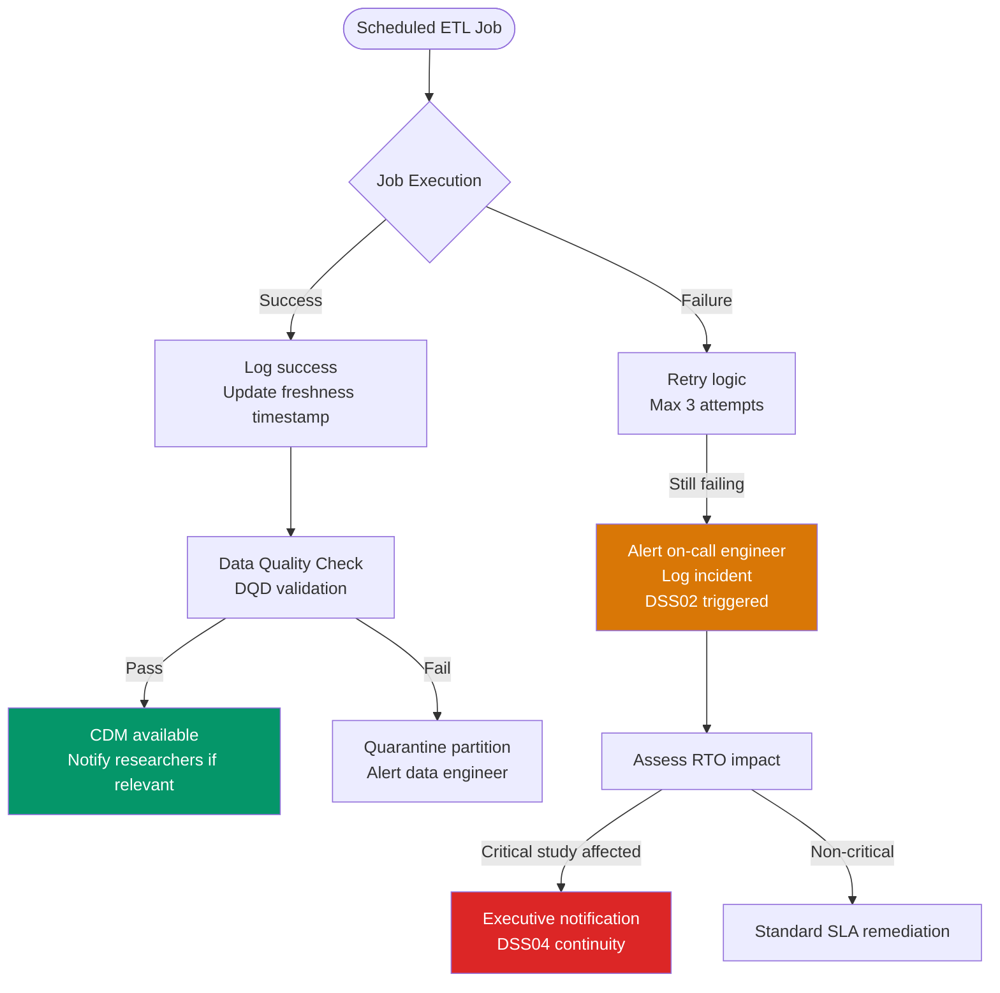
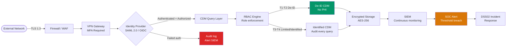
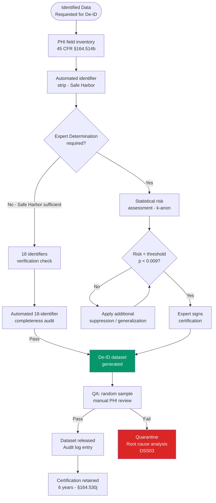

# Deliver, Service & Support (DSS) Domain — DSS01–DSS06

> **Domain purpose:** Ensure IT services are delivered, supported, and managed to meet business needs.  
> **Healthcare context:** Operational management of the health data pipeline, security services, and researcher support.  
> **COBIT alignment:** 6 management objectives covering operations, incidents, continuity, security, and process controls.

---

## DSS01 — Managed Operations

**Purpose:** Coordinate and execute activities and operational procedures for IT services and infrastructure.

**Healthcare context:** CDM operational management requires disciplined pipeline monitoring: ETL jobs that load EHR data into OMOP must run reliably on defined schedules, data freshness SLAs must be monitored, and failed jobs must trigger automated alerts before researchers notice stale data. DSS01 establishes the operational discipline that distinguishes a research-grade data warehouse from a research sandbox.

**Key activities:**
- Define and monitor ETL job schedules (daily EHR extract, weekly CDM refresh, monthly de-ID dataset generation)
- Implement automated pipeline monitoring with alerting (PagerDuty or equivalent)
- Establish operational run-books for all pipeline components
- Track data freshness metric: time from EHR encounter to CDM availability
- Maintain operations log for all pipeline events (successes, failures, re-runs)

**Metrics:**

| KPI | Target | Alert Threshold |
|-----|--------|----------------|
| ETL job success rate | ≥99% | <97% triggers investigation |
| CDM data freshness | ≤30 days | >45 days triggers researcher notification |
| Pipeline monitoring coverage | 100% of jobs | Any unmonitored job = compliance gap |

---

## DSS02 — Managed Service Requests and Incidents

**Purpose:** Provide timely and effective response to user requests and resolution of all types of incidents.

**Healthcare context:** Research data service requests (new dataset provisioning, cohort query support, CDM access) must be managed systematically — not via email threads. Security incidents involving PHI require HIPAA-compliant response. DSS02 integrates both into a unified service management framework, ensuring no PHI incident falls through the cracks of informal communication.

**Key activities:**
- Operate a ticketing system for all data access requests and incidents
- Define service request SLAs: De-ID data extract ≤10 business days; CDM account provisioning ≤5 days
- Integrate incident response with `governance/incident-response-plan.md` for PHI events
- Conduct weekly incident review meeting; monthly trend analysis
- Publish service catalog with request types, SLAs, and contact information

**Incident classification for health data pipeline:**

| Category | Examples | Target Response |
|----------|---------|----------------|
| SEV-1 Security | PHI breach confirmed | Immediate — 1 hour |
| SEV-2 Availability | CDM down for active studies | 4 hours |
| SEV-3 Data Quality | CDM refresh failed | 24 hours |
| SEV-4 Access | Researcher locked out | 48 hours |

**HIPAA alignment:** §164.308(a)(6) (Security incident procedures)

---

## DSS03 — Managed Problems

**Purpose:** Identify and classify problems, and investigate root causes to prevent recurring incidents.

**Healthcare context:** Recurring CDM data quality issues (e.g., a specific EHR interface consistently mapping a drug concept incorrectly) are "problems" — they will cause repeated incidents until root-caused and permanently fixed. DSS03 applies formal problem management (5-Whys, Fishbone analysis) to ensure persistent data pipeline failures are permanently resolved, not repeatedly patched.

**Key activities:**
- Log all recurring incidents (≥3 occurrences in 90 days) as formal problems
- Conduct root cause analysis for every PHI incident regardless of recurrence
- Maintain known error database (KEDB) for CDM-specific issues (concept mapping failures, terminology gaps)
- Track problem resolution through to verified closure
- Report unresolved known errors in data quality communications to researchers

**NIST alignment:** SI-2 (Flaw remediation — systematic correction of identified flaws)

---

## DSS04 — Managed Continuity

**Purpose:** Establish and maintain a plan to enable the business and IT to respond to incidents and disruptions.

**Healthcare context:** Clinical research studies depend on continuous CDM availability. An unplanned CDM outage during a time-sensitive cohort analysis or grant reporting deadline can have significant consequences. DSS04 ensures the CDM and research data warehouse have documented Recovery Time Objectives (RTO) and Recovery Point Objectives (RPO), with tested disaster recovery procedures.

**Key activities:**
- Define and document RTO/RPO for each pipeline tier:
  - CDM Query Environment: RTO ≤4 hours, RPO ≤1 hour
  - De-ID Dataset Store: RTO ≤8 hours, RPO ≤24 hours
  - ETL Pipeline: RTO ≤24 hours, RPO ≤24 hours
- Conduct annual disaster recovery tabletop exercise
- Test CDM backup restoration quarterly (restore to test environment, verify data integrity)
- Maintain hot standby for PHI-containing systems (clinical operational tier)
- Document emergency access procedures for break-glass scenarios

**HIPAA alignment:** §164.308(a)(7) (Contingency plan — all specifications)

---

## DSS05 — Managed Security Services

**Purpose:** Protect enterprise information to maintain the level of information security risk acceptable to the enterprise.

**Healthcare context:** HIPAA technical safeguards (45 CFR §164.312) are the operational instantiation of DSS05 for the health data pipeline. Every technical control — encryption, access management, audit logging, intrusion detection — is a DSS05 activity. The security services architecture must be documented, monitored, and continuously verified.

**Key security controls:**

| Control | Standard | Implementation |
|---------|----------|---------------|
| Encryption at rest | AES-256 | All PHI data stores, HSM key management |
| Encryption in transit | TLS 1.3 | All network communications, no TLS <1.2 |
| Authentication | MFA + SSO | SAML 2.0 / OIDC, hardware tokens for privileged |
| Intrusion detection | SIEM | 24/7 monitoring, automated alerting |
| Vulnerability management | NIST 800-53 RA-5 | Quarterly scans, Critical patches ≤72h |
| DLP | NIST PM-25 | PHI egress controls, CDM export watermarking |

**HIPAA alignment:** §164.312 (Technical safeguards — entire section)

---

## DSS06 — Managed Business Process Controls

**Purpose:** Define and maintain appropriate business process controls to ensure accurate and reliable processing of information.

**Healthcare context:** De-identification is the most critical business process control in the health data pipeline. It must be executed consistently, verifiably, and with documented output certification. DSS06 ensures that de-identification is not a manual, ad-hoc process but a governed, repeatable control with quality gates and audit trails — directly supporting the re-identification risk management in APO12.

**Key activities:**
- Automate Safe Harbor de-identification with documented algorithm and test suite
- Implement DQD-equivalent checks for de-identified output datasets
- Require independent QA review of every de-identified dataset before release
- Retain de-identification certification records ≥6 years
- Audit de-identification controls annually against current HHS/NIST guidance

**HIPAA alignment:** §164.514(b) De-Identification; §164.530(j) Record retention
