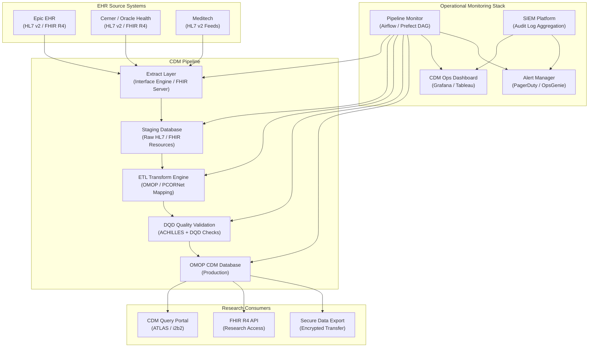
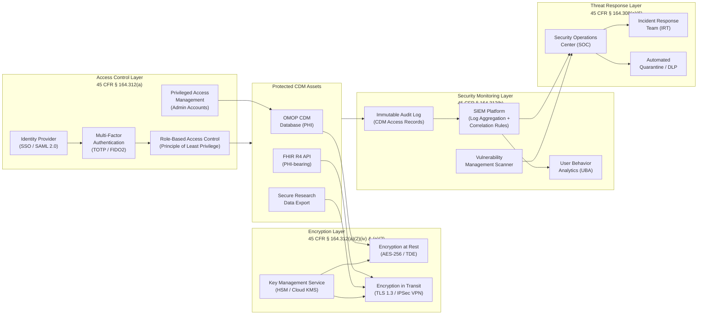
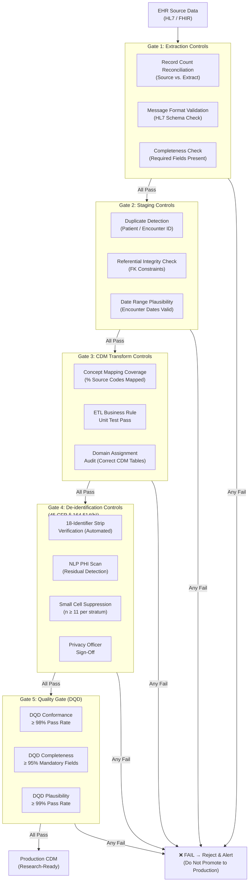

# Deliver, Service & Support (DSS) Domain — DSS01–DSS06

> **COBIT 2019 Reference:** Deliver, Service & Support (DSS) is the COBIT 2019 management objective domain governing the operational delivery of IT services and the day-to-day management of service operations, incidents, problems, continuity, security services, and business process controls. In a healthcare research data environment, DSS objectives govern how the CDM infrastructure is operated, monitored, and maintained on a continuous basis — ensuring that data remains available, accurate, secure, and compliant throughout the full research lifecycle. Effective DSS governance is the operational backbone of HIPAA Security Rule compliance, translating the administrative and technical safeguard requirements into day-to-day operational reality.

---

## Table of Contents

- [DSS01 — Managed Operations](#dss01--managed-operations)
- [DSS02 — Managed Service Requests and Incidents](#dss02--managed-service-requests-and-incidents)
- [DSS03 — Managed Problems](#dss03--managed-problems)
- [DSS04 — Managed Continuity](#dss04--managed-continuity)
- [DSS05 — Managed Security Services](#dss05--managed-security-services)
- [DSS06 — Managed Business Process Controls](#dss06--managed-business-process-controls)

---

## DSS01 — Managed Operations

### Healthcare Context

DSS01 requires the organization to perform and monitor IT operational procedures reliably and consistently. In a healthcare research data environment, **operational management of the CDM infrastructure is the most operationally demanding and compliance-critical daily activity** the data team performs. The CDM is not a static database — it is continuously updated by ETL pipelines ingesting data from multiple EHR source systems, updated with new vocabulary releases, queried by multiple research teams simultaneously, and monitored for data quality and security events.

Operational management must address the **full CDM pipeline monitoring lifecycle**: EHR data extraction (monitoring HL7/FHIR feed connectivity, message throughput, and error rates); staging database ingestion (monitoring row counts, processing times, and rejected record rates); CDM transformation execution (monitoring ETL job completion status, row-level transformation error rates, and business rule exception counts); CDM data quality validation (monitoring DQD check results, plausibility alerts, and completeness trends); and CDM data delivery to researchers (monitoring query portal availability, response times, and access log completeness).

Data freshness SLAs (defined in APO09) are operationally enforced through the pipeline monitoring process. The operations team must have automated alerts for any pipeline delay that will cause the CDM data to exceed the contractual freshness SLA threshold. Pipeline monitoring must include **end-to-end latency tracking** from the moment a clinical event is recorded in the EHR to the moment that event is available in the CDM — this latency metric is the most important operational quality indicator for time-sensitive research (prospective cohort studies, FDA safety surveillance).

Operational procedures must be documented in formal runbooks for every CDM operational process, so that any qualified staff member can execute routine and incident response procedures without requiring tribal knowledge. Runbooks must be maintained as living documents, updated with every operational change, and tested at least semi-annually.

### Operational Monitoring Architecture

### Key Activities

- **Execute Daily CDM Pipeline Operations:** Execute and monitor all scheduled CDM ETL batch jobs (daily data load, vocabulary synchronization, incremental update jobs); verify successful completion by reviewing automated pipeline status reports; escalate any failed or delayed jobs per the operational runbook.
- **Implement Pipeline Monitoring and Alerting:** Deploy automated pipeline monitoring covering: ETL job completion status, record counts (expected vs. actual), processing latency (end-to-end EHR-to-CDM lag), DQD check results, and query portal availability; configure alerts for all threshold breaches with appropriate on-call escalation.
- **Manage Operational Runbooks:** Maintain documented operational runbooks for all recurring CDM operational tasks (daily ETL monitoring, vocabulary update execution, batch job failure recovery, CDM backup verification, user access provisioning); review and update runbooks at least semi-annually.
- **Monitor and Enforce Data Freshness SLAs:** Implement automated freshness monitoring that measures the timestamp of the most recent CDM record against the SLA threshold (e.g., CDM data must be ≤ 24 hours behind EHR); alert operations team immediately upon SLA breach; notify affected researcher stakeholders within 2 hours of confirmed SLA breach.
- **Conduct Daily Operational Standups:** Hold daily CDM operations standup (15 minutes maximum) to review overnight pipeline status, open incidents, upcoming maintenance, and operational risk items; document standup outcomes and action items in the operations log.

### Metrics

| Metric | Target | Measurement Frequency |
|---|---|---|
| Daily ETL Job Success Rate | ≥ 99.5% of scheduled ETL jobs completing successfully without manual intervention | Daily |
| CDM Data Freshness SLA Adherence | ≤ 24-hour lag for daily batch CDM; ≤ 4-hour lag for near-real-time CDM feeds | Daily |
| Mean Time to Detect Pipeline Failure (MTTD) | ≤ 15 minutes from pipeline failure to alert generation | Continuous |
| CDM Query Portal Monthly Availability | ≥ 99.5% during core research hours (06:00–22:00 local time) | Monthly |
| Operational Runbook Currency | 100% of operational runbooks reviewed and updated within 30 days of procedural changes | Semi-annual audit |

### HIPAA / NIST Alignment

| Standard | Citation | Alignment |
|---|---|---|
| HIPAA Security Rule | 45 CFR § 164.308(a)(1)(ii)(D) | Information system activity review — operational log monitoring |
| HIPAA Security Rule | 45 CFR § 164.312(b) | Audit controls — hardware, software, and procedural mechanisms |
| NIST SP 800-53 Rev. 5 | SI-4 (System Monitoring) | Continuous system monitoring |
| NIST SP 800-53 Rev. 5 | AU-6 (Audit Record Review, Analysis, and Reporting) | Operational audit log review |

---

## DSS02 — Managed Service Requests and Incidents

### Healthcare Context

DSS02 requires the organization to manage IT service requests and incidents through a structured process that ensures timely, consistent, and documented resolution. In a healthcare research data environment, the service request and incident management function handles two critically distinct categories: **researcher data access requests** (the routine provisioning of access to CDM data for approved research projects) and **HIPAA security incidents** (any actual or suspected unauthorized access, use, or disclosure of PHI that must be assessed and potentially reported under HIPAA's Breach Notification Rule).

**Researcher data access requests** must follow a formal access provisioning workflow that enforces the HIPAA minimum necessary standard and ensures that no researcher gains access to CDM data without a valid IRB-approved protocol, executed DUA (if applicable), completed HIPAA training, and formal access approval from the Data Access Committee. The workflow must be documented, auditable, and produce a complete access provisioning record for each approved request. Access provisioning records must be retained for ≥ 6 years per HIPAA documentation requirements (45 CFR § 164.316(b)(2)(i)).

**HIPAA incident response** is governed by the Breach Notification Rule (45 CFR §§ 164.400–164.414), which establishes specific timelines: covered entities must notify affected individuals without unreasonable delay and within 60 days of discovery of a breach (45 CFR § 164.404(b)); breaches affecting ≥ 500 individuals in a state must be simultaneously reported to HHS and prominent local media (45 CFR § 164.406); all breaches must be reported to HHS annually if affecting < 500 individuals (45 CFR § 164.408). The incident response process must integrate with the operational HIPAA breach risk assessment framework to determine whether a security incident constitutes a reportable breach.

The incident classification system must distinguish between: **security incidents** (any actual or attempted unauthorized access, use, disclosure, modification, or destruction of information — requiring security response); **HIPAA privacy incidents** (actual or suspected unauthorized disclosure of PHI — requiring Privacy Officer notification and breach risk assessment); **CDM data quality incidents** (data integrity failures in the CDM — requiring data quality response and researcher notification); and **system availability incidents** (CDM outages or degraded performance — requiring operational response and SLA reporting).

### Key Activities

- **Implement a Tiered Data Access Request Workflow:** Define a multi-step data access provisioning workflow: (1) researcher submits access request with IRB protocol number; (2) IRB liaison verifies protocol approval and data scope; (3) Data Access Committee reviews and approves or denies; (4) IT provisions access with appropriate RBAC roles and minimum necessary data scope; (5) access confirmation and training verification; document each step in the ticketing system.
- **Operate a HIPAA-Integrated Incident Response Process:** Maintain a documented Incident Response Plan (IRP) that integrates HIPAA breach risk assessment at every security incident stage; require Privacy Officer notification within 24 hours of any suspected PHI breach; conduct breach risk assessment per HHS four-factor test within 5 business days of incident discovery.
- **Classify and Prioritize Incidents by HIPAA Impact:** Assign incident priority based on PHI exposure risk: P1 (Active PHI Breach — immediate CISO and Privacy Officer notification); P2 (Suspected PHI exposure — 4-hour response); P3 (CDM data quality or availability — 1 business day response); P4 (General IT request — 3 business day response).
- **Track All Incidents and Service Requests in Ticketing System:** Log 100% of service requests and incidents in the IT service management (ITSM) platform (ServiceNow, Jira Service Management, or equivalent); capture: timestamp, reporter, incident type, PHI involvement flag, assigned owner, status, resolution, and HIPAA breach risk assessment outcome.
- **Conduct Monthly Incident Trend Analysis:** Analyze incident data monthly to identify patterns (recurring ETL errors, access provisioning bottlenecks, repeated security alerts); report trends to CISO and DGC; feed trends into the APO12 risk management process and DSS03 problem management.

### Metrics

| Metric | Target | Measurement Frequency |
|---|---|---|
| Data Access Request Provisioning Cycle Time (Days) | ≤ 5 business days from complete request submission to access granted | Per request |
| P1 (Active PHI Breach) Mean Time to Respond (MTTR) | ≤ 1 hour from P1 declaration to active CISO engagement | Per P1 incident |
| Breach Risk Assessment Completion Time | 100% of suspected PHI incidents with completed breach risk assessment within 5 business days | Per incident |
| Incident Documentation Completeness | 100% of closed incidents with complete resolution documentation in ITSM | Monthly audit |
| HHS Breach Notification Compliance | 100% of reportable breaches notified within 60-day statutory deadline | Per reportable breach |

### HIPAA / NIST Alignment

| Standard | Citation | Alignment |
|---|---|---|
| HIPAA Breach Notification Rule | 45 CFR §§ 164.400–164.414 | Breach notification requirements and timelines |
| HIPAA Security Rule | 45 CFR § 164.308(a)(6) | Security incident procedures — required implementation specification |
| NIST SP 800-61 Rev. 2 | Computer Security Incident Handling Guide | Incident response methodology |
| NIST SP 800-53 Rev. 5 | IR-4 (Incident Handling), IR-5 (Incident Monitoring) | Incident management controls |

---

## DSS03 — Managed Problems

### Healthcare Context

DSS03 requires the organization to identify and address the root causes of recurring incidents to prevent recurrence and proactively reduce operational risk. In a healthcare research data environment, **problem management is essential for addressing the persistent, systemic data quality and operational issues** that are the most common source of researcher distrust of CDM data and the most damaging to the organization's research mission.

The most consequential problem categories in a clinical data program include: **recurring CDM data quality issues** (systematic mapping errors affecting entire clinical domains, e.g., all laboratory results for a specific LOINC code consistently missing from the CDM due to an ETL business rule error); **persistent ETL pipeline failures** (recurring job failures at the same processing step due to an underlying infrastructure or data format incompatibility); **chronic EHR interface instability** (repeated feed disconnections or message format changes from the source EHR that cause episodic CDM data gaps); and **systematic access control issues** (patterns of failed access requests indicating a flaw in the RBAC provisioning process that could create both research barriers and PHI over-exposure risks).

Problem management in healthcare research data requires **high-quality root cause analysis (RCA)** because the consequences of an unresolved data quality problem include: invalid research findings, potential patient safety risks (if CDM data is used for safety surveillance), and regulatory exposure (if the data quality issue affects a submitted research dataset). RCA must go beyond the immediate technical cause to identify the underlying systemic factors — inadequate testing processes, insufficient monitoring thresholds, under-documented ETL business rules, or insufficient vocabulary validation — that allowed the problem to occur.

The problem management process must maintain a **Known Error Database (KEDB)** that documents all identified CDM data quality issues and their workarounds, so that researchers using CDM data can be informed of known limitations and apply appropriate methodological adjustments. The KEDB must be publicly accessible (within the institutional research network) and actively communicated to affected researcher stakeholders.

### Key Activities

- **Operate a Formal Problem Management Process:** Define a documented problem management workflow: Problem detection (from incident trend analysis, proactive monitoring, or researcher report); Problem logging (ITSM problem record with affected CDM domains, estimated record count, and PHI risk assessment); Root cause analysis (structured RCA using fishbone/Ishikawa diagram or 5-Why methodology); Workaround identification; Permanent fix development and change management; Problem closure with verification.
- **Conduct Structured Root Cause Analyses for High-Impact Problems:** For all P1–P2 CDM incidents and any data quality problem affecting ≥ 100 CDM records, conduct a formal written RCA within 10 business days; present RCA findings to DGC; document corrective actions in the CAPA log.
- **Maintain the CDM Known Error Database (KEDB):** Document all known CDM data quality issues and limitations in the KEDB; include: affected data domain, affected time period, estimated record count, root cause, workaround, and permanent fix ETA; publish KEDB updates to affected researchers within 5 business days of new entry; update when permanent fix is implemented.
- **Perform Proactive Problem Prevention Analysis:** Analyze CDM pipeline metrics, DQD trends, and incident history monthly to proactively identify emerging problems before they cause researcher impact; use statistical process control (SPC) methods to detect trends in ETL error rates, DQD score degradation, and access provisioning latency.
- **Track Problem Resolution Through to Closure and Verification:** Maintain problem records in ITSM through full lifecycle to verified closure; require post-fix validation (DQD check re-run, researcher data validation spot-check) before closing any CDM data quality problem; conduct 30-day post-fix recurrence check.

### Metrics

| Metric | Target | Measurement Frequency |
|---|---|---|
| RCA Completion Rate (High-Impact Problems) | 100% of high-impact CDM problems with completed written RCA within 10 business days | Per problem |
| Known Error Database (KEDB) Currency | 100% of KEDB entries reviewed and updated within 60 days | Bi-monthly audit |
| Problem Recurrence Rate | ≤ 5% of closed problems reopening within 90 days of closure | Quarterly |
| Proactive Problem Detection Rate | ≥ 30% of CDM problems identified proactively (before researcher impact) | Monthly |

### HIPAA / NIST Alignment

| Standard | Citation | Alignment |
|---|---|---|
| HIPAA Security Rule | 45 CFR § 164.308(a)(1)(ii)(B) | Risk management — addressing root causes of security vulnerabilities |
| NIST SP 800-53 Rev. 5 | SI-2 (Flaw Remediation) | Identifying and correcting system flaws |
| ISO 9001:2015 | Clause 10.2 | Nonconformity and corrective action (CAPA) |

---

## DSS04 — Managed Continuity

### Healthcare Context

DSS04 requires the organization to develop, maintain, and test IT continuity and disaster recovery capabilities to ensure that critical IT services can be restored within acceptable timeframes following a disruptive event. In a healthcare research data environment, **continuity planning for the CDM infrastructure** is both a HIPAA compliance obligation (45 CFR § 164.308(a)(7) — Contingency Plan — is a required administrative safeguard) and a research mission-critical obligation, as CDM unavailability can halt time-sensitive research activities with direct consequences for grant deliverables and patient safety surveillance programs.

The HIPAA Contingency Plan requirement (45 CFR § 164.308(a)(7)) mandates five specific implementation specifications: (1) **Data backup plan** — a documented procedure for creating and maintaining retrievable exact copies of ePHI; (2) **Disaster recovery plan** — a documented procedure to restore any loss of data; (3) **Emergency mode operation plan** — a documented procedure to enable continuation of critical business processes for protection of ePHI while operating in emergency mode; (4) **Testing and revision procedures** — procedures for periodic testing of contingency plans and revision based on test results; and (5) **Applications and data criticality analysis** — an assessment of which applications and data are most critical for continuity.

The CDM constitutes **Category 1 Critical Infrastructure** for research continuity. Recovery Time Objective (RTO) and Recovery Point Objective (RPO) targets must be defined based on: the cost of CDM unavailability per hour (measured in researcher productivity loss and potential study protocol violations), the maximum acceptable data loss (measured in hours of CDM data gap), and the technical capabilities of the backup and recovery infrastructure. Industry best practice for healthcare research data warehouses typically targets: **RTO ≤ 4 hours** for complete CDM system failure (acceptable given that most CDM access is not real-time clinical care); **RPO ≤ 24 hours** aligned with the daily ETL batch cycle, meaning the worst-case data loss is one day's worth of CDM transactions.

Continuity planning must also address **federated network continuity** — if the organization participates in PCORNet, ENACT, or another federated query network, CDM unavailability prevents the organization from responding to network queries, potentially affecting network-level research agreements and performance metrics.

### Key Activities

- **Develop and Maintain HIPAA-Compliant Contingency Plans:** Develop and maintain all five HIPAA-required contingency plan components: Data Backup Plan, Disaster Recovery Plan, Emergency Mode Operation Plan, Testing and Revision Procedures, and Applications and Data Criticality Analysis; review and update annually and within 30 days of any material system change; obtain CISO and CIO sign-off.
- **Implement CDM Backup and Recovery Infrastructure:** Implement automated daily encrypted backups of all CDM databases to geographically separate storage (offsite or cloud region); verify backup integrity through weekly automated restore tests to isolated recovery environment; retain 90-day backup history; encrypt backups with AES-256 and store encryption keys separately from backup data.
- **Define and Validate RTO/RPO Targets for CDM Systems:** Formally define RTO (≤ 4 hours) and RPO (≤ 24 hours) targets for CDM production system; validate targets against actual backup and recovery infrastructure capability through annual full DR test; document any gaps between target and achieved RTO/RPO.
- **Conduct Annual Disaster Recovery Testing:** Execute a full CDM disaster recovery test annually simulating complete primary system loss; test full restore from backup to recovery environment; measure and document actual RTO and RPO achieved; identify gaps vs. targets; remediate gaps within 90 days; present DR test report to DGC.
- **Develop and Test Emergency Mode Researcher Access:** Define and document the minimum researcher access capability the organization will maintain during CDM disaster recovery (e.g., read-only access to last known good CDM snapshot via alternative access path); test emergency mode access procedure annually; communicate emergency mode plan to researcher stakeholders.

### Metrics

| Metric | Target | Measurement Frequency |
|---|---|---|
| CDM Backup Success Rate | ≥ 99.9% of scheduled CDM backup jobs completing successfully | Daily |
| Backup Restore Test Success Rate | 100% of weekly automated backup integrity checks passing | Weekly |
| Annual DR Test — RTO Achieved | ≤ 4 hours (full CDM restore from backup to research-ready state) | Annual DR test |
| Annual DR Test — RPO Achieved | ≤ 24 hours (maximum CDM data loss in worst-case failure) | Annual DR test |
| Contingency Plan Review Currency | 100% of contingency plan components reviewed and updated within 30 days of material change | Annual + Post-change |

### HIPAA / NIST Alignment

| Standard | Citation | Alignment |
|---|---|---|
| HIPAA Security Rule | 45 CFR § 164.308(a)(7) | Contingency Plan — all five required implementation specifications |
| HIPAA Security Rule | 45 CFR § 164.308(a)(7)(ii)(D) | Testing and revision procedures |
| NIST SP 800-34 Rev. 1 | Contingency Planning Guide for Federal Information Systems | IT contingency planning methodology |
| NIST SP 800-53 Rev. 5 | CP-2 through CP-13 | Full contingency planning control family |

---

## DSS05 — Managed Security Services

### Healthcare Context

DSS05 requires the organization to manage and operate security services — access management, security monitoring, encryption, key management, and threat response — on a continuous, operational basis. While APO13 governs the design and strategy of the security program, **DSS05 governs its day-to-day execution**. In a healthcare research data environment, this operational security function must directly implement and continuously enforce the HIPAA Security Rule's technical safeguards (45 CFR § 164.312) across the full CDM data lifecycle.

The operational security challenge in healthcare research data is the **tension between access and restriction**: researchers need broad access to CDM data to conduct valid research, but HIPAA mandates the minimum necessary standard, requiring that access be limited to only the data needed for the specific approved research purpose. Managing this tension operationally requires a sophisticated role-based access control (RBAC) system that can provision study-specific data access scopes, enforce temporal access limits (access expires with the IRB protocol), and detect access anomalies (a researcher querying data outside their approved study scope).

The security monitoring function must maintain a **complete, tamper-evident audit log** of all access to CDM data containing PHI. This is a required implementation specification under HIPAA Security Rule 45 CFR § 164.312(b) (Audit Controls). The audit log must capture: the identity of the user (authenticated identity, not just a user ID), the date and time of access (to the second), the type of access (read, write, export, delete), the specific data accessed (CDM domain, time range, query scope), and the outcome (success or failure). Audit logs must be retained for ≥ 6 years and protected from unauthorized modification (immutable log storage).

### Security Services Architecture

### Key Activities

- **Operate Identity and Access Management for CDM:** Manage user provisioning and deprovisioning through a formal IAM process integrated with institutional Single Sign-On (SSO); enforce MFA for all CDM system access without exception; enforce RBAC with study-specific access scopes linked to active IRB protocols; review all user access rights quarterly; deprovision access within 24 hours of role change or separation.
- **Maintain and Monitor Audit Logging Infrastructure:** Configure comprehensive, immutable audit logging for all CDM data access events; aggregate logs into the SIEM platform; configure correlation rules for anomalous access patterns (high-volume data extraction, access outside business hours, access to non-approved data domains); review SIEM alerts daily.
- **Manage Encryption and Key Lifecycle:** Maintain AES-256 encryption at rest for all CDM database storage; enforce TLS 1.3 for all CDM data in transit; manage encryption keys in a FIPS 140-2 validated Key Management Service (HSM or cloud KMS); rotate encryption keys annually or upon suspected compromise; test key recovery procedures quarterly.
- **Execute Vulnerability Management Program:** Conduct authenticated vulnerability scans of all CDM infrastructure monthly; conduct full penetration test annually; prioritize remediation by CVSS score: Critical (CVSS ≥ 9.0) within 30 days, High (CVSS ≥ 7.0) within 90 days, Medium within 180 days; track remediation in vulnerability management platform.
- **Operate Data Loss Prevention (DLP) Controls:** Deploy DLP tools monitoring all outbound data channels (email, web upload, USB, cloud sync) on systems with CDM access; configure PHI detection rules (18 HIPAA Safe Harbor identifiers); alert and/or block unauthorized PHI transmission attempts; review DLP policy effectiveness quarterly.

### Metrics

| Metric | Target | Measurement Frequency |
|---|---|---|
| MFA Enforcement Rate (CDM Access) | 100% — no CDM access without MFA | Continuous |
| Orphaned Account Detection and Removal Time | ≤ 24 hours from separation event to access revocation | Per separation event |
| Critical Vulnerability Remediation Time (CVSS ≥ 9.0) | ≤ 30 days from scan detection to validated remediation | Per vulnerability |
| SIEM High-Priority Alert False Positive Rate | ≤ 15% (high-quality alert tuning) | Monthly |
| Audit Log Integrity Verification | 100% of monthly audit log integrity checks passing (hash verification) | Monthly |

### HIPAA / NIST Alignment

| Standard | Citation | Alignment |
|---|---|---|
| HIPAA Security Rule | 45 CFR § 164.312(a)(1) | Access control — unique user identification, emergency access, automatic logoff, encryption |
| HIPAA Security Rule | 45 CFR § 164.312(b) | Audit controls — hardware, software, procedural mechanisms |
| HIPAA Security Rule | 45 CFR § 164.312(c) | Integrity controls — protecting ePHI from improper alteration |
| HIPAA Security Rule | 45 CFR § 164.312(e) | Transmission security — encryption in transit |
| NIST SP 800-53 Rev. 5 | AC, IA, AU, SC, SI control families | Comprehensive technical safeguard controls |

---

## DSS06 — Managed Business Process Controls

### Healthcare Context

DSS06 requires the organization to define and operate controls over business processes to ensure that process outputs are complete, accurate, and authorized. In a healthcare research data environment, **business process controls govern the most critical data transformation and validation steps** in the CDM pipeline — the points at which errors, omissions, or unauthorized modifications would have the greatest impact on data integrity and research validity.

The most critical business process control domains in a clinical data program are: **(1) De-identification process controls** — controls ensuring that the de-identification pipeline reliably removes all 18 HIPAA Safe Harbor identifiers before any record is released as de-identified; **(2) CDM data loading controls** — controls ensuring that all source EHR records are completely and accurately transformed and loaded into the CDM, with no records lost, duplicated, or incorrectly mapped; **(3) Data quality gates** — mandatory quality validation checkpoints in the ETL pipeline that prevent low-quality data from reaching the production CDM; and **(4) Access authorization controls** — controls ensuring that CDM data is only provided to researchers with valid IRB approval and appropriate access authorization.

Business process controls must follow the **three lines of defense model**: first-line controls (automated pipeline controls built into the ETL and de-identification processes themselves), second-line controls (data quality monitoring and compliance oversight functions that independently verify first-line control effectiveness), and third-line controls (internal and external audit functions that independently assess the overall control environment).

Controls must be formally documented in a **Control Catalog** that maps each control to: the business process risk it mitigates, the control type (preventive, detective, corrective), the control frequency (real-time, daily, monthly), the control owner, the evidence of operation, and the applicable regulatory requirement. The Control Catalog must be reviewed annually and tested per the MEA02 internal control assessment process.

### Control Validation Flow

### Key Activities

- **Define and Implement the CDM Control Catalog:** Develop a comprehensive Control Catalog documenting all business process controls in the CDM pipeline; for each control include: control ID, description, type (preventive/detective/corrective), frequency, owner, evidence, and regulatory citation; obtain DGC approval; review annually.
- **Operate Automated CDM Loading Controls:** Implement automated controls at each ETL pipeline gate (extraction, staging, transformation, quality): record count reconciliation, referential integrity validation, business rule unit tests, domain assignment audits, and DQD threshold gates; configure pipeline to automatically halt and alert when any gate fails — never silently pass low-quality data to production.
- **Enforce De-identification Process Controls:** Implement and validate a multi-layered de-identification control process: (1) automated 18-identifier scrubbing; (2) NLP-based residual PHI scanning; (3) automated small cell suppression for aggregate data (n < 11 suppressed); (4) Privacy Officer sign-off for any expert determination de-identification; document all four control layers with audit trail.
- **Implement Research Data Access Authorization Controls:** Enforce a multi-step access authorization workflow before any CDM data is provided to a researcher: valid IRB protocol verification, Data Use Agreement execution (where applicable), HIPAA training completion verification, minimum necessary scope definition, and formal Data Access Committee approval; log all authorization decisions with supporting evidence.
- **Conduct Monthly Control Effectiveness Testing:** Perform monthly automated testing of key business process controls (inject known test records to validate detection controls; verify automation of gate controls; review control exception logs); report control effectiveness metrics to CISO and DGC monthly; escalate any failed control test immediately.

### Metrics

| Metric | Target | Measurement Frequency |
|---|---|---|
| CDM Gate Control Pass Rate | ≥ 99.9% of ETL pipeline runs completing all gates with no manual override | Daily |
| De-identification Control Effectiveness (PHI Residual Rate) | Zero PHI residuals detected in released de-identified datasets | Per dataset release |
| Access Authorization Workflow Compliance | 100% of CDM data access grants with complete authorization documentation | Monthly audit |
| Control Exception Rate (Undocumented Control Bypass) | Zero undocumented gate bypasses | Monthly audit |
| Monthly Control Test Execution Rate | 100% of scheduled control tests executed and documented | Monthly |

### HIPAA / NIST Alignment

| Standard | Citation | Alignment |
|---|---|---|
| HIPAA Privacy Rule | 45 CFR § 164.514(b) | De-identification methods — Safe Harbor controls |
| HIPAA Security Rule | 45 CFR § 164.312(c)(1) | Integrity controls — verify PHI not improperly altered |
| HIPAA Security Rule | 45 CFR § 164.308(a)(1)(ii)(D) | Information system activity review |
| NIST SP 800-53 Rev. 5 | SI-10 (Information Input Validation) | Input validation controls |
| NIST SP 800-53 Rev. 5 | AU-10 (Non-Repudiation) | Control of audit evidence |
| ISO 9001:2015 | Clause 8.5.1 | Control of production and service provision |

---

*Document Version: 1.0 | Effective Date: 2026-05-26 | Owner: Data Governance Committee | Review Cycle: Annual*
*Standards References: COBIT 2019 (ISACA, 2018); HIPAA Security Rule 45 CFR Part 164 Subpart C; HIPAA Breach Notification Rule 45 CFR Part 164 Subpart D; NIST SP 800-53 Rev. 5; NIST SP 800-61 Rev. 2; NIST SP 800-34 Rev. 1; ISO 9001:2015; OHDSI Data Quality Dashboard Specification*
