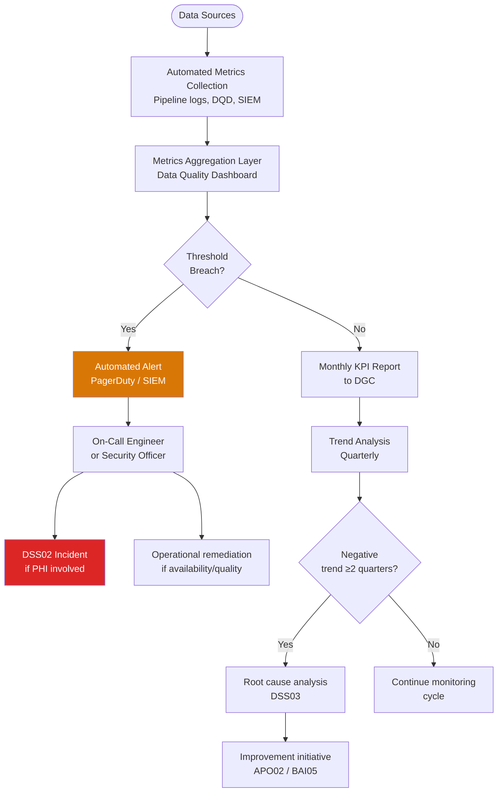

# Monitor, Evaluate & Assess (MEA) Domain — MEA01–MEA04

> **Domain purpose:** Monitor IT performance and conformance, and provide assurance of sound governance.  
> **Healthcare context:** Continuous monitoring of the health data pipeline's compliance posture, data quality, and regulatory alignment.  
> **COBIT alignment:** 4 management objectives covering performance monitoring, internal control, external compliance, and assurance.

---

## MEA01 — Managed Performance and Conformance Monitoring

**Purpose:** Collect, validate, and evaluate business, IT, and process goals and metrics to monitor the degree to which performance and conformance to targets are achieved.

**Healthcare context:** A health data architecture without systematic performance monitoring is flying blind. MEA01 ensures that CDM data quality, pipeline reliability, security posture, and compliance adherence are tracked against defined targets and reported to the Data Governance Committee — not just discovered at audit time. This objective directly supports the trustworthy pipeline governance described in PMC13000207 [REF-2].

**Healthcare KPI Dashboard:**

| KPI | Target | Measurement Frequency | Owner | Alert Threshold |
|-----|--------|----------------------|-------|----------------|
| CDM data freshness | ≤30 days lag | Daily | Data Engineering | >45 days |
| ETL pipeline success rate | ≥99% | Daily | Data Engineering | <97% |
| DQD conformance score | ≥95% critical tables | Per CDM refresh | Clinical Informaticist | <90% |
| PHI access audit completeness | 100% | Weekly | Security Officer | <100% |
| De-ID dataset provisioning time | ≤10 business days | Per request | Research Informatics | >15 days |
| CDM uptime (query environment) | ≥99.5% | Monthly | IT Operations | <99% |
| Researcher satisfaction score | ≥4.0/5.0 | Quarterly | Research Informatics | <3.5 |
| Security vulnerability remediation — Critical | ≤72 hours | Per discovery | Security Officer | >72 hours |

**Key activities:**
- Operate real-time monitoring dashboard covering all 14 pipeline nodes
- Automate KPI data collection from ETL logs, DQD, SIEM, and ticketing system
- Generate monthly KPI report for DGC with trend analysis
- Conduct quarterly strategic review against targets; adjust targets annually
- Benchmark against peer institution CDM implementations (OHDSI network benchmarks)

**Reference:** Chawla et al. (2024) [REF-3] — automated compliance monitoring as a path to CMMI Level 4 (Quantitatively Managed)

---

## MEA02 — Managed System of Internal Control

**Purpose:** Continuously monitor and evaluate the control environment including self-assessment and independent assurance reviews.

**Healthcare context:** Internal controls for the health data pipeline include: de-identification process controls (DSS06), CDM data quality controls (APO11), access provisioning controls (APO01/DSS05), and ETL pipeline controls (DSS01). MEA02 establishes the program for testing these controls — confirming they actually work, not just that they are documented.

**Key activities:**
- Conduct annual internal audit of all Tier 1 controls (directly PHI-protective)
- Perform semi-annual control self-assessments for CDM data quality controls
- Test de-identification controls quarterly: spot-check 100 random records for residual PHI
- Test access control provisioning annually: verify RBAC matrix matches actual system permissions
- Review and update control catalog when architecture changes

**Internal Control Testing Schedule:**

| Control | Test Type | Frequency | Test Method |
|---------|-----------|-----------|------------|
| Safe Harbor de-identification | Substantive | Quarterly | 100-record manual PHI review |
| RBAC access permissions | Design + operating effectiveness | Annual | System permissions vs. RBAC matrix |
| Audit log completeness | Operating effectiveness | Monthly | Log gap analysis |
| ETL data integrity | Substantive | Per CDM refresh | Record count + hash verification |
| Patch management | Operating effectiveness | Annual | Open CVE vs. patch log |

**HIPAA alignment:** §164.308(a)(8) (Evaluation — periodic technical and non-technical evaluation)

---

## MEA03 — Managed Compliance with External Requirements

**Purpose:** Evaluate that IT processes and IT-supported business processes are compliant with laws, regulations, and contractual requirements.

**Healthcare context:** The health data architecture operates within a complex web of external requirements: HIPAA Privacy and Security Rules, HITECH Act, NIST SP 800-53, NIH data management and sharing requirements, IRB requirements, and payer Data Use Agreements. MEA03 ensures compliance is systematically tracked — not discovered as a gap during an OCR audit.

**Compliance Calendar:**

| Activity | Frequency | Owner | Output |
|----------|-----------|-------|--------|
| HIPAA risk analysis | Annual | Privacy Officer + Security Officer | Risk register update |
| HIPAA policy review | Annual | Privacy Officer | Updated policy suite |
| Security awareness training | Annual | Security Officer | Training completion records |
| Business Associate Agreement review | Annual | Legal + Privacy Officer | BAA register update |
| Disaster recovery test | Annual | IT + Security | DR test report |
| HIPAA breach drill | Annual | Privacy + Legal | Drill after-action report |
| DQD compliance validation | Per CDM refresh | Clinical Informaticist | DQD report |
| Access review (T4 accounts) | Semi-annual | Privacy Officer | Access certification sign-off |
| Access review (T1-T3 accounts) | Annual | Department supervisors | Access certification |
| Penetration test | Annual | Security Officer (external vendor) | Pen test report + remediation |
| NIH Data Management and Sharing Plan | Per grant | Research Informatics | DMSP document |

**OCR Audit Readiness:**  
Organizations should be able to produce, within 10 business days:
1. Complete HIPAA risk analysis documentation
2. All HIPAA policies and procedures
3. Training completion records for all workforce members
4. All executed Business Associate Agreements
5. Audit logs for the past 6 years
6. Incident response records and breach investigation documentation

**HIPAA alignment:** §164.308(a)(8) (Evaluation); §164.530 (Administrative requirements)  
**Reference:** Chawla et al. (2024) [REF-3] — automated compliance mapping to institutional governance frameworks

---

## MEA04 — Managed Assurance

**Purpose:** Obtain assurance about the effectiveness of IT and IT governance and management activities.

**Healthcare context:** Third-party assurance — through external security assessments, penetration tests, and data quality audits — provides the objective verification that internal monitoring cannot. For an institution participating in federated research networks (PCORNet, OHDSI, NIH N3C), MEA04 activities are often required by the network to demonstrate trustworthy data contribution.

**Assurance Scope:**

| Assurance Activity | Scope | Provider | Frequency | Output |
|-------------------|-------|----------|-----------|--------|
| Penetration test | All internet-facing systems + CDM API | Independent security firm | Annual | Pen test report + remediation plan |
| HIPAA risk assessment | All ePHI systems (14 pipeline nodes) | HIPAA compliance firm or internal | Annual | Risk analysis documentation |
| CDM data quality audit | OMOP CDM — all critical domains | OHDSI Data Quality Dashboard + peer review | Per CDM release | DQD report + remediation |
| SOC 2 Type II review | If hosting as a service for external partners | CPA firm | Annual | SOC 2 report for partners |
| ISO 27001 surveillance audit | ISMS scope (if pursuing certification) | Accredited certification body | Annual (after initial cert) | Surveillance audit report |
| COBIT capability assessment | Priority objectives (APO12, APO13, DSS05, MEA03) | Internal or external ISACA-trained assessor | Bi-annual | Capability assessment report |

**Key activities:**
- Engage independent security firm for annual penetration test and remediation verification
- Conduct OHDSI DQD-based data quality audit on every CDM release
- Publish data quality results to research community (supporting FAIR Accessible principle)
- Pursue SOC 2 Type II if providing CDM services to external institutions
- Track assurance findings through to remediation closure in MEA01 dashboard

**Reference:** Ohno-Machado et al. (2014) [REF-1] — pSCANNER's data quality auditing SOPs as an assurance framework for multi-site CDM networks

---

## MEA Domain → Regulatory Reporting Mapping

| MEA Objective | Regulatory Reporting Requirement | Timeline | Authority |
|--------------|----------------------------------|---------|-----------|
| MEA01 (Monitoring) | HHS Annual Breach Log | By Jan 31 of following year | 45 CFR §164.408(b) |
| MEA01 (Monitoring) | NIH Progress Reports — data sharing metrics | Per grant cycle | NIH Grants Policy Statement |
| MEA02 (Internal Control) | HIPAA risk analysis documentation | Available on demand for OCR | 45 CFR §164.308(a)(1) |
| MEA02 (Internal Control) | OIG Workplan — audit response | Within 30 days of request | OIG authority |
| MEA03 (Compliance) | HHS Breach Notification ≥500 | Within 60 days of discovery | 45 CFR §164.408(a) |
| MEA03 (Compliance) | HHS Media Notification ≥500 in state | Within 60 days of discovery | 45 CFR §164.406 |
| MEA03 (Compliance) | NIH Data Management and Sharing Plan | At grant submission | NIH NOT-OD-21-013 |
| MEA04 (Assurance) | ISO 27001 Surveillance Audit | Annual (if certified) | ISO/IEC 17021 |
| MEA04 (Assurance) | PCORNet Data Quality Report | Per network requirements | PCORNet governance |
| MEA04 (Assurance) | OHDSI Network Participation | Per OHDSI governance | OHDSI charter |
