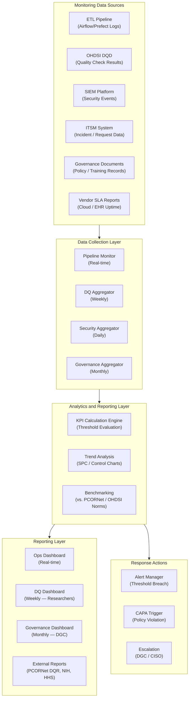

# Monitor, Evaluate & Assess (MEA) Domain — MEA01–MEA04

> **COBIT 2019 Reference:** Monitor, Evaluate & Assess (MEA) is the COBIT 2019 management objective domain that governs how the organization monitors the performance of its IT management and governance systems, evaluates the adequacy of internal controls, ensures compliance with external requirements, and obtains independent assurance about the effectiveness of its governance framework. In a healthcare research data environment, MEA objectives are the **accountability mechanism** for the entire COBIT governance system — they provide the evidence that governance controls are working as designed, that HIPAA obligations are being met, and that the data pipeline is performing at the levels required to support valid research. MEA outputs are the primary inputs to regulatory reporting, internal audit, and Board-level governance reporting.

---

## Table of Contents

- [MEA01 — Managed Performance and Conformance Monitoring](#mea01--managed-performance-and-conformance-monitoring)
- [MEA02 — Managed System of Internal Control](#mea02--managed-system-of-internal-control)
- [MEA03 — Managed Compliance with External Requirements](#mea03--managed-compliance-with-external-requirements)
- [MEA04 — Managed Assurance](#mea04--managed-assurance)
- [MEA → Regulatory Reporting Mapping](#mea--regulatory-reporting-mapping)

---

## MEA01 — Managed Performance and Conformance Monitoring

### Healthcare Context

MEA01 requires the organization to collect, validate, and report performance and conformance data to enable management to assess whether IT objectives are being met. In a healthcare research data environment, performance monitoring is inseparable from **data quality assurance and regulatory compliance monitoring** — the same monitoring infrastructure that tracks CDM pipeline performance also generates the evidence needed for HIPAA compliance demonstrations, IRB study continuation reports, NIH progress reports, and PCORNet data quality review submissions.

The monitoring program must cover **five distinct performance domains**: (1) CDM Data Quality Performance — tracking OHDSI DQD check results, ACHILLES characterization metrics, and PCORNet DQR metrics across all five quality dimensions (conformance, completeness, plausibility, timeliness, accuracy); (2) Pipeline Operational Performance — tracking ETL job execution times, failure rates, and data freshness against SLA targets; (3) Security and Compliance Performance — tracking HIPAA safeguard implementation status, vulnerability remediation rates, and audit log coverage; (4) Service Delivery Performance — tracking researcher satisfaction, access provisioning cycle times, and SLA adherence rates; and (5) Governance Process Performance — tracking DGC meeting adherence, policy review completion rates, and training completion rates.

The monitoring architecture must support **automated, real-time monitoring** for operational and security KPIs (pipeline status, alert volumes, access anomalies) and **periodic reporting** for data quality and governance KPIs (weekly DQD reports, monthly SLA reports, quarterly governance reports). Monitoring outputs must feed into a unified **CDM Governance Dashboard** accessible to the DGC and senior leadership, enabling data-driven governance decisions.

Conformance monitoring specifically requires tracking adherence to **internal policies and external standards** — not just operational performance. For example, conformance monitoring must detect when a data access grant was made without complete IRB documentation (violating the access authorization policy), when an ETL change was deployed without CAB approval (violating the change management policy), or when a backup restore test was not executed on schedule (violating the contingency plan policy). These conformance violations must be tracked, reported, and remediated with the same rigor as technical incidents.

### Performance Monitoring Architecture

### KPI Dashboard Table

The following 8 KPIs constitute the core CDM governance performance dashboard, reported to the Data Governance Committee on the defined schedule.

| KPI | Definition | Target | Measurement Frequency | Owner |
|---|---|:---:|:---:|---|
| DQD Conformance Pass Rate | % of OHDSI DQD conformance checks passing | ≥ 98% | Weekly | Data Engineering Lead |
| DQD Completeness Score | % completeness of mandatory CDM fields across all domains | ≥ 95% | Weekly | Data Engineering Lead |
| DQD Plausibility Pass Rate | % of OHDSI DQD plausibility checks passing | ≥ 99% | Weekly | Data Engineering Lead |
| ETL Pipeline Success Rate | % of scheduled ETL jobs completing without unplanned failure | ≥ 99.5% | Daily | Platform Operations |
| CDM Data Freshness SLA Adherence | % of measured CDM freshness checks meeting ≤ 24h lag target | ≥ 99% | Daily | Platform Operations |
| HIPAA Training Completion Rate | % of PHI-access staff with current HIPAA training on record | 100% | Monthly | Privacy Officer |
| Access Provisioning Cycle Time | Mean business days from complete request to access granted | ≤ 5 days | Monthly | Data Access Committee |
| Security Vulnerability Remediation Rate | % of identified vulnerabilities remediated within target SLA by severity | ≥ 95% | Monthly | CISO |

### Key Activities

- **Define and Approve the CDM KPI Framework:** Formally define all monitored KPIs, including: definition, calculation methodology, data source, target value, measurement frequency, responsible owner, and escalation threshold; obtain DGC approval; review annually; publish in the governance knowledge base.
- **Implement Automated KPI Collection and Calculation:** Deploy automated tools to collect KPI data from all pipeline, security, and governance systems; calculate KPI values without manual data entry; store KPI results in a time-series database; flag threshold breaches automatically.
- **Publish and Distribute Governance Performance Reports:** Publish weekly Data Quality Reports (to researchers), monthly Operational Performance Reports (to IT leadership), monthly Security Compliance Reports (to CISO), and quarterly Governance Performance Reports (to DGC); archive all reports in the governance document repository for ≥ 6 years.
- **Conduct Monthly KPI Trend Analysis:** Analyze KPI trends month-over-month using statistical process control methods; identify deteriorating trends before threshold is breached; proactively initiate improvement actions for any KPI showing negative trend over three consecutive months.
- **Report Performance to External Stakeholders:** Submit required performance reports to external stakeholders on schedule: PCORNet Data Quality Review metrics (quarterly), NIH progress report data metrics (annual), HHS HIPAA compliance representations (annual); obtain documentation of submission for audit trail.

### Metrics (Meta-KPIs — Monitoring the Monitoring Program)

| Metric | Target | Measurement Frequency |
|---|---|---|
| KPI Dashboard Availability | ≥ 99% — monitoring system uptime during business hours | Monthly |
| Governance Report Distribution On-Time Rate | 100% of scheduled reports distributed within 2 business days of reporting period close | Per report cycle |
| KPI Threshold Breach Response Rate | 100% of threshold breaches acknowledged and action plan documented within 2 business days | Per breach event |

### HIPAA / NIST Alignment

| Standard | Citation | Alignment |
|---|---|---|
| HIPAA Security Rule | 45 CFR § 164.308(a)(1)(ii)(D) | Information system activity review — performance monitoring |
| HIPAA Security Rule | 45 CFR § 164.308(a)(8) | Evaluation — periodic technical and non-technical assessment |
| NIST SP 800-53 Rev. 5 | CA-7 (Continuous Monitoring) | Continuous monitoring strategy and program |
| NIST SP 800-137 | Information Security Continuous Monitoring (ISCM) | ISCM program development |

---

## MEA02 — Managed System of Internal Control

### Healthcare Context

MEA02 requires the organization to maintain and evaluate the system of internal controls that govern IT and data management processes, ensuring that controls are appropriately designed, operating effectively, and continuously improved. In a healthcare research data environment, the system of internal control must address the **full range of risk domains** relevant to PHI management and research data integrity: data quality controls (are CDM records accurate and complete?), access controls (are only authorized individuals accessing CDM data?), de-identification controls (are released datasets truly de-identified per HIPAA standards?), change management controls (are CDM changes being properly reviewed and approved?), and operational controls (are pipeline operations being monitored and documented as required?).

The internal control framework must be structured around a recognized control model. The **COSO Internal Control — Integrated Framework (2013)** is the most widely adopted model and provides five components: Control Environment, Risk Assessment, Control Activities, Information and Communication, and Monitoring Activities. COSO 2013 maps well to HIPAA's administrative safeguards (Control Environment and Control Activities) and technical safeguards (Control Activities and Monitoring Activities). Organizations subject to federal research funding should also align with the **Single Audit Act requirements** (2 CFR Part 200 Subpart F), which require an independent audit of internal controls over federal programs.

The **internal audit of de-identification processes** is a particularly high-stakes MEA02 activity. Because inadequate de-identification constitutes a per se HIPAA Privacy Rule violation, the internal control assessment must include a systematic, documented test of the de-identification pipeline's effectiveness — not just a review of policy documentation, but an actual technical test using synthetic PHI injection and verification that the de-identification controls remove all injected PHI without false negatives. This test must be conducted at least annually and within 30 days of any significant change to the de-identification pipeline.

The **CDM ETL control testing** program must verify that automated controls in the ETL pipeline (record count reconciliation gates, referential integrity checks, domain assignment audits — defined in DSS06) are operating as designed. Control testing must use both inquiry (interviewing the control owner), observation (directly observing the control operating), and re-performance (independently re-executing the control logic) to provide high-quality evidence of control effectiveness.

### Key Activities

- **Develop an Annual Internal Control Assessment Plan:** Define the scope, methodology, timing, and responsible parties for the annual internal control assessment; align with the audit requirements of funding agencies (NIH single audit requirements), regulatory obligations (HIPAA), and governance commitments; obtain DGC approval before the start of each assessment cycle.
- **Conduct De-identification Control Testing:** Perform annual technical testing of the de-identification pipeline using synthetic PHI injection; inject representative records containing each of the 18 HIPAA Safe Harbor identifiers and verify complete removal; document testing methodology, test records, results, and any false negatives; obtain Privacy Officer sign-off on test results.
- **Test CDM ETL Controls Through Re-Performance:** Independently re-execute key ETL pipeline controls (record count reconciliation, referential integrity check, domain assignment audit) for a representative sample of CDM records; compare independently computed results to pipeline-generated control outputs; document any discrepancies.
- **Conduct Access Control Review:** Perform quarterly review of all CDM user access rights; verify that each active user has a current, IRB-approved protocol or operational justification for their access level; identify and remove orphaned accounts, over-privileged accounts, and accounts for departed personnel; document review evidence.
- **Report Internal Control Assessment Results to DGC:** Prepare a formal Internal Control Assessment Report documenting: assessment scope, testing methodology, control effectiveness ratings, deficiencies identified (if any), management responses, and remediation plans; present to DGC; retain for ≥ 6 years.

### Metrics

| Metric | Target | Measurement Frequency |
|---|---|---|
| Internal Control Assessment Coverage | 100% of defined key controls tested in annual assessment cycle | Annual |
| De-identification Pipeline False Negative Rate (PHI Injection Test) | Zero false negatives (all injected PHI removed) | Annual + Post-change |
| Access Control Review Completion Rate | 100% of CDM user accounts reviewed quarterly | Quarterly |
| Control Deficiency Remediation Rate | 100% of significant control deficiencies remediated within 90 days | Per deficiency identified |
| Internal Audit Finding Repeat Rate | ≤ 10% of annual assessment findings are repeats from prior year | Annual |

### HIPAA / NIST Alignment

| Standard | Citation | Alignment |
|---|---|---|
| HIPAA Security Rule | 45 CFR § 164.308(a)(8) | Evaluation — assessment of security controls effectiveness |
| HIPAA Privacy Rule | 45 CFR § 164.514(b) | De-identification testing — internal control over PHI removal |
| NIST SP 800-53 Rev. 5 | CA-2 (Control Assessments) | Security and privacy control assessment |
| COSO 2013 | Full framework | Internal control framework |
| 2 CFR Part 200 | Subpart F (§§ 200.514–200.521) | Single audit requirements for federally funded programs |

---

## MEA03 — Managed Compliance with External Requirements

### Healthcare Context

MEA03 requires the organization to identify, assess, and ensure compliance with all relevant external requirements — legal, regulatory, and contractual — affecting its IT and data management activities. In a healthcare research data environment, the **external regulatory landscape is unusually dense and dynamic**, requiring dedicated compliance monitoring capability to avoid violations that carry significant civil monetary penalties (HIPAA CMPs up to $1.9 million per violation category per year), criminal liability, grant debarment, and reputational damage.

The primary external regulatory requirements affecting the health data pipeline include: the **HIPAA Privacy Rule** (45 CFR Part 164 Subpart E — use and disclosure of PHI); the **HIPAA Security Rule** (45 CFR Part 164 Subpart C — administrative, physical, and technical safeguards for ePHI); the **HIPAA Breach Notification Rule** (45 CFR Part 164 Subpart D — breach notification obligations); the **HITECH Act** (reinforcing HIPAA, establishing higher CMPs, extending HIPAA to Business Associates); the **Common Rule** (45 CFR Part 46 — human subjects research protections, including IRB requirements and consent); the **NIH Data Management and Sharing Policy** (NOT-OD-21-013, effective January 25, 2023 — data management and sharing plan requirements for NIH-funded research); **OIG Workplan** items that identify healthcare data management and privacy as OIG audit priorities; and **applicable state privacy laws** (which may be more stringent than HIPAA and vary by state).

The **OIG (Office of Inspector General) Workplan** is a particularly important compliance monitoring input for healthcare organizations. OIG publishes an annual Workplan identifying audit priorities, and health data management and privacy consistently appear as areas of OIG interest. The MEA03 compliance program must track published OIG Workplan items relevant to data management and proactively assess the organization's compliance with those items — avoiding the reactive posture of responding to an OIG audit without prior self-assessment.

**OCR (Office for Civil Rights) investigation response** readiness is another MEA03 priority. The organization must maintain documentation — policies, training records, risk assessments, incident logs, BA agreements — in a state of perpetual audit readiness, able to produce comprehensive HIPAA compliance evidence to OCR within the standard OCR response timeline (typically 10–30 days).

### Compliance Calendar

The following compliance calendar defines recurring MEA03 activities across the annual cycle:

#### Monthly Activities
- Review HHS OCR enforcement news and OIG Workplan updates for new items relevant to health data management
- Verify HIPAA training completion rates for all PHI-access personnel (100% target)
- Confirm all active Business Associate Agreements are current (no expired BAAs)
- Review access control logs for unauthorized access anomalies
- Generate and distribute monthly HIPAA security compliance report to CISO

#### Quarterly Activities
- Conduct quarterly CDM user access review (verify all access rights tied to active IRB protocols)
- Review and update the regulatory requirements inventory (add new requirements, remove superseded ones)
- Submit PCORNet Data Quality Review metrics to network coordinating center
- Review and update the BAA register for all Business Associates
- Conduct DGC quarterly meeting with compliance agenda item (regulatory update briefing)
- Assess compliance with NIH data sharing milestones for active funded grants

#### Annual Activities
- Conduct comprehensive HIPAA Security Rule risk analysis (45 CFR § 164.308(a)(1)(ii)(A)) — due before annual attestation
- Commission independent HIPAA compliance gap assessment
- Complete and submit NIH Data Management and Sharing Reports for all active awards (at milestones defined in DMSP)
- Review and update HIPAA Notice of Privacy Practices (NPP) — verify accuracy and posting requirements
- Conduct annual contingency plan testing (disaster recovery test) — document results
- Complete Single Audit (if federal expenditures ≥ $750,000 under 2 CFR Part 200 Subpart F)
- Submit HHS annual breach report (for breaches affecting < 500 individuals discovered during the calendar year) — due March 1 of following year
- Review all applicable state privacy law developments and assess compliance implications
- Conduct annual OIG Workplan review and self-assessment against relevant audit objectives
- Renew ISO 27001 certification (if applicable — annual surveillance audit or triennial recertification)

### Key Activities

- **Maintain a Regulatory Requirements Inventory:** Develop and maintain a comprehensive, living inventory of all external regulatory, legal, and contractual requirements applicable to the health data pipeline; for each requirement: regulatory citation, effective date, description, responsible owner, compliance status, evidence source, and next review date; review quarterly.
- **Monitor Regulatory Landscape for Changes:** Designate a compliance monitoring function responsible for tracking HHS rulemaking, OCR guidance updates, OIG Workplan publications, NIH policy updates, and state law changes; publish monthly regulatory update briefings to relevant staff.
- **Maintain Perpetual HIPAA Audit Readiness:** Maintain a HIPAA Audit Response File (HARF) containing current copies of all HIPAA-required documentation: risk analysis, risk management plan, sanction policy, information system activity review evidence, workforce training records, BAA register, incident log, contingency plan with test results, and policies and procedures; review and update quarterly.
- **Conduct Annual HIPAA Gap Assessment:** Perform a comprehensive, documented HIPAA compliance gap assessment annually, assessing compliance with all required and addressable implementation specifications in the Privacy Rule, Security Rule, and Breach Notification Rule; document findings, remediation plans, and responsible owners; present to DGC.
- **Manage NIH DMSP Compliance:** For every NIH award with a Data Management and Sharing Plan (DMSP), track DMSP commitments and milestones; submit required data deposits to designated repositories (NCBI dbGaP, Vivli, or other approved repository) on schedule; document evidence of submission; maintain records per 2 CFR § 200.334.

### Metrics

| Metric | Target | Measurement Frequency |
|---|---|---|
| Regulatory Requirements Inventory Currency | 100% of requirements reviewed within 30 days of any known regulatory change | Quarterly + Post-change |
| HIPAA Audit Readiness Documentation Completeness | 100% of required HIPAA documentation current and accessible within 24 hours | Quarterly |
| NIH DMSP Milestone Compliance Rate | 100% of DMSP data sharing milestones met on schedule | Per award milestone |
| Annual HIPAA Gap Assessment Completion | Completed and DGC-reviewed within 60 days of fiscal year start | Annual |
| OIG Workplan Self-Assessment Completion | Annual self-assessment completed within 90 days of OIG Workplan publication | Annual |

### HIPAA / NIST Alignment

| Standard | Citation | Alignment |
|---|---|---|
| HIPAA Privacy Rule | 45 CFR § 164.530 | Administrative requirements — compliance program components |
| HIPAA Security Rule | 45 CFR § 164.316 | Documentation requirements for policies and procedures |
| HIPAA Breach Notification | 45 CFR § 164.408 | Annual breach report to HHS |
| NIH DMSP | NOT-OD-21-013 | Data management and sharing compliance |
| NIST SP 800-53 Rev. 5 | CA-1 (Policy and Procedures), PL-1 | Compliance policy framework |
| 2 CFR Part 200 | Subpart F | Single audit compliance for federal awards |

---

## MEA04 — Managed Assurance

### Healthcare Context

MEA04 requires the organization to obtain independent assurance about the effectiveness of its governance and management of IT and data. While MEA02 governs the internal control assessment function, **MEA04 governs the engagement of independent, external assurance providers** — external auditors, penetration testing firms, independent data quality auditors, and regulatory consultants — who provide objective, third-party verification that the organization's governance controls are effective and that representations made to regulators, funders, and research partners are accurate.

In a healthcare research data environment, external assurance is required or strongly expected across multiple domains: **HIPAA security assessments** (while not mandated by specific frequency in the HIPAA Security Rule, HHS OCR consistently expects covered entities to have conducted independent security risk assessments and uses their absence as evidence of non-compliance in enforcement actions); **penetration testing** (NIST SP 800-115 recommends annual penetration testing of systems processing sensitive information; many BAAs and research network participation agreements contractually require it); **CDM data quality audits** (PCORNet participation agreements require evidence of data quality review; FDA RWE use requires demonstration of data quality to FDA standards); and **SOC 2 Type II assessments** (cloud vendors hosting CDM data are expected to maintain SOC 2 Type II attestation; the organization may also pursue its own SOC 2 Type II if providing CDM services to other institutions).

The assurance program must follow a **risk-based prioritization** — not all systems and processes receive the same assurance investment. The highest assurance investment should be directed to: systems processing the most PHI, processes with the highest regulatory risk (de-identification, breach notification), and areas where internal control assessment has identified past deficiencies.

### Assurance Scope Table

| Assurance Activity | Scope | Provider Type | Frequency | Primary Output | Regulatory Driver |
|---|---|---|---|---|---|
| HIPAA Security Risk Assessment | All ePHI systems and CDM infrastructure | Qualified independent assessor | Annual | Risk Assessment Report | 45 CFR § 164.308(a)(1)(ii)(A) |
| Penetration Test (External) | All internet-facing CDM systems, FHIR APIs, researcher portals | Certified penetration testing firm (CPTS/OSCP certified) | Annual | Penetration Test Report with CVSS-rated findings | NIST SP 800-115; BAA requirements |
| Penetration Test (Internal) | Internal CDM network, lateral movement paths, insider threat vectors | Certified penetration testing firm | Annual (may be combined with external) | Internal Penetration Test Report | NIST SP 800-115 |
| CDM Data Quality Audit | OMOP CDM conformance, completeness, plausibility vs. source EHR | Independent clinical informaticist or academic partner | Annual | Data Quality Audit Report | PCORNet participation; FDA RWE requirements |
| HIPAA Privacy Compliance Review | Privacy Rule compliance (NPP, minimum necessary, authorizations, IRB) | Healthcare attorney or compliance consultant | Annual | Compliance Gap Report | HHS OCR enforcement guidance |
| De-identification Validation (Expert) | De-identification pipeline, dataset releases | PHI Expert (Expert Determination method under 45 CFR § 164.514(b)(1)) | Per major dataset release | Expert Determination Certificate | 45 CFR § 164.514(b)(1) |
| ISO 27001 Surveillance Audit | ISMS scope as defined in Statement of Applicability | ISO 27001 Accredited Certification Body | Annual (surveillance); Triennial (recertification) | Surveillance Audit Report; Certificate | ISO/IEC 27001:2022 |
| COBIT Capability Assessment | COBIT 2019 management objective capability levels | Internal or external COBIT assessor | Biennial | Capability Assessment Report | COBIT 2019 assessment guide |
| SOC 2 Type II Readiness Assessment | Organizational controls relevant to Trust Service Criteria (Security, Availability, Confidentiality) | CPA firm with SOC 2 expertise | As required by BAA or network participation agreements | SOC 2 Readiness Report | AICPA TSC requirements |

### Key Activities

- **Develop an Annual Assurance Plan:** Define the assurance activities to be conducted in the coming year, including scope, provider selection criteria, timeline, budget, and expected outputs; present to DGC for approval; integrate with the APO06 budget process for assurance cost planning.
- **Procure and Manage Qualified Assurance Providers:** Select assurance providers through a competitive procurement process that verifies relevant credentials (CPTS, CISA, CISSP, healthcare industry experience, familiarity with HIPAA and OMOP CDM); execute formal engagement agreements with defined scope, deliverable expectations, and confidentiality requirements.
- **Facilitate Assurance Engagements:** Designate an internal assurance coordinator for each engagement; provide assurance providers with required access to systems, documentation, and personnel; ensure independent access without undue management influence on findings; maintain a complete engagement evidence file.
- **Review, Validate, and Act on Assurance Findings:** Review each assurance report with the assurance provider to validate finding accuracy; develop formal management responses to all findings; assign owners and due dates to all remediation actions; track remediation in the CAPA log (APO11); report finding status to DGC quarterly until closure.
- **Communicate Assurance Results to Stakeholders:** Share appropriate portions of assurance results with relevant stakeholders: security assessment summaries to CISO and CIO; data quality audit results to research leadership and DGC; compliance review results to Privacy Officer and Legal Counsel; PCORNet-required metrics to network coordinating center; retain complete assurance reports in the governance document repository for ≥ 6 years.

### Metrics

| Metric | Target | Measurement Frequency |
|---|---|---|
| Assurance Plan Execution Rate | 100% of planned assurance activities completed within ± 60 days of planned schedule | Annual |
| Penetration Test Critical Finding Remediation Rate | 100% of critical PT findings remediated and independently verified within 30 days | Per PT engagement |
| COBIT Capability Level Improvement (Net) | Net positive progression ≥ 0.5 capability levels across priority APO/BAI/DSS/MEA objectives | Biennial assessment |
| Assurance Finding Repeat Rate | ≤ 15% of assurance findings repeated from prior engagement | Per engagement |
| Expert De-identification Certificate Coverage | 100% of research datasets released under Expert Determination covered by current Expert certificate | Per dataset release |

### HIPAA / NIST Alignment

| Standard | Citation | Alignment |
|---|---|---|
| HIPAA Security Rule | 45 CFR § 164.308(a)(1)(ii)(A) | Risk Analysis — independent assessment of risk |
| HIPAA Security Rule | 45 CFR § 164.308(a)(8) | Periodic evaluation — independent technical evaluation |
| 45 CFR § 164.514(b)(1) | Expert Determination method | Requires qualified statistical/scientific expert certification |
| NIST SP 800-115 | Technical Guide to Information Security Testing and Assessment | Penetration testing methodology |
| NIST SP 800-53 Rev. 5 | CA-2 (Control Assessments), CA-5 (Plan of Action and Milestones) | Independent control assessment requirements |
| ISO/IEC 27001:2022 | Clauses 9.2–9.3 | Internal audit and management review |

---

## MEA → Regulatory Reporting Mapping

The following table maps each MEA objective to the specific regulatory reporting requirements it addresses, providing traceability from COBIT governance activity to regulatory obligation.

| Regulatory Reporting Requirement | Regulation / Standard | MEA Objective(s) | Reporting Deadline | Evidence Generated |
|---|---|---|---|---|
| HHS Annual Breach Report (Breaches < 500 individuals) | 45 CFR § 164.408(c) | MEA01, MEA02 | March 1 of year following calendar year of discovery | Breach incident log, risk assessment documentation, HHS web portal submission |
| HHS OCR Breach Notification (Breaches ≥ 500 individuals) | 45 CFR § 164.406 | MEA01, MEA02, MEA03 | Within 60 days of breach discovery | Breach notification letters, HHS web portal submission, media notice |
| HHS OCR Investigation Response | 45 CFR §§ 164.530(e), 164.306(e) | MEA02, MEA03, MEA04 | Per OCR investigation timeline (typically 10–30 days per request) | HIPAA Audit Response File (HARF): policies, training records, risk analysis, BAAs, incident log |
| NIH Data Management and Sharing Report | NOT-OD-21-013; 2 CFR § 200.328 | MEA01, MEA03 | Per DMSP milestones; annual progress report | Data deposit confirmation, repository accession numbers, DMSP compliance narrative |
| OIG Self-Disclosure (if required) | OIG Self-Disclosure Protocol | MEA02, MEA03 | Per OIG protocol timelines (varies) | Internal control assessment report, corrective action documentation |
| ISO 27001 Internal Audit Report | ISO/IEC 27001:2022 Clause 9.2 | MEA02, MEA04 | Annual (surveillance); triennial (recertification) | Internal audit report, nonconformity log, corrective action records |
| COBIT Capability Assessment Report | COBIT 2019 Assessment Guide | MEA04 | Biennial (DGC presentation) | Capability assessment report, improvement roadmap |
| PCORNet Network Data Quality Review | PCORNet Network Policies | MEA01, MEA04 | Quarterly metrics submission; annual DQR | DQD metrics export, PCORNet DQR submission package |
| Federal Single Audit (OMB) | 2 CFR Part 200 Subpart F | MEA02, MEA03 | Within 9 months of fiscal year end (if federal expenditures ≥ $750K) | Schedule of Federal Awards, management representation letter, corrective action plan |
| IRB Annual Protocol Renewal Data Compliance | 45 CFR Part 46 (Common Rule) | MEA01, MEA02 | Per IRB-defined renewal cycle (typically annual) | Data access log, data quality attestation, protocol compliance documentation |
| SOC 2 Type II Attestation Report | AICPA Trust Service Criteria | MEA02, MEA04 | Annual (per audit period) | SOC 2 Type II report (shared under NDA with BAA partners) |
| FDA RWE Submission Data Quality Documentation | FDA Real-World Evidence Framework (2018) | MEA01, MEA04 | Per regulatory submission timeline | CDM data quality report, ACHILLES characterization output, expert de-identification certificate |

---

*Document Version: 1.0 | Effective Date: 2026-05-26 | Owner: Data Governance Committee | Review Cycle: Annual*
*Standards References: COBIT 2019 (ISACA, 2018); HIPAA Privacy Rule 45 CFR Part 164 Subpart E; HIPAA Security Rule 45 CFR Part 164 Subpart C; HIPAA Breach Notification Rule 45 CFR Part 164 Subpart D; HITECH Act; Common Rule 45 CFR Part 46; NIH NOT-OD-21-013; NIST SP 800-53 Rev. 5; NIST SP 800-137; COSO 2013 Internal Control Framework; ISO/IEC 27001:2022; AICPA Trust Service Criteria; 2 CFR Part 200 (Uniform Guidance); PCORNet Network Policies; FDA Real-World Evidence Framework (2018)*
