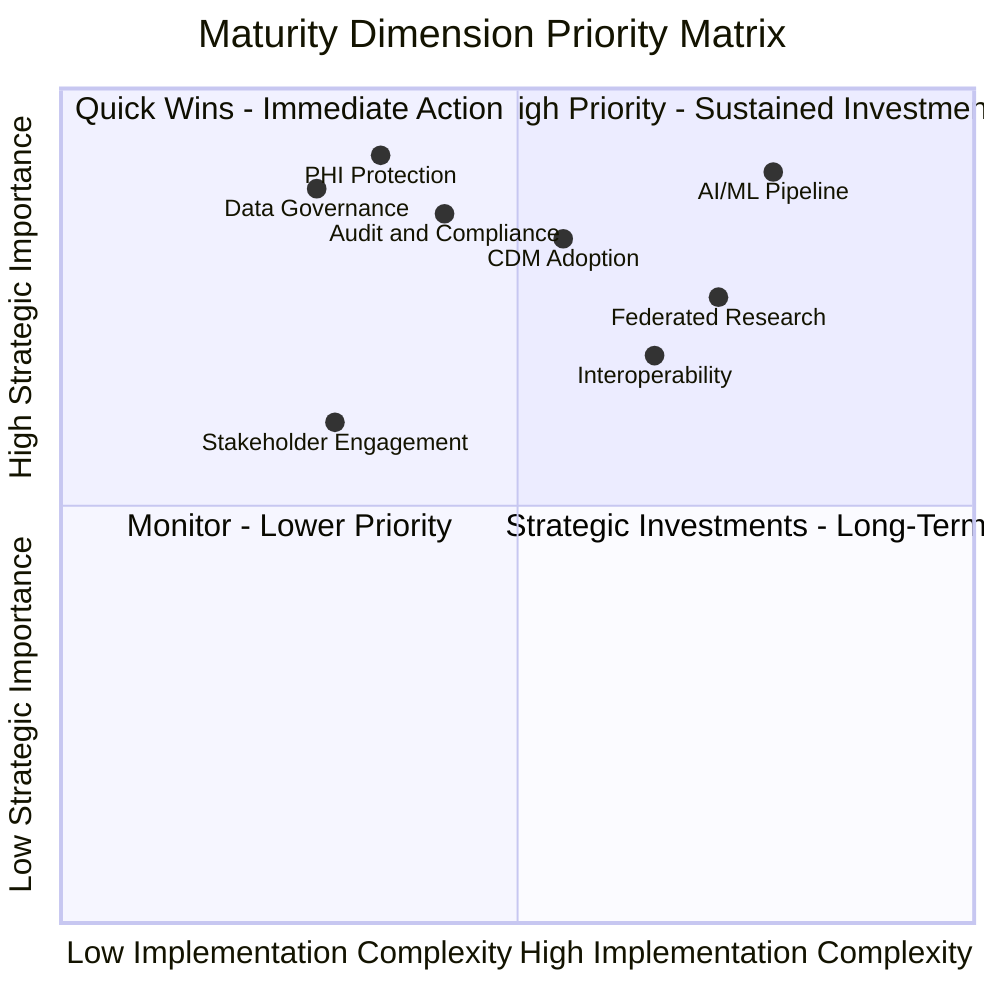
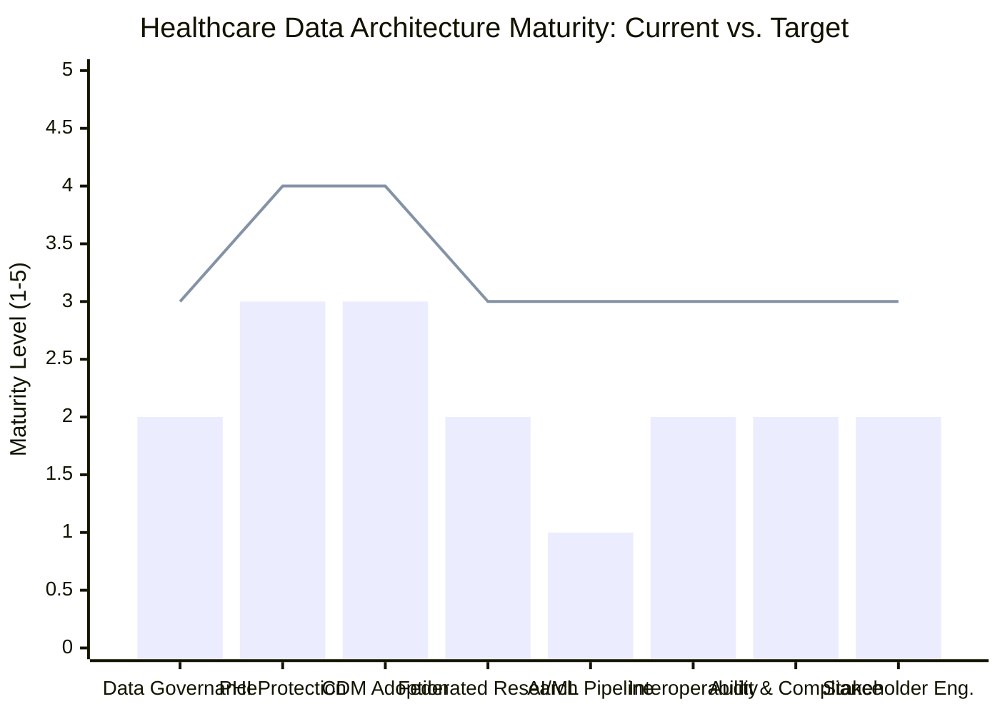

# Healthcare Data Architecture Maturity Model

> **Classification:** Internal Governance Documentation — Lapaki Health Data Architecture Project  
> **Standard Reference:** COBIT 2019 Performance Management (ISO/IEC 33020), CMMI-DEV v2.0  
> **Version:** 1.0  
> **Effective Date:** 2026-05-26  
> **Review Cycle:** Annual  
> **Owner:** Data Governance Committee / Research Informatics Director  

---

## 1. Introduction and Purpose

The Healthcare Data Architecture Maturity Model (HDA-MM) defined in this document provides a structured, evidence-based framework for assessing the current maturity of the Lapaki Health Data Architecture and for planning a measurable progression toward target-state capabilities. The model is grounded in **COBIT 2019's six-level capability framework** (ISO/IEC 33020), adapted to the specific operational dimensions of a federated healthcare research data platform implementing the OMOP Common Data Model (CDM).

### 1.1 Why a Maturity Model Is Necessary

Healthcare data architecture is not a binary state — it is a continuum. An organization may have excellent de-identification practices but immature AI/ML governance. It may operate a well-managed CDM but have fragmented stakeholder engagement. The HDA-MM addresses this heterogeneity by assessing maturity independently across **eight critical dimensions**, each of which represents a distinct capability area that directly impacts the platform's regulatory compliance, research value, and operational resilience.

The maturity model serves four specific governance purposes:

1. **Self-assessment baseline**: Establishes a defensible, evidence-based current-state across all dimensions that can be presented to the DGC, institutional leadership, funding agencies, and external auditors.
2. **Investment prioritization**: By making maturity gaps visible across dimensions, the model enables the DGC to make explicit, documented decisions about where to direct limited resources.
3. **Audit readiness**: HITRUST CSF v11, OCR audit protocols, and Big Four consulting review standards all expect the assessed organization to articulate its control maturity level with supporting evidence. The HDA-MM provides the narrative and visual artifacts to satisfy this expectation.
4. **Research credibility**: Ohno-Machado et al. (2014) demonstrated in the pSCANNER architecture that multi-site federated networks require not just technical interoperability but **governance maturity parity** — participating sites must meet a minimum maturity threshold for the network's integrity to be maintained. The HDA-MM provides the evidence of that threshold.

### 1.2 Relationship to Published Research

Three peer-reviewed works directly inform the maturity model design:

- **Ohno-Machado et al. (2014)**, *JAMIA* 21(4):621–626: The pSCANNER network required standardized governance of data provenance, federated query authorization, and CDM harmonization across multiple PCORnet sites — a real-world embodiment of Levels 3–4 maturity in CDM Adoption, Federated Research Capability, and Data Governance dimensions.

- **PMC13000207 (2026)**: The integrated sleep health trustworthy AI pipeline study documents the governance gaps that emerge when AI/ML capability outpaces governance maturity — specifically in AI/ML Pipeline Governance and Audit & Compliance dimensions. The study's findings indicate that organizations operating below Level 3 in AI/ML governance experience significantly higher rates of model validation failure and regulatory inquiry.

- **Chawla et al. (2024)**, *IJETCSIT* 5(3): This work establishes that trustworthy AI systems in healthcare require explicit COBIT-aligned compliance governance, and identifies five governance capability dimensions (accountability, transparency, explainability, fairness monitoring, and continuous assurance) that map directly to the HDA-MM's AI/ML Pipeline Governance and Audit & Compliance dimensions.

---

## 2. Maturity Level Definitions

The following five levels are defined for all dimensions. Level 0 (Incomplete) is included as a reference baseline but is not a target state for any Lapaki dimension.

| Level | Name | Definition |
|-------|------|------------|
| **1** | **Initial** | Processes are undocumented, ad hoc, and dependent on individual heroics. Outcomes are unpredictable and not repeatable. No formal policies exist. |
| **2** | **Developing** | Basic processes are documented and partially implemented. Repeatability exists for common scenarios. Policies exist but are not uniformly enforced. Measurement is informal. |
| **3** | **Defined** | Standard processes are documented, approved by appropriate authority, consistently applied, and communicated to all relevant personnel. Measurement is systematic and used for reporting. |
| **4** | **Managed** | Quantitative targets are defined for process performance. Statistical methods may be applied. Variation is understood and managed. Governance decisions are data-driven. |
| **5** | **Optimizing** | Continuous improvement is institutionalized. Leading indicators drive proactive intervention. Benchmarking against external standards. Innovation is governed and adopted systematically. |

---

## 3. The Eight Maturity Dimensions

The HDA-MM assesses maturity across the following eight dimensions, chosen to comprehensively represent the governance, technical, operational, and compliance capabilities of a healthcare research data platform:

1. **Data Governance** — The authority structures, policies, roles, and processes that govern all data assets
2. **PHI Protection & De-Identification** — Safeguards for identifiable health information and the processes for rendering data research-safe
3. **Common Data Model Adoption** — The completeness, quality, and operational maturity of OMOP CDM implementation
4. **Federated Research Capability** — The ability to execute multi-site distributed analyses while preserving data governance at each site
5. **AI/ML Pipeline Governance** — The governance of machine learning model development, validation, deployment, and monitoring
6. **Interoperability** — The ability to exchange data with external systems using standard formats, terminologies, and APIs
7. **Audit & Compliance** — The completeness and reliability of audit trails, compliance monitoring, and regulatory evidence management
8. **Stakeholder Engagement** — The breadth, structure, and effectiveness of engagement with all governance stakeholders

---

## 4. The Maturity Matrix (8 Dimensions × 5 Levels)

### 4.1 Dimension 1: Data Governance

Data governance encompasses the structures of authority, accountability, and decision-making that determine how data assets are created, maintained, used, and retired within the Lapaki architecture.

| Level | Description |
|-------|-------------|
| **1 — Initial** | Data governance exists only as informal, individual practice. There is no designated Data Governance Officer, no formal DGC, and no board-level visibility of data governance as a distinct accountability domain. Policy creation is reactive — driven by incidents or audit findings rather than proactive design. PHI stewardship responsibility is vaguely attributed across IT, clinical, and administrative staff with no clear authority hierarchy. |
| **2 — Developing** | A Data Governance Committee has been formed and meets irregularly. A Data Governance Officer role exists but may be partially filled or unfunded. Basic policies covering PHI classification, access control principles, and data sharing are drafted but not uniformly enforced. The governance charter has not been formally ratified by the governing board. Policy violations are addressed case-by-case without a formal sanction framework. |
| **3 — Defined** | The DGC operates under a board-ratified governance charter with defined membership, meeting cadence (≥6×/year), and decision authority. A named Data Governance Officer and Data Stewards for each CDM clinical domain are appointed and functioning. The complete policy suite (PHI classification, minimum necessary, de-identification, data sharing, access control, incident response) is approved, published, communicated, and systematically enforced. The governance charter and all policies are reviewed on a documented annual cycle. HIPAA §164.530 administrative requirements are demonstrably met. |
| **4 — Managed** | Governance performance is quantitatively tracked: DGC meeting compliance rate, policy review on-time rate, incident escalation time, and open action item aging are reported on a governance dashboard. The DGC uses these metrics to make resource allocation and priority decisions. Governance effectiveness is assessed against COBIT 2019 capability levels annually, with documented gap-closure plans. Benchmarking against peer healthcare institutions is conducted. |
| **5 — Optimizing** | Data governance is a strategic differentiator. The DGC proactively identifies emerging governance obligations (new AI regulations, FAIR data mandates, state privacy laws) and adapts the governance framework before regulatory deadlines. Governance innovation (e.g., automated policy compliance checking, AI-assisted audit) is evaluated and adopted through a governed process. The institution publishes its governance framework as a reference model for the broader research community, contributing to OHDSI and CTSA governance working groups. |

---

### 4.2 Dimension 2: PHI Protection & De-Identification

This dimension covers all safeguards protecting identifiable patient data and the processes by which data is rendered compliant with research use regulations (45 CFR §164.514 Safe Harbor and Expert Determination methods).

| Level | Description |
|-------|-------------|
| **1 — Initial** | PHI protection relies entirely on network perimeter security with no structured access control for research data. De-identification is performed manually by individual analysts using inconsistent methods — some removing obvious identifiers (name, DOB) but lacking awareness of quasi-identifiers (rare diagnosis codes, geographic details). No formal de-identification policy exists. There is no re-identification risk assessment capability. Expert Determination methodology has never been applied. |
| **2 — Developing** | A PHI classification policy exists that distinguishes between Direct Identifiers (18 HIPAA Safe Harbor identifiers), quasi-identifiers, and de-identified data. Safe Harbor de-identification is implemented as a defined procedure, but the procedure has not been formally validated or approved by a Privacy Officer. Expert Determination methodology has been explored but not implemented. Re-identification risk assessment is conducted informally on an as-requested basis. Audit logging of PHI access exists but is incomplete and not regularly reviewed. |
| **3 — Defined** | Both Safe Harbor and Expert Determination de-identification pathways are formally implemented, documented with SOPs, and approved by the Privacy Officer and DGC. Each pathway has defined quality controls: Safe Harbor includes automated checking of all 18 identifiers plus configured quasi-identifier suppression rules; Expert Determination includes documented statistical disclosure limitation methodology, signed expert determination letters, and residual re-identification risk scores. PHI access is controlled by role-based access control (RBAC) aligned with minimum necessary principles. All de-identification operations generate complete audit log entries. Cell suppression rules for small counts are implemented and governed by the DGC. |
| **4 — Managed** | De-identification quality is measured quantitatively: re-identification risk scores are calculated for every released dataset using k-anonymity or l-diversity metrics, with defined thresholds triggering mandatory DGC review before release. De-identification throughput (records per hour), error rates, and turnaround time SLAs are tracked and reported. PHI access anomalies are detected by automated behavioral analytics and generate incident tickets within defined SLA windows. Privacy impact assessments (PIAs) are conducted for every new data use and documented with a standardized template. |
| **5 — Optimizing** | De-identification methodology is continuously improved using feedback from re-identification risk research and regulatory guidance updates. Differential privacy techniques are evaluated for application to high-risk datasets (rare diseases, small geographic areas). The Expert Determination program is conducted by a permanent internal privacy statistician rather than relying on ad hoc external engagements. De-identification practices are published in peer-reviewed venues and shared with OHDSI and CTSA network partners. Automated privacy-preserving query (PPQ) capabilities are deployed for high-sensitivity research requests. |

---

### 4.3 Dimension 3: Common Data Model Adoption

The OMOP CDM is the canonical data representation for the Lapaki architecture. This dimension assesses the completeness, quality, conformance, and operational maturity of the CDM implementation, including vocabulary management and quality characterization.

| Level | Description |
|-------|-------------|
| **1 — Initial** | No standardized CDM exists. Research data is extracted from EHR systems in ad hoc formats for each study, requiring custom transformation scripts that are not reused. Vocabulary is inconsistent across studies — some use ICD-9, others ICD-10, with no translation layer. OMOP CDM has been considered but not piloted. Research queries require direct EHR database access, creating PHI governance risk. |
| **2 — Developing** | OMOP CDM v5.x has been piloted for one or two clinical domains (e.g., diagnoses and medications) but is incomplete. Vocabulary mapping exists for common concepts but has significant gaps in less common domains (devices, measurements, notes). OHDSI Achilles has been run but findings have not been acted upon systematically. CDM ETL is functional but undocumented; changes are made informally. Data quality characterization is not routine. |
| **3 — Defined** | OMOP CDM v5.4 is fully implemented across all required clinical domains: Conditions, Drugs, Procedures, Measurements, Observations, Device Exposures, Visits, and Death. Vocabulary mappings use standard OHDSI Athena vocabulary with documented source-to-concept mappings for all non-standard source codes. ETL pipelines are version-controlled, documented in the OMOP ETL specification, and managed through the formal change management process. OHDSI Achilles and the DataQualityDashboard (DQD) run on a defined schedule (at minimum quarterly) and results are reviewed by Data Stewards. CDM conformance rate ≥ 95% is maintained and reported to the DGC. |
| **4 — Managed** | CDM quality metrics are tracked in real-time using automated DQD integration into the CI/CD pipeline — every ETL deployment triggers a DQD run and a conformance report before promotion to production. Quantitative SLAs are defined for ETL freshness (data lag ≤ 48 hours from EHR extract), conformance rate (≥ 97%), and Achilles error count (≤ 5 critical errors). Vocabulary update cadence is governed with a formal review process for each new OHDSI vocabulary release. CDM performance is benchmarked against OHDSI community norms using published Achilles results. |
| **5 — Optimizing** | CDM adoption is a continuous improvement program: the Research Informatics team actively participates in OHDSI community working groups to influence CDM v6.x design. CDM quality improvements discovered through research use cases are fed back into ETL enhancement. ML-assisted concept mapping is piloted to close remaining vocabulary gaps. The CDM is the authoritative data source for operational analytics as well as research, eliminating the need for separate data warehouses. CDM provenance metadata meets FAIR data principles for findability and reusability. |

---

### 4.4 Dimension 4: Federated Research Capability

Federated research capability refers to the ability to participate in and operate multi-site distributed research networks — executing queries that span institutional boundaries without transferring PHI, consistent with the pSCANNER architecture model (Ohno-Machado et al., 2014).

| Level | Description |
|-------|-------------|
| **1 — Initial** | All research data analysis occurs locally. External collaboration requires direct data transfer under manually negotiated DUAs, with no standardized de-identification or format. Multi-site studies require lengthy setup times (typically 6–18 months per study) due to lack of infrastructure. The institution is not a member of any federated research network (PCORI, CTSA, OHDSI). No federated query technology has been evaluated. |
| **2 — Developing** | The institution has expressed intent to join a federated network and has assigned a technical lead for implementation. Pilot OMOP CDM data has been submitted for network quality review. A distributed query tool (e.g., ATLAS, i2b2) has been evaluated but not deployed in production. Data Use Agreements for network participation are under legal review. The governance framework for federated participation (authorization workflow, query logging, result validation) has not been formalized. |
| **3 — Defined** | The institution is an active, governance-approved member of a federated research network (e.g., PCORnet, N3C, OHDSI network). A federated query governance policy defines: who may submit queries, what query types are permitted, what result validation is required before sharing, and what audit logging is required. A distributed query tool (ATLAS or equivalent) is operational and its access is controlled by the research data access process. Participation agreements (DUAs, network operating agreements) are current and reviewed on defined cycles by legal and the DGC. Query turnaround time SLA is defined and tracked. |
| **4 — Managed** | Federated query performance is quantitatively managed: query volume, success rate, turnaround time, and result completeness are tracked and reported quarterly. Query authorization workflow adherence rate is ≥ 99%. A federated network governance dashboard shows real-time network participation health. The institution benchmarks its data quality against other network sites using published OHDSI benchmarks and actively works to close gaps identified. Differential privacy query controls are implemented and tested. |
| **5 — Optimizing** | Federated research capability is a platform capability, not a project. The institution can onboard new federated research use cases within weeks rather than months. Federated learning (privacy-preserving ML training across distributed sites) is operational for select approved use cases. The institution contributes to federated network governance bodies (e.g., PCORnet steering committee, OHDSI coordinating center working groups). New federated network participants are onboarded using the Lapaki governance framework as the reference model. Continuous monitoring of federated query result consistency across sites is automated. |

---

### 4.5 Dimension 5: AI/ML Pipeline Governance

As AI/ML capabilities are integrated into research and clinical decision support, their governance — encompassing training data governance, model validation, deployment authorization, bias monitoring, and continuous performance oversight — becomes a critical maturity dimension. This dimension aligns with Chawla et al. (2024) trustworthy AI governance requirements and PMC13000207 pipeline governance standards.

| Level | Description |
|-------|-------------|
| **1 — Initial** | AI/ML development is entirely ungoverned. Individual researchers develop models using ad hoc data extracts with no training data documentation. No model validation standard exists. Models may be deployed into clinical or operational workflows without formal review. Training data quality, representativeness, and bias are not assessed. No audit trail exists for model versions, training runs, or prediction outputs. Re-use of PHI for model training has not been reviewed for HIPAA compliance. |
| **2 — Developing** | An awareness of AI governance obligations exists but has not been translated into policy. An informal model registry captures some models in development. Training data is extracted from the CDM for new projects but without formal data provenance documentation. Basic model performance metrics (AUC, sensitivity, specificity) are calculated but bias assessment (by race, sex, age, payer) is not performed. IRB review of AI research uses is inconsistent. A preliminary AI governance policy is under development but not approved. |
| **3 — Defined** | A DGC-approved AI/ML Governance Policy is in effect, covering: training data governance (CDM-sourced, provenance documented, IRB-reviewed), model development standards (MLflow or equivalent model registry, mandatory bias assessment across protected classes, holdout validation), deployment authorization (DGC review for clinical decision support applications), and post-deployment monitoring (performance drift alerts, periodic re-validation). All AI/ML projects are registered in the model registry before development begins. Chawla et al. (2024) governance dimensions (accountability, transparency, explainability, fairness, continuous assurance) are addressed in the policy. |
| **4 — Managed** | AI/ML pipeline governance is quantitatively measured: model registry completeness, bias assessment completion rate, deployment authorization cycle time, and post-deployment performance SLA adherence are tracked on the governance dashboard. Automated model drift detection triggers re-validation workflows without manual intervention. Fairness metrics (demographic parity, equalized odds) are calculated and reported quarterly. AI incident reports (model failures, unexpected outputs, adverse events) are tracked and reported to the DGC. The AI governance program is aligned with emerging federal AI guidance (NIST AI RMF, FDA AI/ML-based SaMD action plan). |
| **5 — Optimizing** | AI/ML governance is a published institutional capability. The governance framework is continuously updated in response to regulatory evolution (FDA SaMD, CMS AI transparency requirements, state AI bias laws). Federated learning with differential privacy is operationally governed. Explainability methods (SHAP, LIME) are standardized for all deployed models. AI governance audits are conducted by external assurance providers. The institution contributes to national AI governance standards bodies. Publications describing the AI governance framework (building on PMC13000207 and Chawla et al., 2024 findings) demonstrate the institution's leadership in trustworthy AI. |

---

### 4.6 Dimension 6: Interoperability

Interoperability encompasses the ability of the Lapaki architecture to exchange data with EHR systems, external research networks, payer systems, and public health agencies using standard formats (HL7 FHIR, C-CDA), standard terminologies (SNOMED CT, LOINC, RxNorm, ICD-10-CM), and governed APIs.

| Level | Description |
|-------|-------------|
| **1 — Initial** | Data exchange is entirely file-based (flat file extracts, spreadsheets). No standard terminology is enforced across data sources — local codes coexist with national codes without mapping. EHR integration is achieved through one-off custom queries against production EHR databases, creating security risk and operational fragility. No HL7 FHIR capability exists. The 21st Century Cures Act information blocking rule (45 CFR Part 171) compliance is uncertain. |
| **2 — Developing** | HL7 FHIR R4 has been piloted for one or two EHR data feeds. Standard terminology adoption is underway in OMOP CDM but is incomplete. A basic API layer exists for internal research data access but lacks governance (no API versioning, no rate limiting, no access control integration). Interoperability with external federated networks requires manual data harmonization for each network. The 21st Century Cures Act compliance review has been initiated but not completed. |
| **3 — Defined** | HL7 FHIR R4 is the standard interface for all new EHR data integrations. SMART on FHIR is implemented for authorized researcher access to the research data API. All CDM terminology uses OHDSI Athena standard vocabularies (SNOMED CT, LOINC, RxNorm, ICD-10-CM/PCS, CPT4, HCPCS) with documented source-to-concept mappings. Interoperability with at least one federated research network (using OMOP CDM or equivalent common data model) is operational. A governed API catalog documents all external interfaces, their data governance requirements, and authorization models. 21st Century Cures Act compliance has been formally assessed and documented. |
| **4 — Managed** | API performance and governance metrics are tracked: API uptime ≥ 99.5%, response time SLAs, unauthorized access attempt rate, and API version deprecation compliance. Terminology currency is managed through an automated OHDSI vocabulary update pipeline that detects vocabulary version changes, stages updates in a test environment, validates CDM impact, and deploys on a governed schedule. FHIR implementation guide conformance is tested using automated validation tools. Interoperability with public health reporting systems (e.g., electronic case reporting, immunization registries) is implemented and monitored. |
| **5 — Optimizing** | Interoperability is a strategic capability enabling new research and care coordination models. The institution participates in national FHIR implementation guide development (HL7 working groups, ONC FHIR at Scale Taskforce). Semantic interoperability (ontology alignment, cross-terminology mapping) is automated using ML-assisted concept mapping validated against Athena. Real-time data streaming from EHR systems using FHIR Subscriptions is operational for time-sensitive research use cases. The interoperability framework is extensible to new data types (genomics, wearables, SDOH) without architectural redesign. |

---

### 4.7 Dimension 7: Audit & Compliance

Audit and compliance maturity reflects the completeness, reliability, and governance of audit trails, regulatory evidence management, internal control testing, and external assurance activities. This dimension directly supports MEA01, MEA02, MEA03, and MEA04 COBIT objectives.

| Level | Description |
|-------|-------------|
| **1 — Initial** | Audit logging is incomplete, inconsistent, and unreviewed. Some systems generate logs; others do not. No centralized log management exists. Compliance with HIPAA Security Rule §164.312(b) audit controls has not been formally assessed. Evidence for regulatory audits must be gathered manually from disparate systems under deadline pressure. HITRUST certification has not been pursued. Internal audit of data governance controls does not occur. Breach detection relies on user reports rather than automated monitoring. |
| **2 — Developing** | A centralized log management system (e.g., SIEM) has been deployed or is in procurement. HIPAA audit controls (§164.312(b)) are partially implemented — core systems log access and changes, but coverage is incomplete. A basic HIPAA Security Rule risk analysis has been conducted (though it may not be current). An internal audit of the data governance program has been performed informally. Evidence management is partially organized. HITRUST readiness assessment has been completed, identifying significant gaps. |
| **3 — Defined** | A SIEM provides centralized, tamper-evident audit logging for all systems processing PHI and CDM data. Audit log review is a defined, scheduled process (weekly automated exception reporting, monthly human review, quarterly DGC reporting). The HIPAA Security Rule risk analysis is current (updated within 12 months or on material change) and documented with all required elements. An internal audit program reviews key compliance controls on an annual schedule and reports findings to the DGC with remediation deadlines. A HITRUST self-assessment or validated assessment has been completed. Breach detection and notification processes meet HIPAA §164.400–414 requirements. |
| **4 — Managed** | Audit and compliance performance is quantitatively managed: audit log completeness rate (target: 100%), mean time to detect (MTTD) for security anomalies, breach notification time compliance rate, and internal audit finding remediation on-time rate are tracked on the governance dashboard. Automated compliance monitoring checks control configurations in real time and generates findings when drift occurs. HITRUST validated assessment is current and maintained. External audit findings are tracked in a formal corrective action plan (CAP) with DGC oversight. Audit evidence packages for major regulatory frameworks (HIPAA, HITRUST, NIST) are maintained in a structured repository and can be produced within 10 business days of audit notification. |
| **5 — Optimizing** | Audit and compliance is a proactive, intelligence-driven function. Threat intelligence feeds inform audit rule updates. ML-based anomaly detection identifies novel attack patterns not covered by signature-based rules. The compliance program continuously monitors regulatory developments and pre-adapts controls before implementation deadlines. The institution demonstrates continuous HIPAA compliance through real-time control monitoring rather than point-in-time assessments. External assurance providers attest to the effectiveness of the continuous monitoring program. Published audit methodology and control evidence catalogs contribute to the broader healthcare security community. |

---

### 4.8 Dimension 8: Stakeholder Engagement

Stakeholder engagement maturity reflects the breadth, structure, effectiveness, and inclusivity of the institution's engagement with all parties who have an interest in or are affected by the Lapaki Health Data Architecture, including patients, researchers, clinical staff, governance bodies, regulatory agencies, and external collaborators.

| Level | Description |
|-------|-------------|
| **1 — Initial** | Stakeholder engagement is reactive and ad hoc. Researchers discover data availability through informal channels. Clinical staff are unaware of research data reuse. Patient perspectives on data governance are not sought. IRB is engaged only when legally required. There is no formal communication to research community about data availability, policies, or access procedures. External federated network partners have no formal governance relationship. The institution has no patient advisory board or equivalent mechanism. |
| **2 — Developing** | A basic stakeholder identification exercise has been completed. A researcher portal or wiki provides some information about data access procedures. IRB liaison is more consistent but still reactive. A patient advisory group concept has been proposed but not implemented. External federated site relationships are governed by DUAs but no active governance engagement exists. Communication to research community is sporadic — driven by individual researchers rather than institutional process. Data stewards are identified but not formally organized or empowered. |
| **3 — Defined** | A formal Stakeholder Register is maintained and reviewed annually by the DGC, classifying all stakeholder classes by governance role (authority, consultation, notification), engagement mechanism, and frequency. A structured Researcher Engagement Program provides regular communication (quarterly newsletters, annual data summit, ad hoc training sessions). A Patient Advisory Board convenes annually and provides input to the DGC on consent models, data use transparency, and patient-facing access mechanisms. Data Steward Council meets monthly and reports to the DGC. External federated site governance participation is formalized through network governance body membership. All DGC stakeholder reporting is delivered on defined schedule per the governance charter. |
| **4 — Managed** | Stakeholder engagement effectiveness is measured: researcher satisfaction with data access process (≥ 80% satisfied), patient advisory forum participation rate, DGC stakeholder reporting on-time rate (100%), and external collaborator governance participation compliance rate. Stakeholder feedback is systematically collected, analyzed, and used to drive governance improvements. The Researcher Engagement Program is evaluated annually for coverage gaps and updated. Community engagement in AI governance (per PMC13000207 trustworthy AI findings) includes patient representatives in AI model review panels. Payer partner engagement is formalized through a value-based care data governance working group. |
| **5 — Optimizing** | Stakeholder engagement is a strategic function that amplifies research impact and institutional reputation. The Patient Advisory Board co-governs (not merely advises) consent model design and data use policy development. The institution is a recognized leader in patient engagement in data governance, publishing its engagement model and presenting at national forums (AMIA, PCORnet, CTSA). Researcher engagement drives a virtuous cycle: high data accessibility → high research output → high data reuse → investment in data quality. External federated governance participation shapes national network standards. Community-based participatory research principles are embedded in the data access governance framework for research involving underserved populations. |

---

## 5. Current State and Target State Assessment

The following table documents the Lapaki project's current maturity level (as of assessment date 2026-05-26) and the target maturity level for the 24-month governance roadmap horizon.

| Dimension | Current Level | Target Level (24 Mo.) | Primary Gap Description |
|-----------|--------------|----------------------|------------------------|
| Data Governance | 2 | 3 | DGC charter not board-ratified; steward roles unfilled in some domains |
| PHI Protection & De-Identification | 3 | 4 | Safe Harbor implemented; Expert Determination not yet in production; re-ID risk scoring not quantitative |
| Common Data Model Adoption | 3 | 4 | CDM v5.4 deployed; DQD not in CI/CD pipeline; real-time freshness SLA not enforced |
| Federated Research Capability | 2 | 3 | Network membership pending governance approval; DUA review in progress |
| AI/ML Pipeline Governance | 1 | 3 | No AI governance policy; no model registry; no bias assessment standard |
| Interoperability | 2 | 3 | FHIR piloted; API catalog incomplete; vocabulary update automation not implemented |
| Audit & Compliance | 2 | 3 | SIEM deployed; log review not scheduled; HITRUST readiness only; risk analysis not current |
| Stakeholder Engagement | 2 | 3 | Researcher portal exists; Patient Advisory Board not convened; Steward Council informal |

**Average Current Maturity: 2.1** | **Average Target Maturity: 3.2**

---

## 6. Maturity Visualization Diagrams

### 6.1 Current State vs. Target State Quadrant

This quadrant chart positions the eight maturity dimensions according to their **strategic importance** (Y-axis: how critical the dimension is to research mission and regulatory compliance) and **implementation complexity** (X-axis: how difficult it is to advance maturity). Dimensions in the upper-left quadrant (high importance, lower complexity) should be prioritized for immediate action. Dimensions in the upper-right (high importance, high complexity) require sustained, resourced roadmap execution.

**Interpretation:**
- **PHI Protection, Data Governance, Audit & Compliance** (upper-left): High strategic importance and relatively achievable with focused governance action and policy work. These should be the top priorities for the next 6 months.
- **AI/ML Pipeline Governance** (upper-right): Highest importance due to emerging regulatory requirements (NIST AI RMF, FDA SaMD) and the findings of Chawla et al. (2024) and PMC13000207, but also highest complexity. Requires dedicated program with multi-year roadmap.
- **CDM Adoption, Federated Research, Interoperability** (center-right): Important capabilities that are already partially built; advancement requires sustained technical investment and governance formalization.
- **Stakeholder Engagement** (lower-left): Lower current priority relative to compliance-critical dimensions, but foundational to long-term research mission sustainability.

---

### 6.2 Maturity Progression Bar Chart

This chart shows the current maturity level (blue) and 24-month target maturity level (green) for each of the eight dimensions, providing a visual representation of the planned maturity advancement across the governance roadmap period.

**Chart Legend:** Bar = Current Maturity Level | Line = 24-Month Target Maturity Level

**Key Observations:**
1. **AI/ML Pipeline Governance** shows the largest absolute advancement required (Level 1 → Level 3), representing the most significant governance gap and the highest regulatory risk. The PMC13000207 study confirms that unaddressed AI governance gaps are associated with disproportionate regulatory scrutiny.
2. **PHI Protection** is the only dimension with a Level 4 target, reflecting the non-negotiable nature of PHI safeguarding and the institution's intent to achieve quantitative, predictive de-identification risk management.
3. **CDM Adoption** and **Federated Research** are strongly correlated — advancement in CDM quality directly enables federated research capability, reflecting the pSCANNER architecture's core design principle (Ohno-Machado et al., 2014).
4. All eight dimensions have a target of Level 3 or above, reflecting the COBIT 2019 principle that Level 3 (Established) is the minimum defensible maturity for a healthcare data platform subject to HIPAA and HITRUST audit.

---

## 7. Governance Roadmap Summary

The following roadmap outlines the priority actions required to advance from current state to target state across all eight dimensions.

### Phase 1: Foundation (Months 1–6)
*Priority: Governance and compliance gaps that create immediate regulatory risk*

| Action | Dimension | COBIT Objective | Owner | Timeline |
|--------|-----------|----------------|-------|----------|
| Ratify DGC Charter at board level | Data Governance | EDM01 | CPO | Month 2 |
| Complete and document HIPAA risk analysis | Audit & Compliance | EDM03, APO12 | CISO | Month 3 |
| Establish SIEM audit log review schedule | Audit & Compliance | MEA01, DSS05 | CISO | Month 2 |
| Convene Patient Advisory Board inaugural session | Stakeholder Engagement | EDM05 | CPO | Month 4 |
| Draft and approve AI/ML Governance Policy | AI/ML Pipeline | EDM03, APO13 | CIO + RID | Month 6 |
| Complete Expert Determination SOP | PHI Protection | APO14, DSS06 | Privacy Officer | Month 5 |

### Phase 2: Standardization (Months 7–12)
*Priority: Process documentation, training, and systematic measurement*

| Action | Dimension | COBIT Objective | Owner | Timeline |
|--------|-----------|----------------|-------|----------|
| Deploy model registry (MLflow) | AI/ML Pipeline | BAI08, APO14 | RID | Month 9 |
| Implement DQD in CI/CD pipeline | CDM Adoption | BAI06, MEA01 | Data Engineer | Month 8 |
| Complete FHIR API catalog | Interoperability | APO14, DSS05 | RID | Month 10 |
| Finalize federated network DUA and governance | Federated Research | EDM03, MEA03 | Legal + RID | Month 12 |
| Launch Researcher Engagement Program | Stakeholder Engagement | EDM05 | RID | Month 8 |
| Establish Data Steward Council formal governance | Data Governance | EDM01, APO14 | CPO | Month 7 |

### Phase 3: Optimization (Months 13–24)
*Priority: Quantitative measurement, benchmarking, and Level 4 capability development*

| Action | Dimension | COBIT Objective | Owner | Timeline |
|--------|-----------|----------------|-------|----------|
| Implement re-ID risk scoring (k-anonymity) | PHI Protection | EDM03, APO14 | Privacy Officer | Month 16 |
| Deploy automated model drift detection | AI/ML Pipeline | MEA01, APO12 | RID | Month 18 |
| Conduct HITRUST validated assessment | Audit & Compliance | MEA03, MEA04 | CISO | Month 20 |
| Launch federated learning pilot | Federated Research | APO14, BAI01 | RID | Month 22 |
| Publish governance transparency report | Data Governance | EDM06 | CPO | Month 24 |
| Achieve Level 4 PHI Protection certification | PHI Protection | EDM03, DSS06 | Privacy Officer | Month 24 |

---

## 8. Evidence Requirements by Level

For each maturity level assessment to be defensible in an audit, the following categories of evidence are required:

| Level | Required Evidence Categories |
|-------|------------------------------|
| **Level 1** | Documentation of *absence* of formal process; incident records showing ad hoc response |
| **Level 2** | Draft or partially approved policy documents; informal process documentation; evidence of initiation |
| **Level 3** | Approved policies; process SOPs with version history; training records; meeting minutes; audit logs; risk register; approved governance artifacts |
| **Level 4** | Quantitative performance metrics with trend data; dashboard screenshots; SLA compliance reports; statistical process control charts; governance decision records citing metrics |
| **Level 5** | Published governance framework; external benchmarking results; innovation adoption records; community contribution artifacts; continuous monitoring reports |

---

## 9. Integration with COBIT 2019 Capability Assessment

The HDA-MM dimensions map to COBIT 2019 objectives for formal capability level assessment as follows:

| HDA-MM Dimension | Primary COBIT Objectives | Secondary COBIT Objectives |
|-----------------|--------------------------|---------------------------|
| Data Governance | EDM01, EDM02, EDM05, EDM06 | APO01, APO14, MEA03 |
| PHI Protection & De-ID | EDM03, DSS06 | APO14, DSS05, MEA01 |
| CDM Adoption | APO14, BAI06 | BAI07, BAI08, DSS01, MEA01 |
| Federated Research | APO14, EDM03 | BAI01, DSS05, MEA03 |
| AI/ML Pipeline | EDM03, APO12 | APO13, APO14, BAI06, MEA01 |
| Interoperability | APO14, BAI04 | APO03, DSS01, DSS05 |
| Audit & Compliance | MEA01, MEA02, MEA03, MEA04 | DSS05, EDM03 |
| Stakeholder Engagement | EDM05, EDM02 | APO02, APO05, APO11 |

Formal COBIT capability level assessments for the primary COBIT objectives listed above should be conducted annually using the ISACA COBIT capability assessment methodology, with assessment results presented to the DGC as part of the annual governance performance report.

---

## 10. References

1. **Ohno-Machado, L., et al. (2014).** pSCANNER: Patient-centered scalable national network for effectiveness research. *Journal of the American Medical Informatics Association (JAMIA)*, **21**(4), 621–626. [https://doi.org/10.1136/amiajnl-2014-002751](https://doi.org/10.1136/amiajnl-2014-002751)  
   *Applied in: Sections 1.2, 4.4 (Federated Research), 6.2 (CDM-Federated correlation)*

2. **[Toward Integrated Sleep Health] (2026).** Trustworthy AI pipeline governance in multi-site health research networks. PMC13000207. *PubMed Central.*  
   *Applied in: Sections 1.2, 4.5 (AI/ML Pipeline), 4.8 (Stakeholder Engagement — community AI governance), 6.2 (AI/ML gap analysis)*

3. **Chawla, A., et al. (2024).** Trustworthy AI Systems: Governance, Compliance, and Accountability Frameworks. *International Journal of Emerging Technologies in Computer Science and Information Technology (IJETCSIT)*, **5**(3).  
   *Applied in: Sections 1.2, 4.5 (AI governance dimensions: accountability, transparency, explainability, fairness, continuous assurance), 6.1 (AI/ML quadrant priority), 7 Phase 1 roadmap*

4. **ISACA. (2018).** COBIT 2019 Framework: Governance and Management Objectives. ISACA.

5. **OHDSI. (2023).** OMOP Common Data Model v5.4 Specification. Observational Health Data Sciences and Informatics.

6. **U.S. Department of Health and Human Services.** HIPAA Administrative Simplification Regulations. 45 CFR Parts 160 and 164.

7. **NIST. (2023).** Artificial Intelligence Risk Management Framework (AI RMF 1.0). NIST AI 100-1.

8. **Wilkinson, M.D., et al. (2016).** The FAIR Guiding Principles for scientific data management and stewardship. *Scientific Data*, **3**, 160018. [https://doi.org/10.1038/sdata.2016.18](https://doi.org/10.1038/sdata.2016.18)

---

*This document is maintained by the Lapaki Data Governance Committee and the Research Informatics Director. Maturity assessments are conducted annually and results presented to the DGC at the Q4 governance meeting. All modifications to the maturity model framework require DGC approval.*
