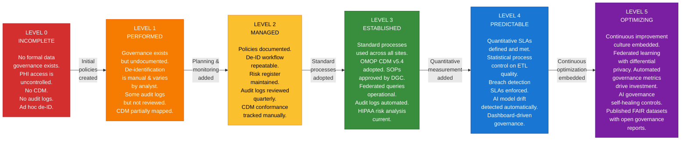
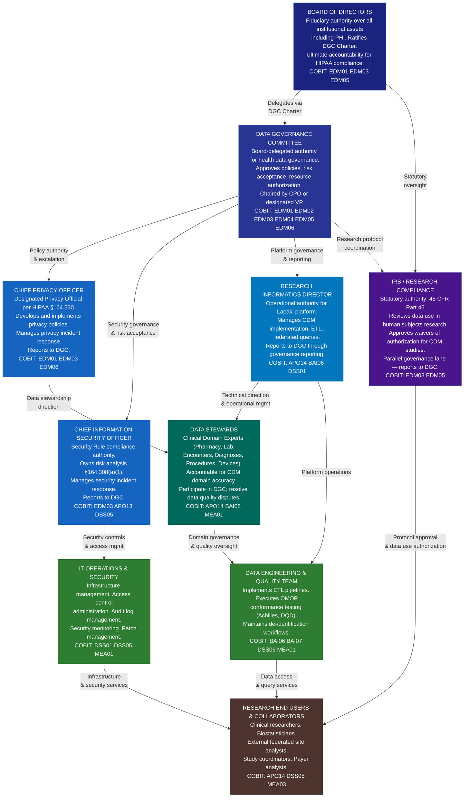
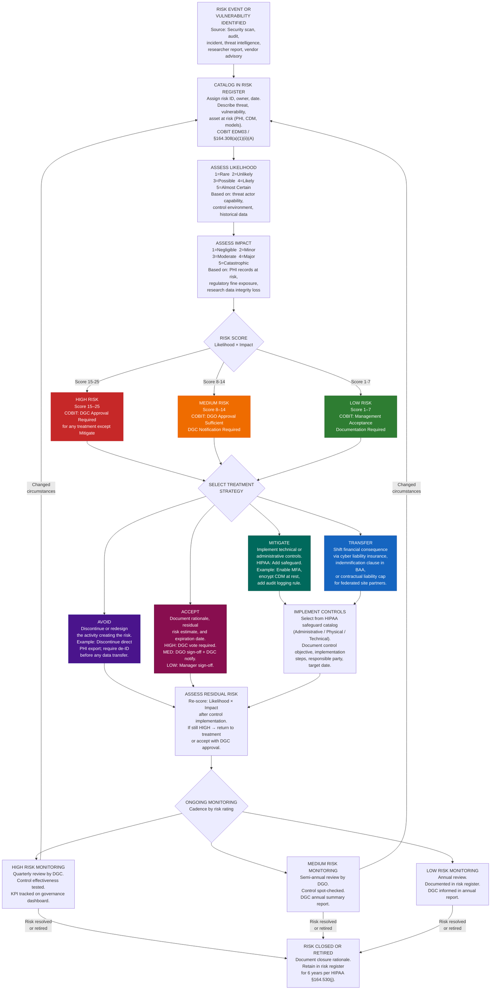

# COBIT 2019 — Mermaid Governance Diagrams

> **Classification:** Internal Governance Documentation — Lapaki Health Data Architecture Project  
> **Purpose:** Visual reference for COBIT 2019 domain architecture, capability levels, governance hierarchy, risk treatment, and HIPAA control mapping  
> **Version:** 1.0  
> **Effective Date:** 2026-05-26  
> **Owner:** Data Governance Committee  

---

## Overview

This document provides five canonical Mermaid diagrams that visually represent the COBIT 2019 governance architecture as applied to the Lapaki Health Data Architecture. These diagrams are intended for use in governance presentations, audit evidence packages, and training materials. Each diagram is accompanied by explanatory narrative that contextualizes its elements within the healthcare data governance domain.

All diagrams comply with Mermaid v10+ syntax and have been validated for rendering in GitHub Markdown, MkDocs, and Confluence environments.

---

## Diagram 1: COBIT 2019 Domain Architecture

This diagram illustrates the full COBIT 2019 objective architecture across all five domains, showing the total objective count per domain, the flow of authority from governance to management, and the relationship between organizational stakeholders (board, management, operations) and the COBIT domains they engage with. The governance domain (EDM) sits at the apex, directing the four management domains below it. Stakeholder inputs drive governance decisions; governance outputs direct management execution; management outputs deliver value to and through the organization.

Note the asymmetry in objective counts: APO has the largest number (14) because it spans the broadest scope — from strategy alignment and risk management through HR, quality management, security architecture, and data management. BAI (11) covers the full delivery lifecycle. DSS (6) focuses on operational service delivery. MEA (4) provides assurance and compliance oversight. EDM (6) provides governance authority across all of the above.

```mermaid
flowchart TD
    subgraph STAKEHOLDERS["STAKEHOLDERS & ENVIRONMENT"]
        direction LR
        STK1["Board &\nExecutive Leadership"]
        STK2["Regulatory Bodies\n(HHS/OCR, State)"]
        STK3["Researchers &\nClinicians"]
        STK4["External Collaborators\n& Payer Partners"]
    end

    subgraph EDM["EDM — EVALUATE, DIRECT & MONITOR  (6 Objectives)"]
        direction LR
        EDM01["EDM01\nGovernance\nFramework"]
        EDM02["EDM02\nBenefits\nDelivery"]
        EDM03["EDM03\nRisk\nOptimization"]
        EDM04["EDM04\nResource\nOptimization"]
        EDM05["EDM05\nStakeholder\nEngagement"]
        EDM06["EDM06\nTransparency"]
    end

    subgraph APO["APO — ALIGN, PLAN & ORGANIZE  (14 Objectives)"]
        direction LR
        APO_A["APO01-APO05\nStrategy · Portfolio\nArchitecture · Innovation\nHuman Resources"]
        APO_B["APO06-APO10\nBudget · Risk\nSecurity Architecture\nVendors · Quality"]
        APO_C["APO11-APO14\nChange Enablement\nData Management\nSecurity Mgmt\nInformation Security"]
    end

    subgraph BAI["BAI — BUILD, ACQUIRE & IMPLEMENT  (11 Objectives)"]
        direction LR
        BAI_A["BAI01-BAI04\nProgramme Mgmt\nRequirements\nSolutions ID\nAvailability & Capacity"]
        BAI_B["BAI05-BAI08\nChange Readiness\nChange Mgmt\nIT Changes\nKnowledge Mgmt"]
        BAI_C["BAI09-BAI11\nAsset Mgmt\nConfiguration Mgmt\nProject Mgmt"]
    end

    subgraph DSS["DSS — DELIVER, SERVICE & SUPPORT  (6 Objectives)"]
        direction LR
        DSS01["DSS01\nOperations\nMgmt"]
        DSS02["DSS02\nService\nRequests &\nIncidents"]
        DSS03["DSS03\nProblems"]
        DSS04["DSS04\nContinuity"]
        DSS05["DSS05\nSecurity\nServices"]
        DSS06["DSS06\nBusiness\nProcess\nControls"]
    end

    subgraph MEA["MEA — MONITOR, EVALUATE & ASSESS  (4 Objectives)"]
        direction LR
        MEA01["MEA01\nPerformance &\nConformance\nMonitoring"]
        MEA02["MEA02\nInternal\nControl\nSystem"]
        MEA03["MEA03\nExternal\nCompliance"]
        MEA04["MEA04\nExternal\nAssurance"]
    end

    subgraph OUTPUTS["VALUE DELIVERED TO ORGANIZATION"]
        direction LR
        OUT1["Clinical Research\nOutputs"]
        OUT2["PHI Protection\n& Compliance"]
        OUT3["Operational\nEfficiency"]
        OUT4["Regulatory\nConformance"]
    end

    STK1 -->|"Governance Direction\n& Risk Appetite"| EDM
    STK2 -->|"Regulatory\nRequirements"| EDM
    EDM -->|"Direction &\nPriorities"| APO
    EDM -->|"Risk Governance\n& Oversight"| MEA
    APO -->|"Plans, Policies\n& Architecture"| BAI
    APO -->|"Security & Risk\nFrameworks"| DSS
    BAI -->|"Solutions &\nCapabilities"| DSS
    DSS -->|"Operational\nResults"| MEA
    MEA -->|"Assurance &\nCompliance Reports"| EDM
    DSS --> OUTPUTS
    OUTPUTS -->|"Research Results &\nClinical Value"| STK3
    OUTPUTS -->|"Compliance\nEvidence"| STK2
    OUTPUTS -->|"Federated Results\n& Shared Data"| STK4
```

---

## Diagram 2: COBIT Capability Level Maturity Model

This diagram represents the six COBIT 2019 capability levels (derived from ISO/IEC 33020) as a left-to-right progression from the least mature (Level 0: Incomplete) to the most mature (Level 5: Optimizing). For each level, a healthcare data pipeline example is provided to illustrate what the level looks like in practice for the Lapaki architecture.

The Lapaki project's current baseline assessment places most EDM objectives at **Level 2 (Managed)** and most APO/DSS/MEA objectives at **Level 1–2**, with a 24-month target to reach Level 3 (Established) across all primary objectives and Level 4 (Predictable) in the highest-priority risk and compliance objectives.

---

## Diagram 3: Healthcare COBIT Governance Hierarchy

This diagram illustrates the full governance hierarchy for the Lapaki Health Data Architecture, from the governing board at the apex down to research end users at the operational level. At each layer, the relevant COBIT EDM objectives are mapped to show which governance accountability is exercised at that level.

This hierarchy reflects the principle that **governance and management are distinct**: the upper layers (Board, DGC, Privacy Officer, CISO) exercise governance authority (evaluate, direct, monitor) while the lower layers (Data Stewards, Research Informatics, IT Operations) exercise management authority (plan, build, run, monitor). The IRB occupies a parallel governance lane because it exercises statutory authority over human subjects research that is co-equal with (not subordinate to) the institutional data governance structure.

---

## Diagram 4: Risk Treatment Decision Flow

This diagram operationalizes the COBIT EDM03 risk governance framework as a step-by-step decision flow. It represents the complete risk treatment lifecycle from initial risk identification through ongoing monitoring and review. Each decision node is aligned with the HIPAA Security Rule risk management requirements of §164.308(a)(1).

The flow incorporates the five-by-five risk matrix scoring methodology (Likelihood × Impact = Risk Score), with clear routing to appropriate treatment options based on risk rating. Critically, the diagram shows that **formal DGC acceptance is required for High risks** — they cannot be accepted at the management level alone, reflecting the governance principle that risk appetite decisions belong to the governance layer.

The diagram also reflects the differentiated monitoring cadence: High risks are reviewed quarterly, Medium risks semi-annually, Low risks annually. This graduated monitoring reflects resource efficiency while ensuring the highest risks receive commensurate attention.

---

## Diagram 5: COBIT ↔ HIPAA Control Mapping

This diagram provides the definitive visual cross-reference between COBIT 2019 governance and management objectives and the corresponding HIPAA Security Rule and Privacy Rule administrative and technical safeguard requirements. This mapping is the evidentiary basis for the Lapaki project's assertion that COBIT governance satisfies HIPAA governance requirements — a critical artifact for OCR audit defense and HITRUST certification.

Each COBIT objective node shows the HIPAA regulatory citation it satisfies. Bidirectional relationships indicate that the COBIT objective both supports the HIPAA requirement and uses HIPAA requirements as an input to its own implementation. The flow from left (COBIT objectives) to right (HIPAA safeguard categories) to rightmost (specific HIPAA sections) mirrors the audit evidence chain.

```mermaid
flowchart LR
    subgraph COBIT_OBJ["COBIT 2019 OBJECTIVES"]
        EDM03["EDM03\nRisk Optimization"]
        APO12["APO12\nManaged Risk"]
        APO13["APO13\nManaged Security"]
        APO14["APO14\nManaged Data"]
        BAI06["BAI06\nManaged IT Changes"]
        DSS05["DSS05\nManaged Security Services"]
        DSS06["DSS06\nBusiness Process Controls"]
        MEA01["MEA01\nPerformance Monitoring"]
        MEA02["MEA02\nInternal Control System"]
        MEA03["MEA03\nExternal Compliance"]
    end

    subgraph HIPAA_ADMIN["HIPAA ADMINISTRATIVE SAFEGUARDS\n45 CFR §164.308"]
        HA1["§164.308(a)(1)\nSecurity Management Process\nRisk Analysis & Risk Management"]
        HA2["§164.308(a)(2)\nAssigned Security Responsibility"]
        HA3["§164.308(a)(3)\nWorkforce Security"]
        HA4["§164.308(a)(4)\nInformation Access Management"]
        HA5["§164.308(a)(5)\nSecurity Awareness & Training"]
        HA6["§164.308(a)(6)\nSecurity Incident Procedures"]
        HA7["§164.308(a)(7)\nContingency Plan"]
        HA8["§164.308(a)(8)\nEvaluation"]
        HA9["§164.308(b)\nBAA Requirements"]
    end

    subgraph HIPAA_PHYS["HIPAA PHYSICAL SAFEGUARDS\n45 CFR §164.310"]
        HP1["§164.310(a)\nFacility Access Controls"]
        HP2["§164.310(d)\nDevice & Media Controls\nAudit Controls"]
    end

    subgraph HIPAA_TECH["HIPAA TECHNICAL SAFEGUARDS\n45 CFR §164.312"]
        HT1["§164.312(a)\nAccess Controls\nUnique User IDs & Auto-Logoff"]
        HT2["§164.312(b)\nAudit Controls"]
        HT3["§164.312(c)\nIntegrity Controls"]
        HT4["§164.312(d)\nPerson or Entity Authentication"]
        HT5["§164.312(e)\nTransmission Security\nEncryption"]
    end

    subgraph HIPAA_PRIVACY["HIPAA PRIVACY RULE\n45 CFR §164.500-164.534"]
        HV1["§164.502-§164.514\nUses & Disclosures\nDe-Identification Standards"]
        HV2["§164.530\nAdministrative Requirements\nPrivacy Officer & Training"]
    end

    EDM03 -->|"Governs risk\nanalysis process"| HA1
    APO12 -->|"Implements risk\nmanagement program"| HA1
    APO13 -->|"Defines security\narchitecture"| HA2
    APO13 -->|"Manages security\nprogram"| HA5
    APO14 -->|"Data classification\n& minimum necessary"| HA4
    APO14 -->|"PHI use governance"| HV1
    BAI06 -->|"Change management\nfor PHI systems"| HA5
    DSS05 -->|"Access control\nadministration"| HT1
    DSS05 -->|"Authentication\nmanagement"| HT4
    DSS05 -->|"Encryption in\ntransit & at rest"| HT5
    DSS05 -->|"Incident detection\n& response"| HA6
    DSS05 -->|"Facility & device\ncontrols"| HP1
    DSS06 -->|"Business continuity\nfor PHI systems"| HA7
    DSS06 -->|"Integrity controls\non PHI"| HT3
    MEA01 -->|"Periodic evaluation\nof security controls"| HA8
    MEA01 -->|"Audit log review"| HT2
    MEA01 -->|"Device audit\ncontrols"| HP2
    MEA02 -->|"Internal audit\nof HIPAA controls"| HA8
    MEA03 -->|"External compliance\nassessment (HITRUST)"| HA9
    MEA03 -->|"Regulatory reporting\nto HHS/OCR"| HV2

    style EDM03 fill:#c62828,color:#fff,stroke:#b71c1c
    style APO12 fill:#1565c0,color:#fff,stroke:#0d47a1
    style APO13 fill:#1565c0,color:#fff,stroke:#0d47a1
    style APO14 fill:#1565c0,color:#fff,stroke:#0d47a1
    style BAI06 fill:#00695c,color:#fff,stroke:#004d40
    style DSS05 fill:#4a148c,color:#fff,stroke:#311b92
    style DSS06 fill:#4a148c,color:#fff,stroke:#311b92
    style MEA01 fill:#e65100,color:#fff,stroke:#bf360c
    style MEA02 fill:#e65100,color:#fff,stroke:#bf360c
    style MEA03 fill:#e65100,color:#fff,stroke:#bf360c
```

---

## Diagram Usage Notes

### Rendering Environments

| Environment | Compatibility | Notes |
|-------------|--------------|-------|
| GitHub Markdown | ✅ Full support | Native Mermaid rendering since 2022 |
| MkDocs (Material theme) | ✅ Full support | Requires `pymdownx.superfences` plugin |
| Confluence | ✅ With plugin | Requires Mermaid for Confluence app |
| VS Code | ✅ With extension | Mermaid Preview or Markdown Preview Enhanced |
| Notion | ⚠️ Partial | Code block display only; no native render |

### Version Control

All diagrams in this document are version-controlled with the parent document. Any structural change to the COBIT 2019 governance architecture (new objective, revised HIPAA mapping) requires DGC review and a new document version number.

### Audit Evidence Usage

These diagrams serve as Exhibit A in the Lapaki COBIT governance evidence package. When preparing for HITRUST assessment or OCR audit, reference this document as the control architecture visualization. Pair with:
- `01-governance-system.md` for EDM narrative evidence
- `06-maturity-model.md` for maturity assessment evidence
- Risk register export for EDM03 risk treatment evidence

---

*This document is maintained by the Lapaki Data Governance Committee. All modifications require DGC approval.*
