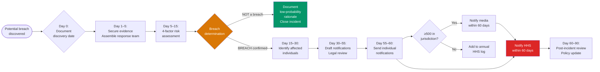

# HIPAA Breach Notification & HITECH Act Requirements

> **Regulatory basis:** 45 CFR §§164.400–414 (Breach Notification Rule); Pub.L. 111-5 (HITECH Act, 2009)  
> **COBIT alignment:** DSS02 (Managed Service Requests and Incidents), MEA03 (Managed Compliance)

---

## HITECH Act Overview

The Health Information Technology for Economic and Clinical Health (HITECH) Act of 2009 significantly strengthened HIPAA enforcement in five key ways:

1. **Direct liability for Business Associates** — BAs are now directly liable for HIPAA violations (previously enforcement was only against covered entities)
2. **Enhanced civil monetary penalties (CMPs)** — Tiered penalty structure up to $1.9M per violation category per calendar year
3. **Criminal penalties** — Individuals (not just entities) can face criminal charges
4. **Expanded breach notification** — Stricter timelines and media notification requirements
5. **Audit program** — Mandated HHS audit program for covered entities and BAs

---

## Civil Monetary Penalty Tiers (Updated 2023)

| Violation Category | Per Violation | Annual Maximum |
|-------------------|--------------|---------------|
| Unknown (did not know and could not have known) | $137 – $68,928 | $2,067,813 |
| Reasonable cause (not willful neglect) | $1,379 – $68,928 | $2,067,813 |
| Willful neglect — corrected within 30 days | $13,785 – $68,928 | $2,067,813 |
| Willful neglect — NOT corrected | $68,928 – $2,067,813 | $2,067,813 |

*Figures adjusted for inflation per HHS CMP adjustments (most recent: 2023).*

---

## Breach Definition

A **breach** is an impermissible use or disclosure of PHI that compromises its security or privacy. There is a rebuttable presumption of breach unless the covered entity demonstrates a low probability of compromise based on a four-factor risk assessment:

1. The nature and extent of the PHI involved (including types of identifiers and likelihood of re-identification)
2. The unauthorized person who used the PHI or to whom the disclosure was made
3. Whether the PHI was actually acquired or viewed
4. The extent to which the risk to the PHI has been mitigated

### Exceptions to Breach (45 CFR §164.402)

Three circumstances are not breaches:
- **Unintentional access** by a workforce member acting in good faith within their scope
- **Inadvertent disclosure** between authorized persons at the same covered entity/BA
- **Good faith belief** that the unauthorized person who received the PHI could not have retained it

---

## Breach Notification Requirements

### Individual Notification (45 CFR §164.404)

| Requirement | Detail |
|-------------|--------|
| **Timeline** | Without unreasonable delay and no later than **60 calendar days** after discovery |
| **Method** | First-class mail (or email if individual has agreed) |
| **Content required** | Description of breach, PHI involved, steps individuals should take, steps entity is taking, contact information |
| **Substitute notice** | If 10+ individuals have insufficient contact info: prominent posting on website or major print/broadcast media |
| **Urgent notice** | Immediate telephone notification if serious/imminent threat to health/safety |

### Covered Entity to HHS Notification (45 CFR §164.408)

| Breach Size | Notification Method | Timeline |
|------------|--------------------|----|
| ≥500 individuals | HHS online portal | Within **60 days** of discovery |
| <500 individuals | HHS annual log | No later than **60 days after end of calendar year** |

**HHS Breach Reporting Portal:** https://ocrportal.hhs.gov/ocr/breach/wizard_breach.jsf

### Media Notification (45 CFR §164.406)

For breaches affecting ≥500 residents of a state or jurisdiction:
- Notify prominent media outlets serving that state/jurisdiction
- Timeline: Without unreasonable delay and no later than **60 calendar days** after discovery

### Business Associate to Covered Entity (45 CFR §164.410)

- BAs must notify covered entity without unreasonable delay and no later than **60 calendar days** after discovery
- If multiple covered entities are affected, BA must notify each
- BA notification must include: identification of each individual whose PHI was involved (or will be provided as information becomes available)

---

## Incident Response Timeline

---

## BA Breach Notification to Covered Entity

When a Business Associate discovers a breach:

1. **Immediate action:** Contain the breach; do not wait for full investigation
2. **Notify CE within 60 days** of discovery (regardless of how long investigation takes)
3. Provide: date of breach, date of discovery, description, PHI types involved, number of individuals affected (estimated), steps taken
4. Update CE as additional information becomes available

---

## HITECH Audit Program

HHS Office for Civil Rights (OCR) conducts two types of audits:
1. **Desk audits** — Documentation-based remote reviews
2. **Onsite audits** — In-person comprehensive assessments

**Common audit targets:**
- Risk analysis completeness (§164.308(a)(1))
- Breach notification timeliness
- BA agreement documentation
- Training records
- Access control logs

**Preparation:** Organizations should be able to produce, within 10 business days, all policies, procedures, training records, risk analysis documentation, and BA agreements.
