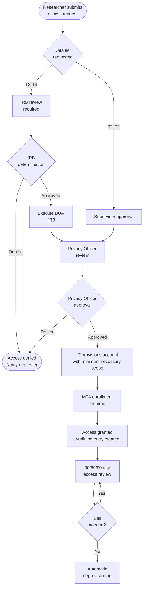

# Role-Based Access Control (RBAC) Matrix

> **Standard basis:** 45 CFR §164.308(a)(3) (Workforce Security), §164.312(a)(1) (Access Control)  
> **COBIT alignment:** DSS05 (Managed Security Services), APO01 (Managed IT Management Framework)  
> **Principle:** Minimum Necessary (45 CFR §164.502(b))

---

## Access Tiers

| Tier | Label | Data Access | Examples |
|------|-------|------------|---------|
| T0 | Public | Public aggregates only | General public, press |
| T1 | Self-Service Analyst | De-identified aggregate queries only | Clinical ops staff, quality teams |
| T2 | Research Analyst | De-identified individual-level records | Research coordinators, data analysts |
| T3 | Limited Dataset Researcher | Limited dataset with DUA | IRB-approved investigators |
| T4 | Identified Data Researcher | Full CDM identified records | Senior researchers with IRB full board approval |
| T5 | Data Engineer | Pipeline ETL, no direct research use | Data engineering team |
| T6 | DBA / System Admin | Database infrastructure, no data view | Database administrators |
| T7 | Privacy Officer | All tiers (audit only) | Privacy & Compliance Officer |
| T8 | Security Officer | All systems (security monitoring) | CISO / Security team |

---

## System × Role Access Matrix

| System / Environment | T0 | T1 | T2 | T3 | T4 | T5 | T6 | T7 | T8 |
|---------------------|----|----|----|----|----|----|----|----|-----|
| **EHR System (Source)** | ❌ | ❌ | ❌ | ❌ | 👁 Read | 🔧 ETL | 🔑 Admin | 🔍 Audit | 🔍 Monitor |
| **Operational DW** | ❌ | 📊 Aggregate | ❌ | ❌ | ❌ | 🔧 ETL | 🔑 Admin | 🔍 Audit | 🔍 Monitor |
| **Operational Self-Service** | ❌ | 📊 Query | ❌ | ❌ | ❌ | ❌ | 🔑 Admin | 🔍 Audit | 🔍 Monitor |
| **Integrated Research DW** | ❌ | ❌ | ❌ | ❌ | 👁 Read | 🔧 ETL | 🔑 Admin | 🔍 Audit | 🔍 Monitor |
| **CDM — Identified** | ❌ | ❌ | ❌ | ❌ | 📊 Query | 🔧 Load | 🔑 Admin | 🔍 Audit | 🔍 Monitor |
| **CDM — De-Identified** | ❌ | ❌ | 📊 Query | 📊 Query | 📊 Query | 🔧 Load | 🔑 Admin | 🔍 Audit | 🔍 Monitor |
| **Limited Dataset Cohorts** | ❌ | ❌ | ❌ | 📊 Query | 📊 Query | ❌ | 🔑 Admin | 🔍 Audit | 🔍 Monitor |
| **External Hub (Federated)** | ❌ | ❌ | ❌ | ❌ | 📊 Federated | 🔧 Feed | 🔑 Admin | 🔍 Audit | 🔍 Monitor |
| **Multi-Site De-ID Pool** | ❌ | ❌ | 📊 Aggregate | 📊 Aggregate | 📊 Aggregate | ❌ | 🔑 Admin | 🔍 Audit | 🔍 Monitor |
| **Multi-Site Query Platform** | ❌ | ❌ | 📊 Aggregate | 📊 Aggregate | 📊 Aggregate | ❌ | 🔑 Admin | 🔍 Audit | 🔍 Monitor |
| **Audit Logs** | ❌ | ❌ | ❌ | ❌ | ❌ | ❌ | 🔑 Infra | ✅ Full | 🔍 Monitor |
| **CI/CD Pipelines** | 👁 Public | ❌ | ❌ | ❌ | ❌ | ✅ Deploy | 🔑 Admin | 🔍 Audit | 🔍 Monitor |

**Legend:** 📊 Read/Query only · 👁 Read only · 🔧 ETL/Load access · 🔑 Admin · 🔍 Audit/Monitor · ✅ Full · ❌ No access

---

## Access Request & Provisioning Workflow

---

## Access Review Schedule

| Access Tier | Review Frequency | Reviewer | Action if Lapsed |
|------------|-----------------|---------|-----------------|
| T1 — Self-Service | Annual | Supervisor | Revoke automatically |
| T2 — Research De-ID | 6 months | Supervisor + Privacy | Revoke; re-request required |
| T3 — Limited Dataset | Per DUA term | Privacy Officer | Revoke at DUA expiry |
| T4 — Identified | Per IRB approval | IRB + Privacy Officer | Revoke when IRB expires |
| T5 — Data Engineer | Annual | IT Manager | Revoke if role changes |
| T6 — DBA | Annual | CISO | Revoke if role changes |
| T7/T8 — Officers | N/A | Executive Leadership | Role-based |

---

## Privileged Account Controls

Privileged accounts (T5, T6, T7, T8) require:
1. **Separation of duties** — No single person can both provision access and approve access requests
2. **Privileged Access Workstation (PAW)** — Dedicated workstations for privileged operations
3. **Session recording** — All privileged sessions recorded and retained ≥1 year
4. **Just-in-time access** — Privileged access granted for defined time windows only (max 8 hours per session)
5. **Dual authorization** — For production data system changes, two privileged users must authorize
