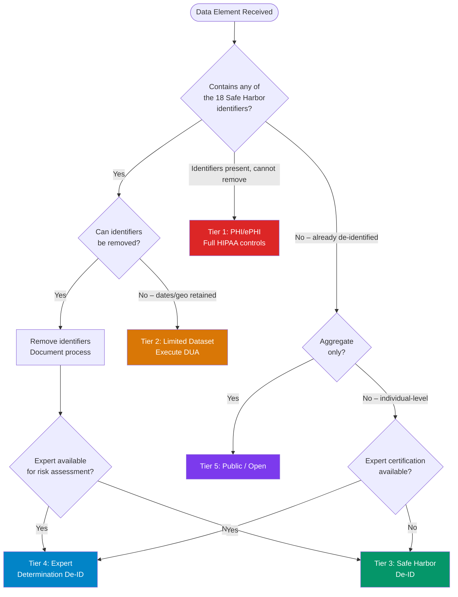

# Data Classification Scheme

> **Standard basis:** HIPAA 45 CFR §164.514, NIST SP 800-188, HHS Guidance on De-identification  
> **COBIT alignment:** APO01 (Managed IT Management Framework), APO12 (Managed Risk)

---

## Classification Tiers

### Tier 1 — Identified (PHI/ePHI)

**Definition:** Any individually identifiable health information transmitted or maintained in any form or medium by a covered entity or its business associates. PHI includes information that:
- Relates to the past, present, or future physical or mental health or condition of an individual
- Relates to the provision of healthcare to an individual
- Relates to the past, present, or future payment for healthcare to an individual
- Can reasonably be used to identify the individual

**Examples:** Named patient records, encounter records with patient identifiers, claims data with member IDs

**Controls required:**
- Full HIPAA Security Rule compliance (45 CFR §164.302–318)
- BAA for all business associates
- Minimum necessary access controls
- Audit logging of all access events
- Encryption at rest (AES-256) and in transit (TLS 1.3)
- Authorization: IRB approval + data access agreement

---

### Tier 2 — Limited Dataset (Quasi-Identified)

**Definition:** Defined in 45 CFR §164.514(e). A limited dataset has had direct identifiers removed but retains:
- Geographic data: town, city, state, ZIP code
- Dates: admission, discharge, service, birth, death dates (not ages)
- Ages in years (for research, may retain exact dates)

**Examples:** Claims data with ZIP + date of service but no name/SSN, longitudinal research cohorts with birth year retained

**Controls required:**
- Data Use Agreement (DUA) per 45 CFR §164.514(e)(4)
- Prohibition on identifying or contacting individuals
- Obligation to use safeguards to prevent misuse
- DUA must specify permitted uses, term, and data return/destruction obligations
- Authorization: IRB + executed DUA

---

### Tier 3 — De-Identified (HIPAA Safe Harbor)

**Definition:** Data from which all 18 Safe Harbor identifier categories have been removed (45 CFR §164.514(b)(2)) AND the covered entity has no actual knowledge that the information could be used to re-identify an individual.

**Examples:** De-identified CDM exports, de-identified research datasets, multi-site pooled de-identified data

**Controls required:**
- Documentation of de-identification methodology
- Annual re-identification risk review
- No BAA required (de-identified data is not PHI)
- Authorization: Institutional policy; some studies may still require IRB review
- Retain de-identification certification records ≥6 years

---

### Tier 4 — Expert Determination De-Identified

**Definition:** Data determined to have a very small risk of re-identification by a person with appropriate statistical and scientific expertise (45 CFR §164.514(b)(1)).

**Distinction from Safe Harbor:** Expert Determination is statistically grounded and may retain fields not permitted under Safe Harbor (e.g., rare disease codes with geographic precision), provided expert certification documents the risk is acceptably small.

**Controls required:**
- Written expert certification retained ≥6 years
- Methodology documentation (statistical tests applied, data set size, external data linkage risk)
- Periodic re-assessment if dataset is joined with new external data sources
- Authorization: Expert certification; IRB review recommended for sensitive populations

---

### Tier 5 — Publicly Available / Fully Open

**Definition:** Data with no residual re-identification risk, typically aggregate counts (e.g., disease prevalence by ZIP code, without individual-level records) or data explicitly placed in the public domain.

**Examples:** Published aggregate statistics, synthetic data, open-access OMOP CDM benchmark datasets

**Controls required:**
- No PHI controls required
- Recommended: data dictionary, methodology notes, and citation guidance
- Authorization: None beyond publication policy

---

## Classification Decision Flowchart

---

## Access Matrix by Tier

| Data Tier | Research Use | IRB Needed? | DUA Needed? | BAA Needed? | Audit Log |
|-----------|-------------|------------|------------|------------|---------|
| Tier 1 — PHI | Restricted | Yes (full board) | Yes (institutional) | Yes | Required |
| Tier 2 — Limited Dataset | Research | Yes (may expedite) | Yes (HHS template) | Yes | Required |
| Tier 3 — Safe Harbor De-ID | Research | Depends on design | Recommended | No | Recommended |
| Tier 4 — Expert Det. De-ID | Research | Depends | Recommended | No | Recommended |
| Tier 5 — Public | Unrestricted | No | No | No | Optional |
